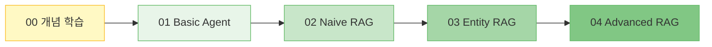

# 🚀 LangGraph RAG Agent 학습 가이드

LangGraph를 이용한 RAG(Retrieval-Augmented Generation) Agent 학습을 위한 종합 튜토리얼입니다.
본 문서는 LangGraph의 기초부터 고급 RAG 패턴까지 단계별로 학습할 수 있도록 구성되었습니다.

---

## ⚡ LangGraph 핵심 요약 (Cheat Sheet)

학습 전, 가장 자주 사용되는 **LangGraph의 핵심 함수와 패턴**입니다.
빠르게 찾아보는 참고서(Reference)로 활용하세요.

### 1. 기본 구성 요소 (Imports)

```python
from typing import TypedDict, Annotated, Literal
from langgraph.graph import StateGraph, START, END, MessagesState
from langgraph.prebuilt import ToolNode
```

### 2. 상태(State) 정의

```python
# 1. 메시지 기반 상태 (Chatbot용)
#    - messages 리스트에 대화가 자동으로 누적됨
class MyAgentState(MessagesState):
    custom_data: str

# 2. 일반 커스텀 상태 (사용자 정의)
class MyState(TypedDict):
    input: str
    count: int
    messages: list
```

### 3. 그래프 빌딩 (Graph Building)

```python
# 그래프 초기화
builder = StateGraph(MyState)

# (1) 노드 추가: 작업을 수행하는 함수
builder.add_node("node_name", node_function)

# (2) 엣지 추가: 순차적 연결
builder.add_edge(START, "first_node")      # 시작 -> 첫 노드
builder.add_edge("first_node", "next_node") # 노드 -> 노드
builder.add_edge("last_node", END)         # 종료

# (3) 조건부 엣지: 분기 처리 (Router)
def router(state) -> Literal["path_a", "path_b"]:
    if state["count"] > 10:
        return "path_a"
    return "path_b"

builder.add_conditional_edges(
    "decision_node",   # 분기 시작 노드
    router,            # 라우터 함수
    {"path_a": "node_A", "path_b": "node_B"} # 매핑 (선택)
)
```

### 4. 실행 (Execution)

```python
# 컴파일: 실행 가능한 객체로 변환
graph = builder.compile()

# 실행
initial_state = {"count": 0}
result = graph.invoke(initial_state)

# 스트리밍 실행 (중간 과정 확인)
for event in graph.stream(initial_state):
    print(event)
```

---

## 🔧 GPT-OSS Harmony 호환성 가이드 (로컬 LLM)

본 프로젝트는 **GPT-OSS (vLLM 기반 로컬 모델)** 서버와의 완벽한 호환성을 지원합니다. 로컬 모델을 사용하여 에이전트를 개발할 때 발생하는 응답 포맷 차이 및 서버 에러를 방지하기 위한 가이드를 제공합니다.

- [**GPT-OSS (vLLM) Harmony 호환성 가이드 바로가기**](docs/harmony_compatibility.md)
  - `clean_history_for_harmony`: 서버 에러 방지를 위한 메시지 정제
  - `parse_harmony_tool_call`: 로컬 모델의 특수한 도구 호출 포맷 파싱

---

## 📋 목차

- [LangGraph 핵심 요약](#-langgraph-핵심-요약-cheat-sheet)
- [GPT-OSS Harmony 호환성 가이드](#-gpt-oss-harmony-호환성-가이드-로컬-llm)
- [학습 로드맵](#-학습-로드맵)
- [개념 학습](#-개념-학습)
- [설치 방법](#-설치-방법)
- [예제 가이드](#-예제-가이드)
    - [1. Basic Agent](#1️⃣-basic-agent-01_basic_agentpy)
    - [2. Naive RAG](#2️⃣-naive-rag-02_naive_ragpy)
    - [3. Entity RAG](#3️⃣-entity-rag-03_entity_ragpy)
    - [4. Advanced RAG](#4️⃣-advanced-rag-04_advanced_ragpy)

---

## 🗺️ 학습 로드맵

단계별로 복잡도가 증가하는 구조로 설계되었습니다.



## 📖 개념 학습

LangGraph를 시작하기 전에 LangChain과의 차이점과 필수 개념을 먼저 익히세요.

- [**00. LangGraph 개념 및 LangChain 필수 요소**](docs/00_concepts.md)
  - LangChain vs LangGraph 차이점
  - LangGraph 학습을 위한 4가지 필수 요소 (ChatModel, Prompt, Tools, Messages)
  - LangGraph의 핵심 구조 (State, Node, Edge)

| 단계 | 예제 | 핵심 학습 내용 | 난이도 |
|:---:|:---|:---|:---:|
| 1️⃣ | **Basic Agent** | LangGraph 기본 구조 (State, Node, Edge), 도구 사용, 조건부 분기 | ⭐ |
| 2️⃣ | **Naive RAG** | 기본적인 검색-생성 파이프라인, Vector Store 연동, 문서 임베딩 | ⭐⭐ |
| 3️⃣ | **Entity RAG** | 엔티티(Entity) 추출, 하이브리드 검색(Keyword + Semantic), 병렬 노드 | ⭐⭐⭐ |
| 4️⃣ | **Advanced RAG** | Self-RAG, Corrective RAG, 문서 평가(Grading), 환각 검사, 루프(Loop) | ⭐⭐⭐⭐ |

---

## 💻 설치 방법

**1. 저장소 클론 및 이동**
```bash
git clone <repository-url>
cd rag_agent
```

**2. 가상환경 생성 (권장)**
```bash
python -m venv venv
# Windows
venv\Scripts\activate
# macOS/Linux
source venv/bin/activate
```

**3. 의존성 설치**
```bash
pip install -r requirements.txt
```

**4. 환경 변수 설정 (`.env`)**
```env
OPENAI_API_KEY=sk-your-api-key-here
```

---

## 📂 예제 가이드

### 1️⃣ Basic Agent (`01_basic_agent.py`)

가장 기초적인 Agent를 구현하며 LangGraph의 뼈대를 익힙니다.

- **핵심 코드**:
  - `StateGraph(MessagesState)`: 메시지 기록을 유지하는 그래프 생성
  - `bind_tools(tools)`: LLM에 도구(함수) 연결
  - `add_conditional_edges(..., should_continue)`: 도구 호출 여부에 따른 분기

📖 [상세 문서 바로가기](docs/01_basic_agent.md)

### 2️⃣ Naive RAG (`02_naive_rag.py`)

문서를 검색하고 답변을 생성하는 가장 단순한 RAG 구조입니다.

- **핵심 코드**:
  - `VectorStoreManager`: 문서 임베딩 및 검색 관리
  - **Pipeline**: `Retrieve` (검색) → `Generate` (생성)
  - 단순 선형 구조 (Linear Graph)

📖 [상세 문서 바로가기](docs/02_naive_rag.md)

### 3️⃣ Entity RAG (`03_entity_rag.py`)

질문에서 중요 단어(Entity)를 추출하여 검색 정확도를 높입니다.

- **핵심 코드**:
  - `Extract Entity Node`: LLM을 이용해 쿼리에서 핵심 엔티티 추출
  - **Hybrid Search**: 엔티티 기반 검색(Exact Match) + 의미 기반 검색(Semantic)
  - **Parallel Execution**: 두 가지 검색을 동시에 수행하고 `Merge` 노드에서 병합

📖 [상세 문서 바로가기](docs/03_entity_rag.md)

### 4️⃣ Advanced RAG (`04_advanced_rag.py`)

검색 결과가 부실하거나 답변이 이상할 경우 스스로 수정하는 지능형 RAG입니다.

- **핵심 패턴**:
  - **Self-Reflective**: 문서가 질문과 관련 있는지 평가 (`Grade Documents`)
  - **Corrective**: 관련 문서가 없으면 `Web Search` 등 폴백(Fallback) 수행
  - **Anti-Hallucination**: 답변이 문서에 기반한 사실인지 검증 (`Check Hallucination`)
  - **Loop**: 만족스럽지 않으면 다시 검색 단계로 돌아감

📖 [상세 문서 바로가기](docs/04_advanced_rag.md)

---

## 🛠️ 실행 방법

각 예제는 독립적으로 실행 가능합니다.

```bash
# 1. 기본 에이전트
python examples/01_basic_agent.py

# 2. Naive RAG
python examples/02_naive_rag.py

# 3. Entity RAG
python examples/03_entity_rag.py

# 4. Advanced RAG
python examples/04_advanced_rag.py
```

---

## 📚 참고 자료

- [LangGraph 공식 문서](https://langchain-ai.github.io/langgraph/)
- [LangChain 공식 문서](https://python.langchain.com/)
- [Advanced RAG 논문 (Self-RAG)](https://arxiv.org/abs/2310.11511)
- [Corrective RAG (CRAG)](https://arxiv.org/abs/2401.15884)
