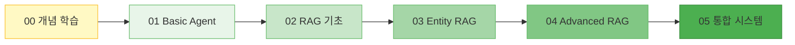

# 🚀 LangGraph RAG Agent 학습 가이드

LangGraph를 이용한 RAG(Retrieval-Augmented Generation) Agent 학습을 위한 종합 튜토리얼입니다.
본 문서는 LangGraph의 기초부터 고급 RAG 패턴까지 단계별로 학습할 수 있도록 구성되었습니다.

---

## ⚡ LangGraph 핵심 요약 (Cheat Sheet)

학습 전, 가장 자주 사용되는 **LangGraph의 핵심 함수와 패턴**입니다.
빠르게 찾아보는 참고서(Reference)로 활용하세요.

### 1. 기본 구성 요소 (Imports)

```python
from typing import TypedDict, Annotated, Literal
from langgraph.graph import StateGraph, START, END, MessagesState
from langgraph.prebuilt import ToolNode, tools_condition, create_react_agent
```

### 2. 상태(State) 정의

```python
# 1. 메시지 기반 상태 (Chatbot용)
#    - messages 리스트에 대화가 자동으로 누적됨
class MyAgentState(MessagesState):
    custom_data: str

# 2. 일반 커스텀 상태 (사용자 정의)
class MyState(TypedDict):
    input: str
    count: int
    messages: list
```

### 3. 그래프 빌딩 (Graph Building)

```python
# 그래프 초기화
builder = StateGraph(MyState)

# (1) 노드 추가: 작업을 수행하는 함수
builder.add_node("node_name", node_function)

# (2) 엣지 추가: 순차적 연결
builder.add_edge(START, "first_node")      # 시작 -> 첫 노드
builder.add_edge("first_node", "next_node") # 노드 -> 노드
builder.add_edge("last_node", END)         # 종료

# (3) 조건부 엣지: 분기 처리 (Router)
def router(state) -> Literal["path_a", "path_b"]:
    if state["count"] > 10:
        return "path_a"
    return "path_b"

builder.add_conditional_edges(
    "decision_node",   # 분기 시작 노드
    router,            # 라우터 함수
    {"path_a": "node_A", "path_b": "node_B"} # 매핑 (선택)
)
```

### 4. 실행 (Execution)

```python
# 컴파일: 실행 가능한 객체로 변환
graph = builder.compile()

# 실행
initial_state = {"count": 0}
result = graph.invoke(initial_state)

# 스트리밍 실행 (중간 과정 확인)
for event in graph.stream(initial_state):
    print(event)
```

---

## 🔧 GPT-OSS Harmony 호환성 가이드 (로컬 LLM)

본 프로젝트는 **GPT-OSS (vLLM 기반 로컬 모델)** 서버와의 완벽한 호환성을 지원합니다.

- [**GPT-OSS (vLLM) Harmony 호환성 가이드 바로가기**](docs/harmony_compatibility.md)
  - `clean_history_for_harmony`: 서버 에러 방지를 위한 메시지 정제
  - `parse_harmony_tool_call`: 로컬 모델의 특수한 도구 호출 포맷 파싱

---

## 📋 목차

- [LangGraph 핵심 요약](#-langgraph-핵심-요약-cheat-sheet)
- [GPT-OSS Harmony 호환성 가이드](#-gpt-oss-harmony-호환성-가이드-로컬-llm)
- [학습 로드맵](#-학습-로드맵)
- [개념 학습](#-개념-학습)
- [설치 방법](#-설치-방법)
- [예제 가이드](#-예제-가이드)

---

## 🗺️ 학습 로드맵

단계별로 복잡도가 증가하는 구조로 설계되었습니다.



---

## 📖 개념 학습

LangGraph를 시작하기 전에 필수 개념을 먼저 익히세요.

| 문서 | 내용 |
|------|------|
| [00. LangGraph 개념](docs/00_concepts.md) | LangChain vs LangGraph, 핵심 구조 (State, Node, Edge) |
| [00. API Reference](docs/00_langgraph_api_reference.md) | LangGraph 함수 레퍼런스 |

---

## 💻 설치 방법

**1. 저장소 클론 및 이동**
```bash
git clone <repository-url>
cd rag_agent
```

**2. 가상환경 생성 (권장)**
```bash
python -m venv venv
# Windows
venv\Scripts\activate
# macOS/Linux
source venv/bin/activate
```

**3. 의존성 설치**
```bash
pip install -r requirements.txt
```

**4. 환경 변수 설정 (`.env`)**
```env
OPENAI_API_KEY=sk-your-api-key-here
```

---

## 📂 예제 가이드

### 1️⃣ Basic Agent 시리즈

LangGraph의 기본 구조와 에이전트 패턴을 학습합니다.

| 예제 | 파일 | 핵심 학습 내용 |
|------|------|--------------|
| **Basic Agent** | [`01_basic_agent.md`](docs/01_basic_agent.md) | Standard vs ReAct 패턴 비교 |
| **Standard Pattern** | `01_base_agent_standard.py` | StateGraph 직접 구성 |
| **ReAct Pattern** | `01_base_agent_react.py` | create_react_agent 활용 |
| **Multi-Tool** | [`01a_multi_tool_agent.md`](docs/01a_multi_tool_agent.md) | 5개 이상 도구 관리 |
| **Memory** | [`01b_memory_agent.md`](docs/01b_memory_agent.md) | MemorySaver, thread_id |
| **Multi-Agent** | [`01c_multi_agent.md`](docs/01c_multi_agent.md) | Supervisor 패턴 |
| **MCP Agent** | [`01d_mcp_agent.md`](docs/01d_mcp_agent.md) | MCP 서버 연동 |

---

### 2️⃣ RAG 기초 시리즈

문서 검색 및 답변 생성 파이프라인을 학습합니다.

| 예제 | 파일 | 핵심 학습 내용 |
|------|------|--------------|
| **Naive RAG** | [`02_naive_rag.md`](docs/02_naive_rag.md) | 기본 검색-생성 파이프라인 |
| **Rerank RAG** | [`02a_rerank_rag.md`](docs/02a_rerank_rag.md) | LLM 기반 문서 재정렬 |
| **Query Transform** | [`02b_query_transform_rag.md`](docs/02b_query_transform_rag.md) | HyDE, 쿼리 변환 |

---

### 3️⃣ Entity RAG

| 예제 | 파일 | 핵심 학습 내용 |
|------|------|--------------|
| **Entity RAG** | [`03_entity_rag.md`](docs/03_entity_rag.md) | 엔티티 추출, 하이브리드 검색 |

---

### 4️⃣ Advanced RAG 시리즈

지능형 RAG 패턴을 학습합니다.

| 예제 | 파일 | 핵심 학습 내용 |
|------|------|--------------|
| **Advanced RAG** | [`04_advanced_rag.md`](docs/04_advanced_rag.md) | Self-RAG, Corrective RAG |
| **Adaptive RAG** | [`04a_adaptive_rag.md`](docs/04a_adaptive_rag.md) | 질문 유형별 라우팅 |

---

### 5️⃣ 통합 시스템

| 예제 | 파일 | 핵심 학습 내용 |
|------|------|--------------|
| **Integrated Test** | [`05_integrated_test.md`](docs/05_integrated_test.md) | 모든 기법 통합 |

---

## 🛠️ 실행 방법

각 예제는 독립적으로 실행 가능합니다.

```bash
# Basic Agent 시리즈
python examples/01_base_agent_standard.py
python examples/01_base_agent_react.py
python examples/01d_mcp_agent.py

# RAG 시리즈
python examples/02_naive_rag.py
python examples/03_entity_rag.py
python examples/04_advanced_rag.py

# 통합 테스트
python examples/05_integrated_test.py
```

---

## 📚 참고 자료

- [LangGraph 공식 문서](https://langchain-ai.github.io/langgraph/)
- [LangChain 공식 문서](https://python.langchain.com/)
- [MCP (Model Context Protocol)](https://modelcontextprotocol.io/)
- [Advanced RAG 논문 (Self-RAG)](https://arxiv.org/abs/2310.11511)
- [Corrective RAG (CRAG)](https://arxiv.org/abs/2401.15884)
