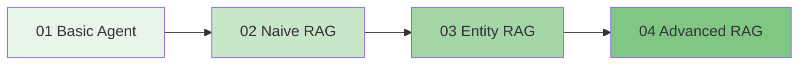

# 🚀 LangGraph RAG Agent 학습 가이드

LangGraph를 이용한 RAG(Retrieval-Augmented Generation) Agent 학습을 위한 종합 튜토리얼입니다.

## 📋 목차

- [소개](#소개)
- [설치 방법](#설치-방법)
- [프로젝트 구조](#프로젝트-구조)
- [학습 로드맵](#학습-로드맵)
- [예제 설명](#예제-설명)
- [문서](#문서)
- [실행 방법](#실행-방법)

---

## 소개

### LangGraph란?

**LangGraph**는 LangChain 팀에서 개발한 라이브러리로, **상태를 가진(stateful) 다중 행위자(multi-actor) AI 애플리케이션**을 구축하기 위한 프레임워크입니다.

주요 특징:
- 🔄 **상태 관리**: 노드 간 공유 상태를 통한 데이터 전달
- 🔁 **사이클 지원**: 일반 DAG와 달리 순환 구조 허용 (자기 수정 루프)
- 🎛️ **세밀한 제어**: 에이전트 실행 흐름의 정밀한 제어
- 💾 **영속성**: 체크포인트를 통한 상태 저장 및 복원

### RAG란?

**RAG (Retrieval-Augmented Generation)**는 외부 지식 소스에서 관련 정보를 검색하여 LLM의 응답 품질을 향상시키는 기법입니다.

```
질문 → [검색(Retrieval)] → 관련 문서 → [증강(Augmentation)] → LLM → 답변
```

---

## 설치 방법

### 1. 저장소 클론

```bash
git clone <repository-url>
cd agent
```

### 2. 가상환경 생성 (권장)

```bash
python -m venv venv
# Windows
venv\Scripts\activate
# macOS/Linux
source venv/bin/activate
```

### 3. 의존성 설치

```bash
pip install -r requirements.txt
```

### 4. 환경 변수 설정

```bash
cp .env.example .env
# .env 파일을 편집하여 API 키 입력
```

**필수 환경 변수:**
```env
OPENAI_API_KEY=sk-your-api-key-here
```

---

## 프로젝트 구조

```
agent/
├── 📄 README.md                    # 이 문서
├── 📄 requirements.txt             # 의존성 패키지
├── 📄 .env.example                 # 환경 변수 예제
├── 📁 config/
│   └── settings.py                 # 설정 관리
├── 📁 examples/                    # 예제 코드
│   ├── 01_basic_agent.py          # 기본 Agent
│   ├── 02_naive_rag.py            # Naive RAG
│   ├── 03_entity_rag.py           # Entity RAG
│   └── 04_advanced_rag.py         # Advanced RAG
├── 📁 docs/                        # 상세 문서
│   ├── 00_langgraph_api_reference.md
│   ├── 01_basic_agent.md
│   ├── 02_naive_rag.md
│   ├── 03_entity_rag.md
│   └── 04_advanced_rag.md
├── 📁 utils/
│   ├── llm_factory.py             # LLM 생성 팩토리
│   └── vector_store.py            # Vector Store 관리
└── 📁 data/
    └── sample_documents.txt        # 샘플 문서
```

---

## 학습 로드맵

단계별로 복잡도가 증가하는 구조로 설계되었습니다:



| 단계 | 예제 | 학습 내용 | 난이도 |
|------|------|----------|--------|
| 1️⃣ | Basic Agent | LangGraph 기본 개념 (State, Node, Edge) | ⭐ |
| 2️⃣ | Naive RAG | 기본 RAG 파이프라인 (검색 → 생성) | ⭐⭐ |
| 3️⃣ | Entity RAG | 엔티티 추출, 하이브리드 검색 | ⭐⭐⭐ |
| 4️⃣ | Advanced RAG | Self-RAG, Corrective RAG, 자기 수정 | ⭐⭐⭐⭐ |

---

## 예제 설명

### 1️⃣ Basic Agent (01_basic_agent.py)

LangGraph의 기본 개념을 학습합니다.

**핵심 개념:**
- `StateGraph`: 그래프 빌더
- `add_node()`: 노드 추가
- `add_edge()`: 엣지 추가
- `add_conditional_edges()`: 조건부 분기
- `compile()`: 그래프 컴파일

```python
# 기본 흐름
START → agent → (도구 필요?) → tools → agent → END
```

📖 [상세 문서: docs/01_basic_agent.md](docs/01_basic_agent.md)

---

### 2️⃣ Naive RAG (02_naive_rag.py)

가장 기본적인 RAG 파이프라인을 구현합니다.

**핵심 개념:**
- Vector Store (ChromaDB)
- 문서 임베딩 및 청킹
- 유사도 검색
- 컨텍스트 기반 생성

```python
# 파이프라인
START → retrieve → generate → END
```

📖 [상세 문서: docs/02_naive_rag.md](docs/02_naive_rag.md)

---

### 3️⃣ Entity RAG (03_entity_rag.py)

엔티티 추출과 하이브리드 검색을 결합합니다.

**핵심 개념:**
- LLM 기반 Named Entity Recognition (NER)
- 엔티티 기반 필터링
- 의미론적 검색 + 엔티티 검색 병합

```python
# 파이프라인 (병렬 검색)
START → extract_entities → entity_search ─┐
                                          ├→ merge → generate → END
                         semantic_search ─┘
```

📖 [상세 문서: docs/03_entity_rag.md](docs/03_entity_rag.md)

---

### 4️⃣ Advanced RAG (04_advanced_rag.py)

Self-RAG와 Corrective RAG 패턴을 구현합니다.

**핵심 개념:**
- 문서 관련성 평가 (Grading)
- 환각 검사 (Hallucination Check)
- 폴백 검색 및 자기 수정 루프

```python
# 파이프라인 (조건부 분기)
START → retrieve → grade ─┬→ generate → check ─┬→ END
                          │                    │
                          └→ fallback ←────────┘
```

📖 [상세 문서: docs/04_advanced_rag.md](docs/04_advanced_rag.md)

---

## 문서

### API 레퍼런스

LangGraph의 핵심 함수와 클래스에 대한 상세 설명:

📖 [**LangGraph API 레퍼런스**](docs/00_langgraph_api_reference.md)

- `StateGraph`, `MessagesState`
- `add_node()`, `add_edge()`, `add_conditional_edges()`
- `compile()`, `invoke()`, `stream()`
- `START`, `END`, `MemorySaver`

---

## 실행 방법

### 개별 예제 실행

```bash
# 1. Basic Agent
python examples/01_basic_agent.py

# 2. Naive RAG
python examples/02_naive_rag.py

# 3. Entity RAG
python examples/03_entity_rag.py

# 4. Advanced RAG
python examples/04_advanced_rag.py
```

### 문법 검사만 실행 (API 키 없이)

```bash
python -m py_compile examples/01_basic_agent.py
python -m py_compile examples/02_naive_rag.py
python -m py_compile examples/03_entity_rag.py
python -m py_compile examples/04_advanced_rag.py
```

---

## 라이선스

MIT License

---

## 참고 자료

- [LangGraph 공식 문서](https://langchain-ai.github.io/langgraph/)
- [LangChain 공식 문서](https://python.langchain.com/)
- [RAG 논문 (Lewis et al., 2020)](https://arxiv.org/abs/2005.11401)
