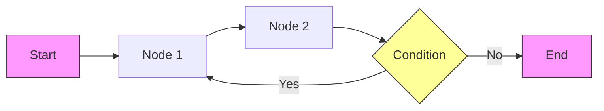

# 00. LangGraph 개념 및 LangChain 필수 요소

LangGraph 학습을 시작하기 전에 알아야 할 LangChain의 핵심 개념과 LangGraph의 특징을 설명합니다.

---

## 📚 1. LangGraph란?

**LangGraph**는 LLM(Large Language Model)을 이용해 **상태를 유지하는(Stateful) 다중 행위자(Multi-Actor) 애플리케이션**을 구축하기 위한 라이브러리입니다.

LangChain 생태계의 일부로, 복잡한 에이전트(Agent) 워크플로우를 **그래프(Graph)** 형태로 모델링할 수 있게 해줍니다.

### 왜 LangGraph가 필요한가요?
기존의 LangChain 체인(Chain)은 주로 **DAG(Directed Acyclic Graph, 순환 없는 방향 그래프)** 구조였습니다. 즉, 데이터가 한 방향으로만 흐르고, 이전 단계로 되돌아가는 루프(Loop)를 구현하기 어려웠습니다.

하지만 실제 에이전트는 다음과 같은 동작이 필요합니다:
- 결과가 만족스럽지 않으면 **다시 생각하기** (Loop)
- 여러 작업을 **병렬로 수행하고 합치기** (Parallel execution & Merge)
- 상황에 따라 **다른 경로 선택하기** (Conditional Branching)
- 대화의 **맥락(Context) 유지하기** (State persistence)

LangGraph는 이러한 요구사항을 해결하기 위해 등장했습니다.

---

## ⚖️ 2. LangChain vs LangGraph

| 특징 | LangChain (Chain) | LangGraph |
|:---:|:---|:---|
| **구조** | 선형적 파이프라인 (Linear Pipeline) | 순환 그래프 (Cyclic Graph) |
| **흐름 제어** | A → B → C (일방향) | A → B → (조건) → A (루프 가능) |
| **상태 관리** | 주로 메모리(Memory) 모듈에 의존 | 명시적인 **State** 객체로 관리 |
| **제어권** | 프레임워크가 흐름을 제어 | 개발자가 그래프 구조로 제어 |
| **비유** | 조립 라인 (Assembly Line) | 자율 주행 내비게이션 |

---

## 🛠️ 3. LangChain 필수 요소 (Prerequisites)

LangGraph를 사용하기 위해 꼭 알아야 할 LangChain의 4가지 핵심 요소입니다.

### 1) Chat Model (채팅 모델)
LLM과 상호작용하는 인터페이스입니다.
```python
from langchain_openai import ChatOpenAI

# OpenAI 호환 모델 (Local LLM 포함)
llm = ChatOpenAI(model="gpt-4o-mini", temperature=0)
```

### 2) Prompt Template (프롬프트 템플릿)
LLM에게 보낼 메시지 형식을 정의합니다.
```python
from langchain_core.prompts import ChatPromptTemplate

prompt = ChatPromptTemplate.from_messages([
    ("system", "당신은 {role}입니다."),
    ("human", "{question}")
])
```

### 3) Tools (도구)
에이전트가 외부 세상과 상호작용하기 위한 함수입니다.
```python
from langchain_core.tools import tool

@tool
def search(query: str):
    """인터넷 검색을 수행합니다."""
    return f"{query}에 대한 검색 결과..."

# LLM에 도구 바인딩
llm_with_tools = llm.bind_tools([search])
```

### 4) Messages (메시지)
대화 내용을 구성하는 기본 단위입니다.
- `SystemMessage`: AI의 역할 정의
- `HumanMessage`: 사용자 입력
- `AIMessage`: AI의 응답 (도구 호출 포함)
- `ToolMessage`: 도구 실행 결과

---

## 🌐 4. LangGraph 핵심 구조

LangGraph는 **State(상태)**, **Node(노드)**, **Edge(엣지)** 세 가지로 구성됩니다.



### 1) State (상태)
그래프의 모든 노드가 공유하는 데이터 저장소입니다. 주로 `TypedDict`나 `MessagesState`를 사용합니다.

```python
from typing import TypedDict, List
from langchain_core.messages import BaseMessage

class AgentState(TypedDict):
    messages: List[BaseMessage]
    count: int
```

### 2) Node (노드)
실제 작업을 수행하는 함수입니다. 현재 `State`를 입력받아 업데이트할 값을 반환합니다.

```python
def my_node(state: AgentState):
    # 작업 수행
    new_count = state["count"] + 1
    # 변경된 상태 반환 (기존 상태에 병합됨)
    return {"count": new_count}
```

### 3) Edge (엣지)
노드와 노드를 연결합니다.
- **Normal Edge**: 항상 A에서 B로 이동 (`add_edge("A", "B")`)
- **Conditional Edge**: 조건에 따라 이동 경로 결정 (`add_conditional_edges`)

```python
# 조건부 분기 예시
def router(state):
    if state["count"] > 5:
        return "end"
    return "loop"

graph.add_conditional_edges("node_a", router, {"end": END, "loop": "node_b"})
```

---

## 🚀 학습 로드맵 제안

이제 다음 순서대로 예제를 실습해보세요:

1. **01_basic_agent.py**: LangGraph의 기본 구조와 도구 사용법 익히기
2. **02_naive_rag.py**: 문서 검색과 생성을 연결하는 파이프라인 만들기
3. **03_entity_rag.py**: 복잡한 병렬 실행(Parallel Execution) 구현하기
4. **04_advanced_rag.py**: 루프와 자기 수정을 통한 고급 패턴 익히기
