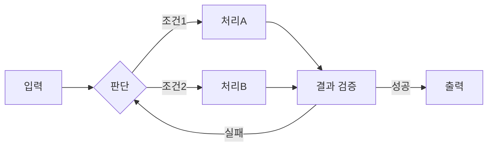
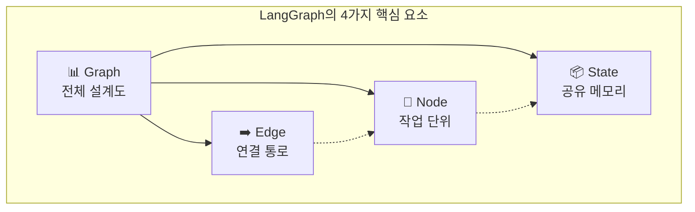
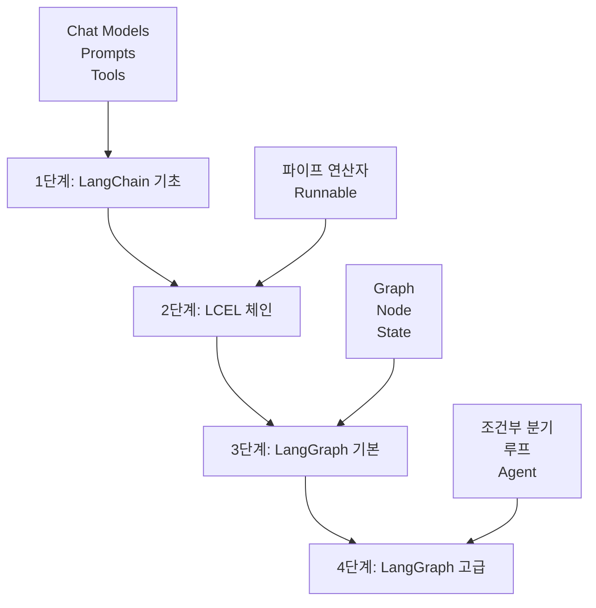

# 🚀 LangChain & LangGraph 완벽 가이드

초보자를 위한 LangChain부터 LangGraph까지의 완벽한 학습 가이드입니다.

---

## 📋 목차

- [1. LangChain 소개](#1-langchain-소개)
  - [LangChain이란?](#langchain이란)
  - [핵심 컴포넌트](#핵심-컴포넌트)
- [2. LCEL (LangChain Expression Language) 완벽 가이드](#2-lcel-langchain-expression-language-완벽-가이드)
  - [LCEL이란?](#lcel이란)
  - [Runnable 인터페이스](#runnable-인터페이스)
  - [LCEL 실습 예제](#lcel-실습-예제)
- [3. LangChain의 한계와 LangGraph의 등장](#3-langchain의-한계와-langgraph의-등장)
- [4. LangGraph 핵심 개념](#4-langgraph-핵심-개념)
- [5. LangGraph 단계별 학습 예제](#5-langgraph-단계별-학습-예제)
- [6. LangGraph API 상세 레퍼런스](#6-langgraph-api-상세-레퍼런스)
- [7. 그래프 패턴 모음](#7-그래프-패턴-모음)
- [8. 학습 로드맵](#8-학습-로드맵)

---

## 1. LangChain 소개

### LangChain이란?

**LangChain**은 대규모 언어 모델(LLM)을 활용한 애플리케이션을 쉽게 개발할 수 있도록 도와주는 **오픈소스 프레임워크**입니다.

#### 왜 LangChain이 필요한가요?

LLM을 직접 사용하면 다음과 같은 어려움이 있습니다:

- 🔧 **복잡한 통합**: 다양한 LLM 제공자(OpenAI, Anthropic, Ollama 등)마다 API가 다름
- 📝 **프롬프트 관리**: 효과적인 프롬프트 작성과 재사용이 어려움
- 🔗 **워크플로우 구성**: 여러 단계를 연결하는 파이프라인 구축이 복잡함
- 🛠️ **도구 연동**: 외부 API, 데이터베이스 등과의 통합이 번거로움

LangChain은 이러한 문제들을 해결하는 **통합 인터페이스**를 제공합니다.

### 핵심 컴포넌트

LangChain의 주요 구성 요소를 알아봅시다.

#### 1) Chat Models (채팅 모델)

LLM과 상호작용하는 통일된 인터페이스입니다.

```python
# OpenAI 호환 모델 (Local LLM 포함)
from langchain_openai import ChatOpenAI

llm = ChatOpenAI(
    model="gpt-4o-mini",
    temperature=0.7,  # 창의성 조절 (0~1)
    max_tokens=1000   # 최대 응답 길이
)

# Ollama (로컬 오픈소스 LLM)
from langchain_ollama import ChatOllama

llm = ChatOllama(
    model="llama3",
    temperature=0
)
```

#### 2) Prompts & Prompt Templates (프롬프트 템플릿)

재사용 가능한 프롬프트를 정의합니다.

```python
from langchain_core.prompts import ChatPromptTemplate

# 기본 템플릿
prompt = ChatPromptTemplate.from_messages([
    ("system", "당신은 {role}입니다."),
    ("human", "{question}")
])

# 사용 예시
formatted = prompt.invoke({
    "role": "친절한 AI 어시스턴트",
    "question": "LangChain이 뭐야?"
})
print(formatted)
# 출력:
# [SystemMessage(content='당신은 친절한 AI 어시스턴트입니다.'),
#  HumanMessage(content='LangChain이 뭐야?')]
```

#### 3) Output Parsers (출력 파서)

LLM 응답을 원하는 형식으로 변환합니다.

```python
from langchain_core.output_parsers import StrOutputParser, JsonOutputParser
from langchain_core.pydantic_v1 import BaseModel, Field

# 문자열 파서 (기본)
parser = StrOutputParser()

# JSON 파서 (구조화된 데이터)
class Person(BaseModel):
    name: str = Field(description="사람의 이름")
    age: int = Field(description="사람의 나이")

json_parser = JsonOutputParser(pydantic_object=Person)

# 파서 사용
prompt_with_format = ChatPromptTemplate.from_messages([
    ("system", "다음 형식으로 응답하세요:\n{format_instructions}"),
    ("human", "{query}")
])

# format_instructions 자동 생성
format_instructions = json_parser.get_format_instructions()
```

#### 4) Tools (도구)

LLM이 외부 세계와 상호작용할 수 있게 해주는 함수입니다.

```python
from langchain_core.tools import tool

@tool
def search_web(query: str) -> str:
    """웹에서 정보를 검색합니다.
    
    Args:
        query: 검색할 키워드
    
    Returns:
        str: 검색 결과
    """
    # 실제로는 검색 API 호출
    return f"{query}에 대한 검색 결과..."

@tool
def calculate(expression: str) -> str:
    """수학 표현식을 계산합니다.
    
    Args:
        expression: 계산할 표현식 (예: "2 + 2")
    
    Returns:
        str: 계산 결과
    """
    try:
        result = eval(expression)  # 주의: 프로덕션에서는 안전한 파서 사용
        return f"결과: {result}"
    except Exception as e:
        return f"오류: {e}"

# 도구 목록
tools = [search_web, calculate]

# LLM에 도구 바인딩
llm_with_tools = llm.bind_tools(tools)
```

#### 5) Messages (메시지)

대화를 구성하는 기본 단위입니다.

```python
from langchain_core.messages import (
    SystemMessage,  # AI의 역할/규칙 정의
    HumanMessage,   # 사용자 입력
    AIMessage,      # AI 응답
    ToolMessage     # 도구 실행 결과
)

# 대화 구성 예시
messages = [
    SystemMessage(content="당신은 수학 전문가입니다."),
    HumanMessage(content="2 + 2는?"),
    AIMessage(content="4입니다."),
    HumanMessage(content="10 곱하기 5는?")
]

# LLM 호출
response = llm.invoke(messages)
print(response.content)  # "50입니다."
```

---

## 2. LCEL (LangChain Expression Language) 완벽 가이드

### LCEL이란?

**LCEL** (LangChain Expression Language)은 LangChain 컴포넌트들을 **체인(Chain)**으로 연결하는 **선언적(Declarative) 문법**입니다.

#### LCEL의 핵심 철학

```python
# ❌ 전통적인 방식 (명령형)
result1 = prompt.format(question="안녕?")
result2 = llm.invoke(result1)
result3 = parser.parse(result2)

# ✅ LCEL 방식 (선언형)
chain = prompt | llm | parser
result = chain.invoke({"question": "안녕?"})
```

**장점:**
- 📖 **읽기 쉬움**: 파이프라인의 흐름이 명확
- 🔄 **재사용 가능**: 체인을 변수로 저장하고 재사용
- ⚡ **자동 최적화**: LangChain이 내부적으로 병렬 처리 등 최적화
- 🔧 **스트리밍 지원**: `.stream()` 메서드로 실시간 응답 가능

### Runnable 인터페이스

LCEL의 모든 컴포넌트는 **Runnable 인터페이스**를 구현합니다.

#### Runnable의 핵심 메서드

```python
from langchain_core.runnables import Runnable

# 모든 Runnable은 다음 메서드를 가짐:

# 1. invoke() - 동기 실행
result = chain.invoke(input_data)

# 2. ainvoke() - 비동기 실행
result = await chain.ainvoke(input_data)

# 3. stream() - 스트리밍 실행
for chunk in chain.stream(input_data):
    print(chunk, end="", flush=True)

# 4. batch() - 배치 실행
results = chain.batch([input1, input2, input3])
```

### LCEL 실습 예제

단계적으로 LCEL을 익혀봅시다.

#### Step 1: 간단한 Prompt + LLM 체인

```python
from langchain_openai import ChatOpenAI
from langchain_core.prompts import ChatPromptTemplate

# 1. 컴포넌트 정의
llm = ChatOpenAI(model="gpt-4o-mini", temperature=0)

prompt = ChatPromptTemplate.from_messages([
    ("system", "당신은 친절한 번역가입니다."),
    ("human", "{text}를 {language}로 번역해주세요.")
])

# 2. 체인 구성 (파이프 연산자 |)
chain = prompt | llm

# 3. 실행
result = chain.invoke({
    "text": "Hello, World!",
    "language": "한국어"
})

print(result.content)
# 출력: "안녕하세요, 세계!"
```

**파이프 연산자 `|`의 의미:**
- `A | B`: "A의 출력을 B의 입력으로 전달"
- `prompt | llm`: "프롬프트 결과를 LLM에 전달"

#### Step 2: Output Parser 추가

```python
from langchain_core.output_parsers import StrOutputParser

# 파서 추가: LLM 응답에서 문자열만 추출
parser = StrOutputParser()

# 체인 확장
chain = prompt | llm | parser

# 실행
result = chain.invoke({
    "text": "Thank you",
    "language": "일본어"
})

print(result)  # 이제 문자열만 반환됨
# 출력: "ありがとうございます"
```

#### Step 3: 복잡한 체인 구성

```python
from langchain_core.runnables import RunnableLambda

# 커스텀 로직을 체인에 추가
def uppercase_text(text: str) -> str:
    """텍스트를 대문자로 변환"""
    return text.upper()

def add_emoji(text: str) -> str:
    """이모지 추가"""
    return f"✨ {text} ✨"

# 여러 단계 체인
chain = (
    prompt 
    | llm 
    | StrOutputParser() 
    | RunnableLambda(uppercase_text)  # 커스텀 함수
    | RunnableLambda(add_emoji)
)

result = chain.invoke({
    "text": "Hello",
    "language": "스페인어"
})

print(result)
# 출력: "✨ HOLA ✨"
```

#### Step 4: 조건부 체인 (RunnableBranch)

```python
from langchain_core.runnables import RunnableBranch

# 입력 언어에 따라 다른 처리
formal_prompt = ChatPromptTemplate.from_template(
    "다음을 격식있게 번역: {text}"
)
casual_prompt = ChatPromptTemplate.from_template(
    "다음을 캐주얼하게 번역: {text}"
)

# 조건부 분기
branch = RunnableBranch(
    (lambda x: x.get("formal", False), formal_prompt | llm | parser),
    casual_prompt | llm | parser  # 기본값
)

# 격식있는 번역
result1 = branch.invoke({"text": "Hello", "formal": True})

# 캐주얼한 번역
result2 = branch.invoke({"text": "Hello", "formal": False})
```

#### Step 5: 병렬 실행 (RunnableParallel)

```python
from langchain_core.runnables import RunnableParallel

# 여러 언어로 동시 번역
translate_ko = ChatPromptTemplate.from_template("{text}를 한국어로") | llm | parser
translate_ja = ChatPromptTemplate.from_template("{text}를 일본어로") | llm | parser
translate_es = ChatPromptTemplate.from_template("{text}를 스페인어로") | llm | parser

# 병렬 체인
parallel_chain = RunnableParallel(
    korean=translate_ko,
    japanese=translate_ja,
    spanish=translate_es
)

# 한번에 3개 언어로 번역
results = parallel_chain.invoke({"text": "Good morning"})

print(results)
# 출력:
# {
#     'korean': '좋은 아침',
#     'japanese': 'おはようございます',
#     'spanish': 'Buenos días'
# }
```

---

## 3. LangChain의 한계와 LangGraph의 등장

### LangChain의 한계

LangChain과 LCEL은 강력하지만, **선형 구조(Linear Pipeline)**에 최적화되어 있습니다.

```
[입력] → [처리1] → [처리2] → [처리3] → [출력]
```

이 구조는 간단한 작업에는 충분하지만, 다음과 같은 상황에서 한계가 있습니다:

> [!WARNING]
> **LangChain/LCEL만으로 구현하기 어려운 것들**
> - ❌ 결과에 따라 **다른 경로로 분기**해야 할 때
> - ❌ 실패 시 **이전 단계로 돌아가**야 할 때 (루프)
> - ❌ 여러 작업을 **병렬로 실행하고 결과를 합쳐**야 할 때
> - ❌ **복잡한 상태**를 여러 단계에서 공유하고 수정해야 할 때
> - ❌ Agent가 **스스로 판단**하여 도구를 반복 호출해야 할 때

### LangGraph의 등장

**LangGraph**는 이러한 한계를 극복하기 위해 등장했습니다. **그래프(Graph)** 구조로 복잡한 워크플로우를 표현할 수 있습니다.



### LangChain vs LangGraph 비교

| 특징 | LangChain (LCEL) | LangGraph |
|:---:|:---|:---|
| **구조** | 선형 파이프라인 | 순환 그래프 |
| **흐름 제어** | A → B → C (일방향) | A → B → A (루프 가능) |
| **상태 관리** | 체인 간 전달 | 명시적 State 객체 |
| **분기** | 제한적 (RunnableBranch) | 자유로운 조건부 분기 |
| **루프** | 불가능 | 가능 (자기 수정 Agent) |
| **제어권** | 프레임워크 주도 | 개발자가 그래프로 명시 |
| **비유** | 🏭 조립 라인 | 🗺️ 의사결정 플로우차트 |
| **적합한 용도** | 단순 파이프라인, RAG | **AI Agent**, 복잡한 워크플로우 |

> [!TIP]
> **Agent란?**
> 스스로 판단하여 도구를 선택하고, 결과를 확인하고, 필요하면 다시 시도하는 "자율적인 AI"입니다.
> LangGraph는 이런 Agent를 만들기 위해 설계되었습니다.

---

## 4. LangGraph 핵심 개념

LangGraph를 이해하려면 **4가지 핵심 개념**만 알면 됩니다.



### 1. 그래프(Graph) - 전체 설계도

**그래프**는 전체 워크플로우의 "지도"입니다.

```python
from langgraph.graph import StateGraph

# 그래프 생성 (상태 스키마 전달)
graph = StateGraph(MyState)
```

**비유**: 그래프는 **건물 설계도**와 같습니다.

### 2. 노드(Node) - 작업 단위

**노드**는 실제로 무언가를 수행하는 "작업 단위"입니다.

```python
def my_task(state):
    """
    노드 함수의 규칙:
    - 입력: 현재 상태(state)
    - 출력: 업데이트할 상태만 딕셔너리로 반환
    """
    current_value = state["count"]
    new_value = current_value + 1
    return {"count": new_value}

# 그래프에 노드 추가
graph.add_node("my_task", my_task)
```

**비유**: 노드는 **공장의 작업자**입니다.

### 3. 엣지(Edge) - 연결 통로

**엣지**는 노드와 노드를 연결하는 "통로"입니다.

#### 일반 엣지 (무조건 이동)
```python
from langgraph.graph import START, END

graph.add_edge(START, "node_a")      # 시작 → node_a
graph.add_edge("node_a", "node_b")   # node_a → node_b
graph.add_edge("node_b", END)        # node_b → 종료
```

#### 조건부 엣지 (조건에 따라 분기)
```python
from typing import Literal

def router(state) -> Literal["path_a", "path_b", END]:
    if state["score"] >= 80:
        return "path_a"
    elif state["score"] >= 50:
        return "path_b"
    return END

graph.add_conditional_edges("check", router)
```

**비유**:
- 일반 엣지 = **일방통행 도로**
- 조건부 엣지 = **교차로**

### 4. 상태(State) - 공유 메모리

**상태**는 그래프의 모든 노드가 함께 사용하는 "공유 메모리"입니다.

```python
from typing import TypedDict

class MyState(TypedDict):
    question: str      # 사용자 질문
    answer: str        # AI 답변
    count: int         # 시도 횟수
    documents: list    # 검색된 문서들
```

**비유**: 상태는 **회사의 공유 문서함**입니다.

> [!NOTE]
> **MessagesState - 챗봇용 특수 상태**
> LangGraph는 챗봇 개발에 편리한 `MessagesState`를 제공합니다.
> ```python
> from langgraph.graph import MessagesState
> 
> # MessagesState를 사용하면 messages 필드가 자동 정의됨
> graph = StateGraph(MessagesState)
> ```

---

## 5. LangGraph 단계별 학습 예제

이제 실제 코드를 통해 LangGraph를 익혀봅시다.

### Step 1: 가장 단순한 그래프

**목표**: 노드 1개만 있는 가장 단순한 그래프 만들기

```python
from typing import TypedDict
from langgraph.graph import StateGraph, START, END

class SimpleState(TypedDict):
    message: str

def greet(state: SimpleState) -> dict:
    """인사 메시지를 생성하는 노드"""
    greeting = f"안녕하세요! 당신의 메시지: '{state['message']}'"
    return {"message": greeting}

# 그래프 구성
graph = StateGraph(SimpleState)
graph.add_node("greet", greet)
graph.add_edge(START, "greet")
graph.add_edge("greet", END)

app = graph.compile()
result = app.invoke({"message": "LangGraph 배우는 중!"})
```

### Step 2: 조건부 분기 구현

**목표**: 상태 값에 따라 다른 경로로 분기하기

```python
from typing import Literal
from langgraph.graph import StateGraph, START, END

class GradeState(TypedDict):
    score: int
    grade: str

def grade_router(state: GradeState) -> Literal["excellent", "good", "needs_work"]:
    """점수에 따라 다음 노드 결정"""
    if state["score"] >= 90:
        return "excellent"
    elif state["score"] >= 70:
        return "good"
    return "needs_work"

# 그래프 구성
graph = StateGraph(GradeState)
graph.add_node("check_score", lambda s: {})
graph.add_node("excellent", lambda s: {"grade": "A"})
graph.add_node("good", lambda s: {"grade": "B"})
graph.add_node("needs_work", lambda s: {"grade": "C"})

graph.add_edge(START, "check_score")
graph.add_conditional_edges("check_score", grade_router)
graph.add_edge("excellent", END)
graph.add_edge("good", END)
graph.add_edge("needs_work", END)

app = graph.compile()
```

### Step 3: 완전한 Agent (도구 호출 + 루프)

**목표**: LLM + 도구 + 루프를 활용한 Agent 구현

```python
from typing import Literal
from langchain_core.messages import HumanMessage
from langchain_core.tools import tool
from langgraph.graph import StateGraph, MessagesState, START, END
from langgraph.prebuilt import ToolNode
from utils.llm_factory import get_llm

llm = get_llm()

# 도구 정의
@tool
def get_weather(city: str) -> str:
    """도시의 날씨를 반환합니다."""
    return f"{city}: 맑음, 15°C"

tools = [get_weather]
llm_with_tools = llm.bind_tools(tools)

# 노드 함수
def agent_node(state: MessagesState) -> dict:
    response = llm_with_tools.invoke(state["messages"])
    return {"messages": [response]}

def should_continue(state: MessagesState) -> Literal["tools", END]:
    last_message = state["messages"][-1]
    if hasattr(last_message, "tool_calls") and last_message.tool_calls:
        return "tools"
    return END

# 그래프 구성
graph = StateGraph(MessagesState)
graph.add_node("agent", agent_node)
graph.add_node("tools", ToolNode(tools))

graph.add_edge(START, "agent")
graph.add_conditional_edges("agent", should_continue)
graph.add_edge("tools", "agent")  # 루프!

app = graph.compile()

# 실행
result = app.invoke({"messages": [HumanMessage(content="서울 날씨는?")]})
```

---

## 6. LangGraph API 상세 레퍼런스

### Graph 구성

#### StateGraph

```python
from langgraph.graph import StateGraph

class MyState(TypedDict):
    data: str

graph = StateGraph(MyState)
```

**주요 메서드:**
- `add_node()` - 노드 추가
- `add_edge()` - 엣지 추가  
- `add_conditional_edges()` - 조건부 엣지 추가
- `compile()` - 컴파일

#### MessagesState

```python
from langgraph.graph import MessagesState

# messages 필드가 자동 정의됨
graph = StateGraph(MessagesState)
```

### Node 관리

#### add_node()

```python
def my_node(state: MyState) -> dict:
    return {"data": "updated"}

graph.add_node("node_name", my_node)
```

#### ToolNode

```python
from langgraph.prebuilt import ToolNode

tools = [search, calculate]
tool_node = ToolNode(tools)
graph.add_node("tools", tool_node)
```

### Edge 관리

#### add_edge()

```python
from langgraph.graph import START, END

graph.add_edge(START, "node_a")
graph.add_edge("node_a", END)
```

#### add_conditional_edges()

```python
def router(state) -> Literal["path_a", END]:
    if state["condition"]:
        return "path_a"
    return END

graph.add_conditional_edges("node", router)
```

### 실행

#### compile()

```python
compiled = graph.compile()

# 메모리 사용
from langgraph.checkpoint.memory import MemorySaver
memory = MemorySaver()
compiled = graph.compile(checkpointer=memory)
```

#### invoke()

```python
result = compiled.invoke({"question": "안녕?"})

# thread_id 사용
config = {"configurable": {"thread_id": "session-1"}}
result = compiled.invoke({"question": "안녕?"}, config)
```

#### stream()

```python
for event in compiled.stream({"question": "안녕?"}):
    print(event)
```

---

## 7. 그래프 패턴 모음

### 1. 단순 순차 실행

```python
graph.add_edge(START, "step1")
graph.add_edge("step1", "step2")
graph.add_edge("step2", END)
```

### 2. 조건부 분기

```python
graph.add_edge(START, "check")
graph.add_conditional_edges("check", router)
graph.add_edge("path_a", END)
graph.add_edge("path_b", END)
```

### 3. 루프 (자기 수정)

```python
graph.add_edge(START, "process")
graph.add_conditional_edges("process", should_retry)
graph.add_edge("retry", "process")  # 루프!
```

### 4. 병렬 실행

```python
graph.add_edge(START, "branch_a")
graph.add_edge(START, "branch_b")
graph.add_edge(["branch_a", "branch_b"], "merge")
graph.add_edge("merge", END)
```

### 5. Agent 루프 (도구 호출)

```python
graph.add_edge(START, "agent")
graph.add_conditional_edges("agent", should_continue)
graph.add_edge("tools", "agent")  # 루프!
```

---

## 8. 학습 로드맵

### 추천 학습 순서



### 1단계: LangChain 기초

**학습 내용:**
- Chat Models, Prompt Templates, Tools

**실습 예제:**
- `examples/01_base_agent_standard.py`
- `examples/01_base_agent_react.py`

### 2단계: LCEL 체인

**학습 내용:**
- Runnable 인터페이스
- 파이프 연산자(`|`) 활용

**실습:**
- 본 문서의 LCEL 예제들

### 3단계: LangGraph 기본

**학습 내용:**
- Graph, Node, Edge, State
- 단순 그래프 구성

**실습:**
- Step 1~2 예제

### 4단계: LangGraph 고급

**학습 내용:**
- 조건부 분기, 루프, Agent

**실습 예제:**
- Step 3 예제
- `examples/02_naive_rag.py`
- `examples/04_advanced_rag.py`

---

## 📚 참고 자료

- [LangChain 공식 문서](https://python.langchain.com/)
- [LangGraph 공식 문서](https://langchain-ai.github.io/langgraph/)
- [LangGraph GitHub](https://github.com/langchain-ai/langgraph)
- [LCEL 가이드](https://python.langchain.com/docs/expression_language/)

---

> [!TIP]
> **다음 단계**
> 
> 이 문서를 읽었다면 실제 예제 코드를 실행해보세요!
> 
> 1. `examples/01_base_agent_standard.py` - LangChain 기본
> 2. `examples/02_naive_rag.py` - LangGraph RAG
> 3. `examples/04_advanced_rag.py` - 고급 Agent 패턴

