# 🔧 LangGraph 완벽 가이드 - 초심자를 위한 API 레퍼런스

LangGraph의 핵심 개념부터 실전 예제까지, 처음 시작하는 분들을 위한 완벽 가이드입니다.

---

## 📋 목차

- [🎯 왜 LangGraph인가? - LangChain과의 차이](#-왜-langgraph인가---langchain과의-차이)
- [📐 핵심 개념 완전 정복](#-핵심-개념-완전-정복)
  - [그래프(Graph)](#1-그래프graph---전체-설계도)
  - [노드(Node)](#2-노드node---작업-단위)
  - [엣지(Edge)](#3-엣지edge---연결-통로)
  - [상태(State)](#4-상태state---공유-메모리)
- [🚀 단계별 학습 예제](#-단계별-학습-예제)
  - [Step 1: 가장 단순한 그래프](#step-1-가장-단순한-그래프)
  - [Step 2: 순차 실행 그래프](#step-2-순차-실행-그래프)
  - [Step 3: 상태(State) 활용](#step-3-상태state-활용하기)
  - [Step 4: 조건부 분기](#step-4-조건부-분기-구현)
  - [Step 5: 완전한 Agent](#step-5-완전한-도구-호출-agent)
- [📚 API 상세 레퍼런스](#-api-상세-레퍼런스)
- [🔷 그래프 패턴 모음](#-그래프-패턴-모음)

---

## 🎯 왜 LangGraph인가? - LangChain과의 차이

### LangChain의 한계

LangChain은 LLM 애플리케이션을 빠르게 만들 수 있는 훌륭한 프레임워크입니다. 하지만 **"체인(Chain)"** 이라는 이름처럼, 기본적으로 **일직선(선형)** 구조입니다.

```
[입력] → [처리1] → [처리2] → [처리3] → [출력]
```

이 구조는 간단한 작업에는 충분하지만, 다음과 같은 상황에서 한계가 있습니다:

> [!WARNING]
> **LangChain만으로 구현하기 어려운 것들**
> - 결과에 따라 다른 경로로 분기해야 할 때
> - 실패 시 이전 단계로 돌아가야 할 때 (루프)
> - 여러 작업을 병렬로 실행해야 할 때
> - 복잡한 상태를 여러 단계에서 공유해야 할 때

### LangGraph의 등장

LangGraph는 **"그래프(Graph)"** 구조로 이 문제를 해결합니다.

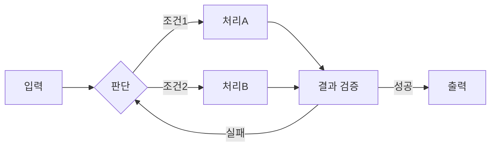

### 비유로 이해하기

| 개념 | LangChain (Chain) | LangGraph (Graph) |
|------|-------------------|-------------------|
| 비유 | 🏭 공장 조립 라인 | 🗺️ 의사결정 플로우차트 |
| 흐름 | 한 방향으로만 진행 | 분기, 루프, 병렬 가능 |
| 상태 | 다음 단계로만 전달 | 모든 노드가 공유 |
| 적합한 용도 | 단순 파이프라인 | **AI Agent**, 복잡한 워크플로우 |

> [!TIP]
> **Agent란?**
> 스스로 판단하여 도구를 선택하고, 결과를 확인하고, 필요하면 다시 시도하는 "자율적인 AI"입니다.
> LangGraph는 이런 Agent를 만들기 위해 설계되었습니다.

---

## 📐 핵심 개념 완전 정복

LangGraph를 이해하려면 **4가지 핵심 개념**만 알면 됩니다.

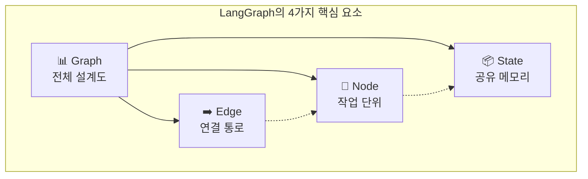

### 1. 그래프(Graph) - 전체 설계도

**그래프**는 전체 워크플로우의 "지도"입니다. 어떤 작업들이 있고, 어떻게 연결되는지를 정의합니다.

```python
from langgraph.graph import StateGraph

# 그래프 생성 (설계도 준비)
graph = StateGraph(MyState)  # MyState는 상태 정의
```

**비유**: 그래프는 **건물 설계도**와 같습니다. 어떤 방(노드)들이 있고, 복도(엣지)로 어떻게 연결되는지 그립니다.

### 2. 노드(Node) - 작업 단위

**노드**는 실제로 무언가를 수행하는 "작업 단위"입니다. Python 함수 하나가 노드 하나가 됩니다.

```python
# 노드로 사용할 함수 정의
def my_task(state):
    """
    노드 함수의 규칙:
    1. 입력: 현재 상태(state)를 받습니다
    2. 출력: 업데이트할 상태만 딕셔너리로 반환합니다
    """
    current_value = state["count"]       # 상태에서 값 읽기
    new_value = current_value + 1        # 작업 수행
    return {"count": new_value}          # 변경된 부분만 반환

# 그래프에 노드 추가
graph.add_node("my_task", my_task)
```

**비유**: 노드는 **공장의 작업자**입니다. 각자 맡은 일을 수행하고, 결과를 다음 사람에게 넘깁니다.

> [!IMPORTANT]
> **노드 함수의 반환값**
> 노드 함수는 **변경하고 싶은 상태 필드만** 딕셔너리로 반환합니다.
> 반환하지 않은 필드는 기존 값이 유지됩니다.

### 3. 엣지(Edge) - 연결 통로

**엣지**는 노드와 노드를 연결하는 "통로"입니다. 두 가지 종류가 있습니다:

#### 3-1. 일반 엣지 (무조건 이동)
```python
from langgraph.graph import START, END

# START: 그래프의 시작점 (특수 상수)
# END: 그래프의 종료점 (특수 상수)

graph.add_edge(START, "first_node")      # 시작 → 첫 노드
graph.add_edge("first_node", "second")   # 첫 노드 → 두 번째
graph.add_edge("second", END)            # 두 번째 → 종료
```

#### 3-2. 조건부 엣지 (조건에 따라 분기)
```python
from typing import Literal

# 라우터 함수: 다음에 어디로 갈지 결정
def router(state) -> Literal["path_a", "path_b", END]:
    if state["score"] >= 80:
        return "path_a"   # 80점 이상이면 A 경로
    elif state["score"] >= 50:
        return "path_b"   # 50점 이상이면 B 경로
    return END            # 50점 미만이면 종료

# 조건부 엣지 추가
graph.add_conditional_edges("check_score", router)
```

**비유**: 
- 일반 엣지는 **일방통행 도로** - 무조건 다음 장소로 이동
- 조건부 엣지는 **교차로** - 표지판을 보고 방향 선택

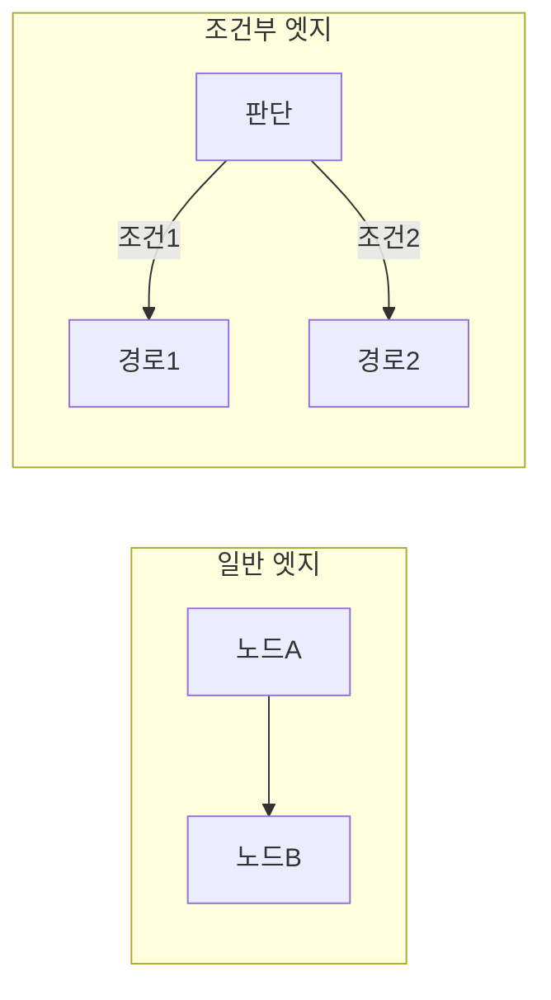

### 4. 상태(State) - 공유 메모리

**상태**는 그래프의 모든 노드가 함께 사용하는 "공유 메모리"입니다.

```python
from typing import TypedDict

# 상태 정의 (어떤 데이터를 저장할지 설계)
class MyState(TypedDict):
    question: str      # 사용자 질문
    answer: str        # AI 답변
    count: int         # 시도 횟수
    documents: list    # 검색된 문서들
```

**비유**: 상태는 **회사의 공유 문서함**입니다. 모든 직원(노드)이 문서를 읽고 수정할 수 있습니다.

> [!NOTE]
> **MessagesState - 챗봇용 특수 상태**
> LangGraph는 챗봇 개발에 편리한 `MessagesState`를 제공합니다.
> 이 상태는 `messages` 리스트에 대화 내용이 자동으로 누적됩니다.
> ```python
> from langgraph.graph import MessagesState
> 
> # MessagesState를 사용하면 messages 필드가 자동 정의됨
> graph = StateGraph(MessagesState)
> ```

---

## 🚀 단계별 학습 예제

이제 실제 코드를 통해 LangGraph를 익혀봅시다. 가장 단순한 것부터 시작해서 점점 복잡한 구조로 발전합니다.

### Step 1: 가장 단순한 그래프

**목표**: 노드 1개만 있는 가장 단순한 그래프 만들기

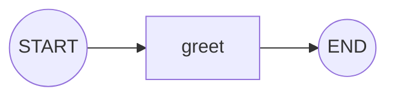

```python
# ============================================================
# Step 1: 가장 단순한 그래프 - 노드 1개
# ============================================================
# 목표: LangGraph의 기본 구조 이해
#       START → 노드 → END 흐름 파악
# ============================================================

from typing import TypedDict
from langgraph.graph import StateGraph, START, END

# ----- 1단계: 상태 정의 -----
# TypedDict로 그래프에서 사용할 데이터 구조를 정의합니다
class SimpleState(TypedDict):
    message: str  # 메시지를 저장할 필드

# ----- 2단계: 노드 함수 정의 -----
# 노드 = 실제 작업을 수행하는 함수
def greet(state: SimpleState) -> dict:
    """
    인사 메시지를 생성하는 노드입니다.
    
    Args:
        state: 현재 상태 딕셔너리
               - message: 입력 메시지
    
    Returns:
        dict: 업데이트할 상태 (message 필드)
    """
    # 현재 상태에서 메시지 읽기
    input_message = state["message"]
    
    # 인사 메시지 생성
    greeting = f"안녕하세요! 당신의 메시지: '{input_message}'"
    
    # 변경할 상태만 반환 (기존 상태와 병합됨)
    return {"message": greeting}

# ----- 3단계: 그래프 구성 -----
# StateGraph 객체 생성 (상태 스키마 전달)
graph = StateGraph(SimpleState)

# 노드 추가: add_node(이름, 함수)
graph.add_node("greet", greet)

# 엣지 추가: 시작점 → greet → 종료점
graph.add_edge(START, "greet")  # 시작하면 greet 노드로
graph.add_edge("greet", END)    # greet 완료 후 종료

# ----- 4단계: 컴파일 -----
# compile()을 호출하면 실행 가능한 그래프가 됩니다
app = graph.compile()

# ----- 5단계: 실행 -----
# 초기 상태를 전달하여 그래프 실행
initial_state = {"message": "LangGraph 배우는 중!"}
result = app.invoke(initial_state)

print(result)
# 출력: {'message': "안녕하세요! 당신의 메시지: 'LangGraph 배우는 중!'"}
```

**핵심 포인트**:
- `StateGraph(상태)`: 그래프 빌더 생성
- `add_node(이름, 함수)`: 노드 추가
- `add_edge(시작, 끝)`: 연결 추가
- `compile()`: 실행 가능하게 변환
- `invoke(초기상태)`: 그래프 실행

---

### Step 2: 순차 실행 그래프

**목표**: 여러 노드를 순서대로 연결하기

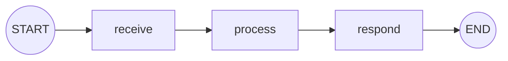

```python
# ============================================================
# Step 2: 순차 실행 그래프 - 여러 노드 연결
# ============================================================
# 목표: 여러 노드를 순서대로 연결하는 방법 학습
#       각 노드가 상태를 어떻게 업데이트하는지 이해
# ============================================================

from typing import TypedDict
from langgraph.graph import StateGraph, START, END

# ----- 상태 정의 -----
class PipelineState(TypedDict):
    raw_input: str      # 원본 입력
    processed: str      # 처리된 데이터
    response: str       # 최종 응답

# ----- 노드 함수들 정의 -----
def receive(state: PipelineState) -> dict:
    """
    1단계: 입력 받기
    원본 입력을 확인하고 로그를 남깁니다.
    """
    print(f"📥 입력 받음: {state['raw_input']}")
    # 이 노드는 상태를 변경하지 않음 (빈 딕셔너리 반환 가능)
    return {}

def process(state: PipelineState) -> dict:
    """
    2단계: 데이터 처리
    입력을 가공하여 processed 필드에 저장합니다.
    """
    raw = state["raw_input"]
    
    # 간단한 처리: 대문자 변환 + 느낌표 추가
    processed_data = raw.upper() + "!!!"
    
    print(f"⚙️ 처리 완료: {processed_data}")
    return {"processed": processed_data}

def respond(state: PipelineState) -> dict:
    """
    3단계: 응답 생성
    처리된 데이터를 바탕으로 최종 응답을 만듭니다.
    """
    processed = state["processed"]
    
    # 응답 메시지 생성
    final_response = f"처리 결과: {processed}"
    
    print(f"📤 응답 생성: {final_response}")
    return {"response": final_response}

# ----- 그래프 구성 -----
graph = StateGraph(PipelineState)

# 노드 추가 (순서는 상관없음, 엣지가 순서를 결정)
graph.add_node("receive", receive)
graph.add_node("process", process)
graph.add_node("respond", respond)

# 엣지 추가 (실행 순서 정의)
graph.add_edge(START, "receive")      # 시작 → receive
graph.add_edge("receive", "process")  # receive → process
graph.add_edge("process", "respond")  # process → respond
graph.add_edge("respond", END)        # respond → 종료

# 컴파일 및 실행
app = graph.compile()

result = app.invoke({
    "raw_input": "hello langgraph",
    "processed": "",
    "response": ""
})

print("\n=== 최종 상태 ===")
print(result)
# 출력:
# 📥 입력 받음: hello langgraph
# ⚙️ 처리 완료: HELLO LANGGRAPH!!!
# 📤 응답 생성: 처리 결과: HELLO LANGGRAPH!!!
# 
# === 최종 상태 ===
# {'raw_input': 'hello langgraph', 
#  'processed': 'HELLO LANGGRAPH!!!', 
#  'response': '처리 결과: HELLO LANGGRAPH!!!'}
```

**핵심 포인트**:
- 여러 노드를 `add_edge()`로 체인처럼 연결
- 각 노드는 필요한 필드만 업데이트
- 상태는 모든 노드에서 누적됨

---

### Step 3: 상태(State) 활용하기

**목표**: 상태를 활용해 여러 노드에서 데이터 공유하기

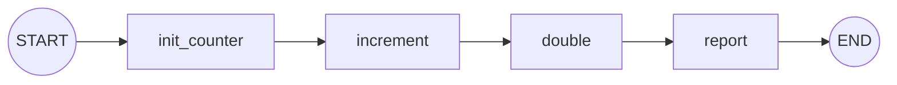

```python
# ============================================================
# Step 3: 상태(State) 활용하기
# ============================================================
# 목표: 상태를 통해 여러 노드에서 데이터를 공유하고
#       누적적으로 업데이트하는 방법 학습
# ============================================================

from typing import TypedDict
from langgraph.graph import StateGraph, START, END

# ----- 상태 정의 -----
class CounterState(TypedDict):
    count: int          # 현재 카운트 값
    history: list       # 변경 이력 추적
    final_message: str  # 최종 메시지

# ----- 노드 함수들 -----
def init_counter(state: CounterState) -> dict:
    """카운터 초기화"""
    print("🏁 카운터 초기화")
    return {
        "count": 0,
        "history": ["초기화: 0"]
    }

def increment(state: CounterState) -> dict:
    """카운터 1 증가"""
    current = state["count"]
    new_value = current + 1
    
    # 기존 히스토리에 새 기록 추가
    # 주의: 리스트는 새 리스트를 반환해야 함
    new_history = state["history"] + [f"+1 → {new_value}"]
    
    print(f"➕ 증가: {current} → {new_value}")
    return {
        "count": new_value,
        "history": new_history
    }

def double(state: CounterState) -> dict:
    """카운터 2배로"""
    current = state["count"]
    new_value = current * 2
    
    new_history = state["history"] + [f"x2 → {new_value}"]
    
    print(f"✖️ 2배: {current} → {new_value}")
    return {
        "count": new_value,
        "history": new_history
    }

def report(state: CounterState) -> dict:
    """최종 결과 보고"""
    print(f"📊 최종 카운트: {state['count']}")
    print(f"📜 히스토리: {state['history']}")
    
    return {
        "final_message": f"최종 값은 {state['count']}입니다. 총 {len(state['history'])}단계 거침."
    }

# ----- 그래프 구성 -----
graph = StateGraph(CounterState)

graph.add_node("init_counter", init_counter)
graph.add_node("increment", increment)
graph.add_node("double", double)
graph.add_node("report", report)

graph.add_edge(START, "init_counter")
graph.add_edge("init_counter", "increment")
graph.add_edge("increment", "double")
graph.add_edge("double", "report")
graph.add_edge("report", END)

app = graph.compile()

# 실행 (초기 상태는 비어있어도 됨 - init_counter가 설정)
result = app.invoke({"count": 0, "history": [], "final_message": ""})

print("\n=== 최종 결과 ===")
print(f"Count: {result['count']}")
print(f"History: {result['history']}")
print(f"Message: {result['final_message']}")

# 출력:
# 🏁 카운터 초기화
# ➕ 증가: 0 → 1
# ✖️ 2배: 1 → 2
# 📊 최종 카운트: 2
# 📜 히스토리: ['초기화: 0', '+1 → 1', 'x2 → 2']
# 
# === 최종 결과 ===
# Count: 2
# History: ['초기화: 0', '+1 → 1', 'x2 → 2']
# Message: 최종 값은 2입니다. 총 3단계 거침.
```

**핵심 포인트**:
- 상태는 모든 노드에서 읽고 쓸 수 있음
- 각 노드는 변경할 필드만 반환
- 리스트 같은 컬렉션은 새 객체로 반환해야 함

---

### Step 4: 조건부 분기 구현

**목표**: 상태 값에 따라 다른 경로로 분기하기

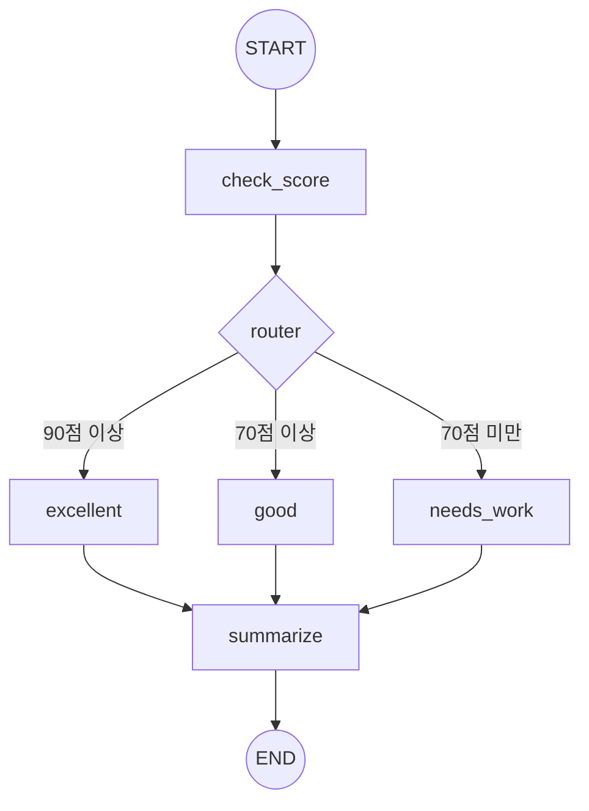

```python
# ============================================================
# Step 4: 조건부 분기 구현
# ============================================================
# 목표: add_conditional_edges()를 사용하여
#       상태 값에 따라 다른 노드로 분기하는 방법 학습
# ============================================================

from typing import TypedDict, Literal
from langgraph.graph import StateGraph, START, END

# ----- 상태 정의 -----
class GradeState(TypedDict):
    score: int           # 점수
    grade: str           # 등급
    feedback: str        # 피드백 메시지
    summary: str         # 최종 요약

# ----- 노드 함수들 -----
def check_score(state: GradeState) -> dict:
    """점수 확인 노드 - 분기 전 준비"""
    print(f"📝 점수 확인: {state['score']}점")
    return {}  # 상태 변경 없음, 다음 노드에서 분기 결정

def excellent(state: GradeState) -> dict:
    """90점 이상: A등급"""
    print("🏆 우수 등급 처리")
    return {
        "grade": "A",
        "feedback": "탁월합니다! 최고의 성과입니다."
    }

def good(state: GradeState) -> dict:
    """70-89점: B등급"""
    print("👍 양호 등급 처리")
    return {
        "grade": "B", 
        "feedback": "잘했습니다. 조금만 더 노력하면 A등급!"
    }

def needs_work(state: GradeState) -> dict:
    """70점 미만: C등급"""
    print("📚 분발 필요 등급 처리")
    return {
        "grade": "C",
        "feedback": "더 노력이 필요합니다. 화이팅!"
    }

def summarize(state: GradeState) -> dict:
    """모든 경로가 모이는 종료 노드"""
    summary = f"""
    ========== 성적표 ==========
    점수: {state['score']}점
    등급: {state['grade']}
    피드백: {state['feedback']}
    ============================
    """
    print(summary)
    return {"summary": summary}

# ----- 라우터 함수 -----
def grade_router(state: GradeState) -> Literal["excellent", "good", "needs_work"]:
    """
    점수에 따라 다음 노드를 결정하는 라우터 함수입니다.
    
    Returns:
        str: 다음에 실행할 노드의 이름
             - "excellent": 90점 이상
             - "good": 70-89점
             - "needs_work": 70점 미만
    
    Note:
        반환값은 반드시 add_conditional_edges()에서 
        정의한 노드 이름 중 하나여야 합니다.
    """
    score = state["score"]
    
    if score >= 90:
        print(f"🔀 라우팅: {score}점 → excellent 경로")
        return "excellent"
    elif score >= 70:
        print(f"🔀 라우팅: {score}점 → good 경로")
        return "good"
    else:
        print(f"🔀 라우팅: {score}점 → needs_work 경로")
        return "needs_work"

# ----- 그래프 구성 -----
graph = StateGraph(GradeState)

# 노드 추가
graph.add_node("check_score", check_score)
graph.add_node("excellent", excellent)
graph.add_node("good", good)
graph.add_node("needs_work", needs_work)
graph.add_node("summarize", summarize)

# 일반 엣지: 시작 → check_score
graph.add_edge(START, "check_score")

# ⭐ 조건부 엣지: check_score 이후 분기
# add_conditional_edges(시작노드, 라우터함수, 경로매핑)
graph.add_conditional_edges(
    "check_score",      # 이 노드 실행 후
    grade_router,       # 이 함수로 다음 노드 결정
    {                   # 라우터 반환값 → 노드 이름 매핑 (생략 가능)
        "excellent": "excellent",
        "good": "good",
        "needs_work": "needs_work"
    }
)

# 모든 등급 노드 → summarize로 모임
graph.add_edge("excellent", "summarize")
graph.add_edge("good", "summarize")
graph.add_edge("needs_work", "summarize")

# summarize → 종료
graph.add_edge("summarize", END)

# 컴파일
app = graph.compile()

# ----- 테스트 실행 -----
print("=" * 50)
print("테스트 1: 95점")
print("=" * 50)
result1 = app.invoke({"score": 95, "grade": "", "feedback": "", "summary": ""})

print("\n" + "=" * 50)
print("테스트 2: 75점")
print("=" * 50)
result2 = app.invoke({"score": 75, "grade": "", "feedback": "", "summary": ""})

print("\n" + "=" * 50)
print("테스트 3: 55점")
print("=" * 50)
result3 = app.invoke({"score": 55, "grade": "", "feedback": "", "summary": ""})
```

**핵심 포인트**:
- `add_conditional_edges(노드, 라우터함수)`: 조건부 분기 설정
- 라우터 함수는 다음 노드 이름을 반환
- `Literal[...]` 타입힌트로 가능한 경로 명시
- 여러 경로가 하나의 노드로 모일 수 있음

---

### Step 5: 완전한 도구 호출 Agent

**목표**: LLM + 도구(Tool) + 루프를 활용한 완전한 Agent 구현

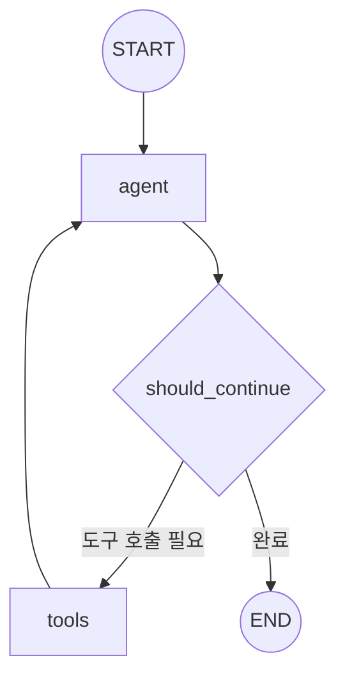

```python
# ============================================================
# Step 5: 완전한 도구 호출 Agent
# ============================================================
# 목표: LLM이 도구를 호출하고, 결과를 받아 다시 판단하는
#       루프(Loop) 구조의 Agent 구현
# ============================================================

from typing import Literal
from langchain_core.messages import HumanMessage, SystemMessage
from langchain_core.tools import tool
from langgraph.graph import StateGraph, MessagesState, START, END
from langgraph.prebuilt import ToolNode

# ----- LLM 설정 (여기서는 예시, 실제로는 환경에 맞게 설정) -----
# from langchain_openai import ChatOpenAI
# llm = ChatOpenAI(model="gpt-4")
# 또는
# from langchain_ollama import ChatOllama
# llm = ChatOllama(model="llama3")

# 이 예제에서는 get_llm() 헬퍼 사용 가정
from utils.llm_factory import get_llm
llm = get_llm()

# ============================================================
# 1단계: 도구(Tool) 정의
# ============================================================
# @tool 데코레이터로 Python 함수를 LLM이 사용할 수 있는 도구로 변환

@tool
def get_weather(city: str) -> str:
    """
    특정 도시의 날씨 정보를 반환합니다.
    
    Args:
        city: 날씨를 조회할 도시명 (예: "서울", "부산")
    
    Returns:
        str: 해당 도시의 날씨 정보
    """
    # 실제로는 외부 API 호출, 여기서는 더미 데이터
    weather_data = {
        "서울": "맑음, 15°C",
        "부산": "흐림, 18°C",
        "제주": "비, 20°C",
    }
    return weather_data.get(city, f"{city}의 날씨 정보를 찾을 수 없습니다.")

@tool
def calculate(expression: str) -> str:
    """
    수학 표현식을 계산합니다.
    
    Args:
        expression: 계산할 수학 표현식 (예: "2 + 2", "10 * 5")
    
    Returns:
        str: 계산 결과
    """
    try:
        result = eval(expression)  # 주의: 프로덕션에서는 안전한 파서 사용
        return f"결과: {result}"
    except Exception as e:
        return f"계산 오류: {e}"

# 도구 목록
tools = [get_weather, calculate]

# LLM에 도구 바인딩 (LLM이 이 도구들을 사용할 수 있음을 알림)
llm_with_tools = llm.bind_tools(tools)

# ============================================================
# 2단계: 노드 함수 정의
# ============================================================

def agent_node(state: MessagesState) -> dict:
    """
    Agent 노드: LLM을 호출하여 응답(또는 도구 호출 요청)을 생성합니다.
    
    Args:
        state: MessagesState - messages 리스트 포함
    
    Returns:
        dict: LLM 응답 메시지를 포함한 상태 업데이트
    
    흐름:
    1. 현재까지의 대화 내용(messages)을 LLM에 전달
    2. LLM은 최종 답변 또는 도구 호출 요청을 반환
    3. 응답을 messages에 추가하여 반환
    """
    # 시스템 메시지 설정
    system_message = SystemMessage(
        content="당신은 친절한 도우미입니다. 날씨 조회와 계산을 도와줄 수 있습니다."
    )
    
    # LLM 호출 (시스템 메시지 + 기존 대화)
    messages = [system_message] + state["messages"]
    response = llm_with_tools.invoke(messages)
    
    print(f"🤖 Agent 응답 타입: {type(response).__name__}")
    if hasattr(response, "tool_calls") and response.tool_calls:
        print(f"   → 도구 호출 요청: {[tc['name'] for tc in response.tool_calls]}")
    else:
        print(f"   → 최종 답변 생성")
    
    # MessagesState의 add_messages 리듀서가 자동으로 기존 메시지에 추가
    return {"messages": [response]}

# ============================================================
# 3단계: 라우터 함수 정의
# ============================================================

def should_continue(state: MessagesState) -> Literal["tools", END]:
    """
    다음 단계를 결정하는 라우터 함수입니다.
    
    LLM 응답을 확인하여:
    - 도구 호출이 있으면 → "tools" 노드로
    - 도구 호출이 없으면 → END (종료)
    
    Returns:
        "tools" 또는 END
    """
    # 마지막 메시지 (LLM의 응답)
    last_message = state["messages"][-1]
    
    # tool_calls 속성 확인
    # LLM이 도구를 사용하려면 이 속성에 호출 정보가 담김
    if hasattr(last_message, "tool_calls") and last_message.tool_calls:
        print("🔀 라우팅: tools 노드로 이동")
        return "tools"
    
    print("🔀 라우팅: 종료 (END)")
    return END

# ============================================================
# 4단계: 그래프 구성
# ============================================================

# MessagesState 사용 - messages 필드 자동 관리
graph = StateGraph(MessagesState)

# 노드 추가
graph.add_node("agent", agent_node)

# ToolNode: 도구 실행 전담 노드 (LangGraph 제공)
# LLM의 tool_calls를 받아 실제 도구를 실행하고 결과 반환
tool_node = ToolNode(tools)
graph.add_node("tools", tool_node)

# 엣지 추가
graph.add_edge(START, "agent")  # 시작 → agent

# 조건부 엣지: agent 이후 분기
graph.add_conditional_edges("agent", should_continue)

# 도구 실행 후 다시 agent로 (루프!)
# 이 엣지가 "Agent가 도구 결과를 보고 다시 판단"을 가능하게 함
graph.add_edge("tools", "agent")

# 컴파일
app = graph.compile()

# ============================================================
# 5단계: 실행
# ============================================================

def run_agent(query: str) -> str:
    """Agent를 실행하고 결과를 반환합니다."""
    print(f"\n{'='*60}")
    print(f"🙋 사용자: {query}")
    print('='*60)
    
    # 초기 상태: 사용자 메시지
    initial_state = {"messages": [HumanMessage(content=query)]}
    
    # 그래프 실행
    result = app.invoke(initial_state)
    
    # 최종 응답 (마지막 메시지)
    final_response = result["messages"][-1].content
    
    print(f"\n🤖 Agent 최종 응답: {final_response}")
    print('='*60)
    
    return final_response

# 테스트
if __name__ == "__main__":
    # 테스트 1: 도구가 필요한 질문
    run_agent("서울의 날씨가 어때?")
    
    # 테스트 2: 계산이 필요한 질문
    run_agent("123 곱하기 456은?")
    
    # 테스트 3: 도구 없이 답변 가능한 질문
    run_agent("안녕하세요!")
```

**핵심 포인트**:
- `@tool` 데코레이터로 함수를 도구로 변환
- `llm.bind_tools(tools)`: LLM에 사용 가능한 도구 알림
- `ToolNode(tools)`: 도구 실행 전담 노드
- `tools → agent` 엣지로 **루프** 생성 (도구 결과를 보고 다시 판단)
- `MessagesState`로 대화 히스토리 자동 관리

> [!IMPORTANT]
> **Agent의 핵심: 루프(Loop)**
> 
> ```
> agent → tools → agent → tools → ... → agent → END
> ```
> 
> Agent는 필요한 만큼 도구를 여러 번 호출할 수 있습니다.
> `tools → agent` 엣지가 이 루프를 가능하게 합니다.

---

## 📚 API 상세 레퍼런스

### Graph 구성

#### StateGraph

그래프를 구성하는 핵심 빌더 클래스입니다.

```python
from langgraph.graph import StateGraph

# 상태 정의
class MyState(TypedDict):
    messages: list
    data: str

# StateGraph 생성
graph = StateGraph(MyState)
```

**매개변수:**
| 매개변수 | 타입 | 설명 |
|----------|------|------|
| `state_schema` | TypedDict | 그래프 전체에서 공유할 상태의 스키마 |

**주요 메서드:**
- `add_node()` - 노드 추가
- `add_edge()` - 엣지 추가  
- `add_conditional_edges()` - 조건부 엣지 추가
- `compile()` - 실행 가능한 그래프로 컴파일

---

#### MessagesState

메시지 기반 상태를 위한 기본 타입입니다. 챗봇이나 Agent 구현 시 편리합니다.

```python
from langgraph.graph import MessagesState

# MessagesState는 다음과 동일:
# class MessagesState(TypedDict):
#     messages: Annotated[list, add_messages]

graph = StateGraph(MessagesState)
```

**특징:**
- `messages` 필드가 자동으로 정의됨
- `add_messages` 리듀서로 메시지가 자동 누적됨
- 새 메시지 반환 시 기존 메시지 리스트에 자동 추가

---

### Node 관리

#### add_node()

그래프에 노드(작업 단위)를 추가합니다.

```python
# 방법 1: 이름과 함수 분리
def my_node(state: MyState) -> dict:
    return {"data": "updated"}

graph.add_node("node_name", my_node)

# 방법 2: 함수명을 노드명으로 자동 사용
graph.add_node(my_node)  # 노드명: "my_node"
```

**시그니처:**
```python
add_node(
    node: str | Callable,       # 노드 이름 또는 함수
    action: Callable = None,    # 노드 이름 사용 시 실행할 함수
    metadata: dict = None,      # 메타데이터 (선택)
    retry_policy: RetryPolicy = None  # 재시도 정책 (선택)
)
```

**노드 함수 규칙:**
```python
def node_function(state: StateType) -> dict:
    """
    Args:
        state: 현재 그래프 상태 (전체 상태 딕셔너리)
    
    Returns:
        dict: 업데이트할 상태 필드만 포함
              (기존 상태와 병합됨)
    """
    # 상태에서 데이터 읽기
    current_value = state["field_name"]
    
    # 새 값 반환 (해당 필드만 업데이트됨)
    return {"field_name": new_value}
```

---

#### ToolNode

도구 실행을 위한 특수 노드입니다.

```python
from langgraph.prebuilt import ToolNode
from langchain_core.tools import tool

@tool
def get_weather(city: str) -> str:
    """도시의 날씨를 반환합니다."""
    return f"{city}: 맑음"

tools = [get_weather]
tool_node = ToolNode(tools)

graph.add_node("tools", tool_node)
```

**특징:**
- LLM의 `tool_calls`를 자동으로 처리
- 도구 실행 결과를 상태에 추가
- Agent 구현 시 필수 구성요소

---

### Edge 관리

#### add_edge()

두 노드를 무조건적으로 연결합니다.

```python
from langgraph.graph import START, END

# 시작점에서 첫 노드로
graph.add_edge(START, "node_a")

# 노드 간 연결
graph.add_edge("node_a", "node_b")

# 마지막 노드에서 종료
graph.add_edge("node_b", END)
```

**시그니처:**
```python
add_edge(
    start_key: str | list[str],  # 시작 노드(들)
    end_key: str                 # 종료 노드
)
```

**여러 노드에서 하나로 병합:**
```python
# node_a, node_b 모두 완료 후 node_c 실행
graph.add_edge(["node_a", "node_b"], "node_c")
```

---

#### add_conditional_edges()

조건에 따라 다른 노드로 분기합니다.

```python
from typing import Literal

def router(state: MyState) -> Literal["path_a", "path_b", END]:
    """조건에 따라 다음 노드 결정"""
    if state["condition"]:
        return "path_a"
    elif state["other_condition"]:
        return "path_b"
    return END

graph.add_conditional_edges(
    "node_name",     # 시작 노드
    router,          # 라우터 함수
    # 경로 매핑 (선택, 반환값과 노드명이 같으면 생략 가능)
    {
        "path_a": "node_a",
        "path_b": "node_b",
        END: END
    }
)
```

**시그니처:**
```python
add_conditional_edges(
    source: str,              # 시작 노드
    path: Callable,           # 경로 결정 함수
    path_map: dict = None,    # 반환값 → 노드명 매핑 (선택)
)
```

---

### 실행

#### compile()

StateGraph를 실행 가능한 CompiledGraph로 변환합니다.

```python
# 기본 컴파일
compiled = graph.compile()

# 체크포인터 사용 (메모리 저장)
from langgraph.checkpoint.memory import MemorySaver
memory = MemorySaver()
compiled = graph.compile(checkpointer=memory)
```

**시그니처:**
```python
compile(
    checkpointer: CheckpointSaver = None,  # 상태 저장소
    interrupt_before: list[str] = None,    # 실행 전 중단할 노드
    interrupt_after: list[str] = None,     # 실행 후 중단할 노드
)
```

**반환:** `CompiledStateGraph` (Runnable 인터페이스 구현)

---

#### invoke()

그래프를 동기적으로 실행합니다.

```python
# 기본 실행
result = compiled.invoke({"question": "안녕?"})

# config 사용 (thread_id 등)
result = compiled.invoke(
    {"question": "안녕?"},
    config={"configurable": {"thread_id": "session-1"}}
)
```

**시그니처:**
```python
invoke(
    input: dict,              # 초기 상태
    config: RunnableConfig = None,  # 실행 설정
) -> dict                     # 최종 상태
```

---

#### stream()

그래프를 스트리밍 모드로 실행합니다.

```python
# 기본 스트리밍 (노드별 업데이트)
for event in compiled.stream({"question": "안녕?"}):
    print(event)

# stream_mode 옵션
# "updates": 변경된 부분만 (기본값)
# "values": 전체 상태
for state in compiled.stream(input, stream_mode="values"):
    print(state["messages"][-1])
```

**시그니처:**
```python
stream(
    input: dict,
    config: RunnableConfig = None,
    stream_mode: str = "updates",  # "updates" | "values"
) -> Iterator
```

---

### 상수

#### START와 END

그래프의 시작점과 종료점을 나타내는 특수 상수입니다.

```python
from langgraph.graph import START, END

# START: 그래프 진입점
graph.add_edge(START, "first_node")

# END: 그래프 종료점
graph.add_edge("last_node", END)

# 조건부 종료
def router(state) -> Literal["continue", END]:
    if state["done"]:
        return END
    return "continue"
```

---

### Memory

#### MemorySaver

그래프 상태를 저장하고 복원하는 체크포인터입니다.

```python
from langgraph.checkpoint.memory import MemorySaver

# 메모리 기반 체크포인터 생성
memory = MemorySaver()

# 컴파일 시 체크포인터 추가
compiled = graph.compile(checkpointer=memory)

# thread_id로 대화 세션 구분
config = {"configurable": {"thread_id": "user-123"}}

# 첫 번째 메시지
result1 = compiled.invoke({"messages": [("user", "안녕")]}, config)

# 같은 thread_id로 이어서 대화 (이전 상태 유지)
result2 = compiled.invoke({"messages": [("user", "내 이름 뭐야?")]}, config)
```

**주요 기능:**
- 대화 히스토리 유지
- 상태 시점 복원 (time travel)
- 중단된 그래프 재개

---

## 🔷 그래프 패턴 모음

자주 사용되는 그래프 패턴을 정리했습니다.

### 1. 단순 순차 실행

가장 기본적인 패턴입니다.

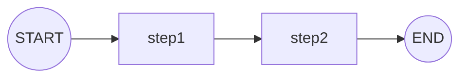

```python
graph.add_edge(START, "step1")
graph.add_edge("step1", "step2")
graph.add_edge("step2", END)
```

### 2. 조건부 분기

상태에 따라 다른 경로로 진행합니다.

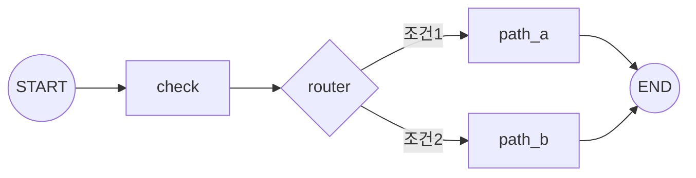

```python
graph.add_edge(START, "check")
graph.add_conditional_edges("check", router)
graph.add_edge("path_a", END)
graph.add_edge("path_b", END)
```

### 3. 루프 (자기 수정)

조건을 만족할 때까지 반복합니다.

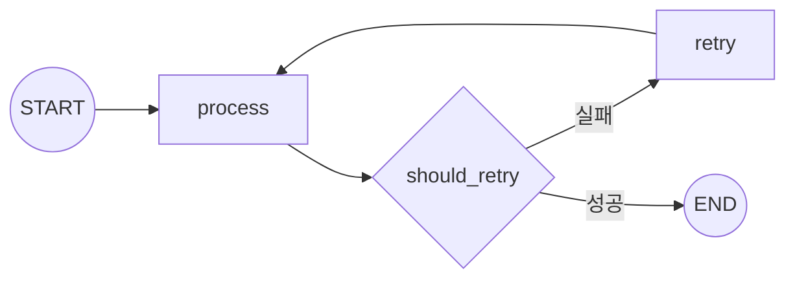

```python
graph.add_edge(START, "process")
graph.add_conditional_edges("process", should_retry)
graph.add_edge("retry", "process")  # 루프 백
```

### 4. 병렬 실행

여러 작업을 동시에 실행하고 결과를 병합합니다.

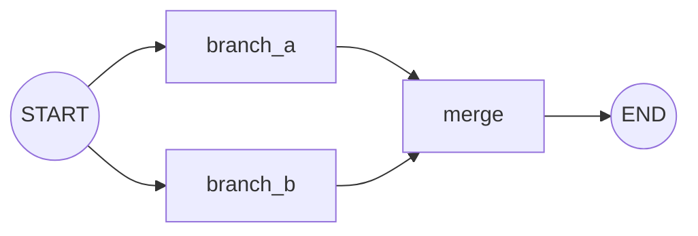

```python
graph.add_edge(START, "branch_a")
graph.add_edge(START, "branch_b")
graph.add_edge(["branch_a", "branch_b"], "merge")
graph.add_edge("merge", END)
```

### 5. Agent 루프 (도구 호출)

LLM이 도구를 호출하고 결과를 확인하는 패턴입니다.

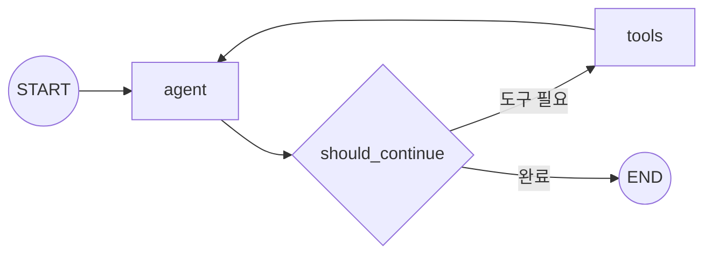

```python
graph.add_edge(START, "agent")
graph.add_conditional_edges("agent", should_continue)
graph.add_edge("tools", "agent")  # 루프 백
```

---

## 📚 참고

- [LangGraph 공식 문서](https://langchain-ai.github.io/langgraph/)
- [LangGraph GitHub](https://github.com/langchain-ai/langgraph)
- [LangChain 공식 문서](https://python.langchain.com/)
