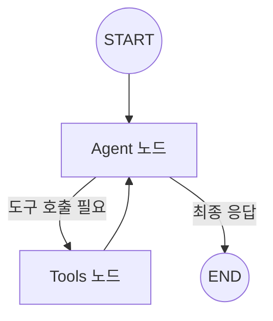

# 📘 01. Basic Agent - LangGraph 기본 개념

LangGraph의 핵심 개념을 학습하는 기본 Agent 예제입니다.

---

## 📋 목차

- [개요](#개요)
- [핵심 개념](#핵심-개념)
- [코드 분석](#코드-분석)
- [실행 결과](#실행-결과)
- [연습 문제](#연습-문제)

---

## 개요

### 학습 목표

1. **StateGraph** - 그래프 빌더의 역할 이해
2. **Node와 Edge** - 작업 단위와 연결의 개념
3. **Tool 바인딩** - LLM에 도구 연결하는 방법
4. **조건부 분기** - 상황에 따른 실행 흐름 제어

### 그래프 구조



---

## 핵심 개념

### 1. State (상태)

그래프를 통해 전달되는 공유 데이터입니다.

```python
from langgraph.graph import MessagesState

# MessagesState는 messages 필드를 가진 기본 상태
# messages: list[BaseMessage] - 대화 히스토리
```

**상태의 역할:**
- 노드 간 데이터 공유
- 대화 히스토리 유지
- 중간 결과 저장

---

### 2. Node (노드)

그래프에서 실제 작업을 수행하는 단위입니다.

```python
def agent_node(state: MessagesState):
    """
    노드 함수는 상태를 받아 업데이트를 반환합니다.
    
    Args:
        state: 현재 그래프 상태
    
    Returns:
        dict: 업데이트할 상태 (기존 상태와 병합됨)
    """
    llm = get_llm()
    response = llm.invoke(state["messages"])
    return {"messages": [response]}
```

---

### 3. Edge (엣지)

노드 간의 연결을 정의합니다.

**단순 엣지:** 무조건 다음 노드로 이동
```python
graph.add_edge(START, "agent")
graph.add_edge("tools", "agent")
```

**조건부 엣지:** 조건에 따라 분기
```python
graph.add_conditional_edges(
    "agent",           # 시작 노드
    should_continue,   # 라우터 함수
)
```

---

### 4. Tool (도구)

Agent가 외부 작업을 수행할 때 사용합니다.

```python
from langchain_core.tools import tool

@tool
def get_weather(city: str) -> str:
    """특정 도시의 날씨를 반환합니다."""
    return f"{city}: 맑음, 15도"

# LLM에 도구 바인딩
llm_with_tools = llm.bind_tools([get_weather])
```

---

## 코드 분석

### 전체 흐름

```
1. 사용자 질문 → HumanMessage 생성
2. Agent 노드 → LLM 호출 (도구 바인딩됨)
3. LLM 응답 분석:
   - tool_calls 있음 → Tools 노드로 이동
   - tool_calls 없음 → END로 종료
4. Tools 노드 → 도구 실행, 결과를 상태에 추가
5. 다시 Agent 노드 → 도구 결과 바탕으로 최종 응답 생성
```

### 핵심 코드 설명

#### 도구 정의
```python
@tool
def calculate(expression: str) -> str:
    """수학 표현식을 계산합니다."""
    result = eval(expression)  # 예제용, 실제로는 안전한 방법 사용
    return f"결과: {result}"
```

#### 라우터 함수
```python
def should_continue(state) -> Literal["tools", END]:
    """도구 호출이 필요한지 판단"""
    last_message = state["messages"][-1]
    
    # AIMessage의 tool_calls 확인
    if last_message.tool_calls:
        return "tools"  # 도구 실행
    return END          # 종료
```

#### 그래프 구성
```python
graph = StateGraph(MessagesState)

# 노드 추가
graph.add_node("agent", agent_node)
graph.add_node("tools", ToolNode(tools))

# 엣지 추가
graph.add_edge(START, "agent")
graph.add_conditional_edges("agent", should_continue)
graph.add_edge("tools", "agent")

# 컴파일
compiled = graph.compile()
```

---

## 실행 결과

### 테스트 1: 도구 사용 (날씨)

```
🙋 사용자: 서울의 날씨가 어때?
============================================================
🔧 도구 호출 감지: ['get_weather']
✅ 최종 응답 생성 완료

🤖 Agent: 현재 서울의 날씨는 맑고, 기온은 15°C입니다.
```

### 테스트 2: 도구 사용 (계산)

```
🙋 사용자: 123 * 456은 얼마야?
============================================================
🔧 도구 호출 감지: ['calculate']
✅ 최종 응답 생성 완료

🤖 Agent: 123 × 456 = 56,088 입니다.
```

### 테스트 3: 도구 불필요

```
🙋 사용자: 안녕하세요!
============================================================
✅ 최종 응답 생성 완료

🤖 Agent: 안녕하세요! 무엇을 도와드릴까요?
```

---

## 연습 문제

### 1. 새로운 도구 추가

검색 도구를 추가해보세요:

```python
@tool
def search_web(query: str) -> str:
    """웹에서 정보를 검색합니다."""
    # 구현해보세요
    pass
```

### 2. 시스템 프롬프트 수정

다른 페르소나를 가진 Agent로 변경해보세요.

### 3. 스트리밍 실행

`invoke()` 대신 `stream()`을 사용해 실시간 출력을 확인하세요.

```python
for event in graph.stream(initial_state):
    print(event)
```

---

## 다음 단계

➡️ [02. Naive RAG](02_naive_rag.md) - 기본 RAG 파이프라인 구현
