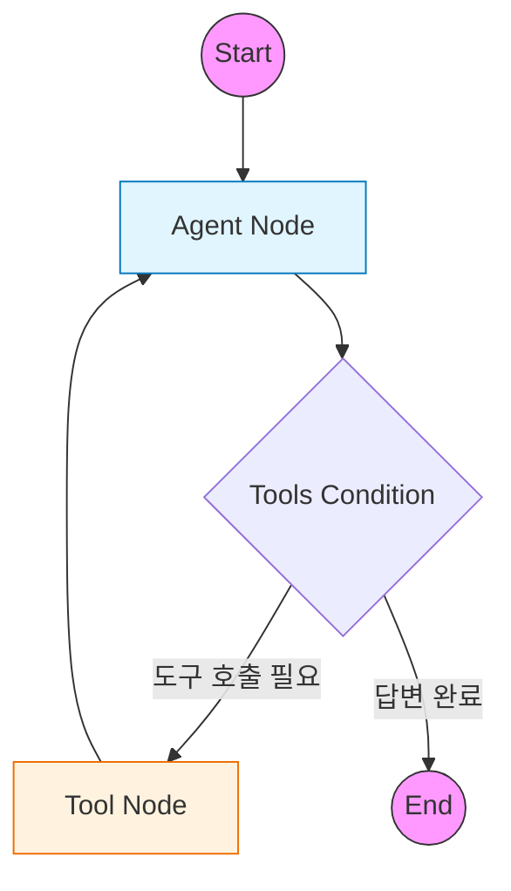

# 1️⃣ Basic Agent: LangGraph 두 가지 구현 패턴 학습

LangGraph에서 에이전트를 구현하는 두 가지 핵심 방식을 학습하는 예제입니다.
명시적인 구조의 **Standard Pattern**과 간결한 자동화 구조의 **ReAct Pattern**을 비교하며 이해합니다.

---

## 🎯 학습 목표
1. **Standard Pattern**: `StateGraph`, `Node`, `Edge`를 직접 정의하여 그래프 흐름을 완벽히 제어
2. **ReAct Pattern**: `create_react_agent`를 사용하여 한 줄로 에이전트 생성
3. **핵심 차이점 파악**: 두 패턴의 장단점과 사용 사례 비교

---

## 🏗️ 패턴 1: Standard Pattern (명시적 구조)

> 📁 **코드 파일**: [`examples/01_basic_agent_standard.py`](../examples/01_basic_agent_standard.py)

### 개념
`StateGraph`를 사용하여 노드(Node)와 엣지(Edge)를 하나씩 수동으로 구성합니다.  
그래프의 모든 흐름을 개발자가 직접 설계하므로 **높은 유연성과 제어력**을 제공합니다.

### 핵심 구성 요소

#### 1. 상태(State) 정의
에이전트가 관리할 데이터 구조를 `TypedDict`로 명시적으로 정의합니다.

```python
from typing import Annotated, TypedDict
from langgraph.graph.message import add_messages

class AgentState(TypedDict):
    # add_messages: 새 메시지가 기존 리스트에 자동 추가됨
    messages: Annotated[list[BaseMessage], add_messages]
```

#### 2. 노드(Node) 함수 구현
각 노드는 현재 상태를 받아 처리하고, 상태 업데이트를 반환하는 함수입니다.

```python
def call_model(state: AgentState):
    """LLM을 호출하여 다음 행동을 결정하는 노드"""
    model = ChatOpenAI(...).bind_tools(tools)
    response = model.invoke(state["messages"])
    return {"messages": [response]}
```

#### 3. 그래프 조립
노드를 추가하고, 엣지로 연결하여 실행 흐름을 구성합니다.

```python
workflow = StateGraph(AgentState)

# 노드 추가
workflow.add_node("agent", call_model)
workflow.add_node("tools", ToolNode(tools))

# 엣지 연결
workflow.add_edge(START, "agent")
workflow.add_conditional_edges("agent", tools_condition)
workflow.add_edge("tools", "agent")

# 컴파일
app = workflow.compile()
```

### 🖥️ 실행 방법
```bash
python examples/01_basic_agent_standard.py
```

---

## 🏗️ 패턴 2: ReAct Pattern (간결한 자동화)

> 📁 **코드 파일**: [`examples/01_base_agent_react.py`](../examples/01_base_agent_react.py)

### 개념
LangGraph에서 제공하는 `create_react_agent` 프리빌트 함수를 사용하여  
**단 한 줄로** ReAct 에이전트를 생성합니다. 내부적으로 노드, 엣지, 조건부 분기가 자동 구성됩니다.

### 핵심 코드
```python
from langgraph.prebuilt import create_react_agent

# 에이전트 생성 (한 줄!)
agent_executor = create_react_agent(
    model,
    tools=tools,
    state_modifier="당신은 유용한 비서입니다."  # 시스템 프롬프트
)
```

### 시스템 프롬프트 설정
`state_modifier` 파라미터를 통해 에이전트의 페르소나(역할)를 지정합니다.

```python
system_prompt = "당신은 날씨 정보와 간단한 계산을 도와주는 유용한 비서입니다."
agent = create_react_agent(model, tools=tools, state_modifier=system_prompt)
```

### 🖥️ 실행 방법
```bash
python examples/01_base_agent_react.py
```

---

## ⚖️ Standard vs ReAct: 언제 무엇을 쓸까?

| 비교 항목 | Standard Pattern | ReAct Pattern |
|:---|:---|:---|
| **파일** | `01_basic_agent_standard.py` | `01_base_agent_react.py` |
| **구현 난이도** | 중간 (구조 이해 필요) | 매우 낮음 (함수 호출 한 번) |
| **코드 양** | 상대적으로 많음 (~50줄) | 매우 적음 (~10줄) |
| **유연성** | 매우 높음 | 낮음 (정해진 패턴만 가능) |
| **커스터마이징** | 중간에 커스텀 노드 삽입 가능 | 어려움 |
| **디버깅** | 각 노드별 상태 확인 용이 | 내부 동작 추적 어려움 |

### 🔹 Standard Pattern을 선택하는 경우
- 복잡한 비즈니스 로직이 필요할 때
- 중간에 검증/로깅/변환 노드를 추가해야 할 때
- 상태에 메시지 외 다른 데이터도 관리해야 할 때
- 그래프 구조를 완전히 이해하고 제어하고 싶을 때

### 🔹 ReAct Pattern을 선택하는 경우
- 빠른 프로토타이핑이 목표일 때
- 전형적인 ReAct(Reasoning + Acting) 루프로 충분할 때
- 코드 간결성이 중요할 때
- LangGraph 입문자가 먼저 동작을 확인하고 싶을 때

---

## 📊 공통 그래프 구조

두 패턴 모두 내부적으로는 동일한 ReAct 루프 구조를 가집니다.



### 실행 흐름
1. **Agent**: LLM이 사용자 질문을 분석하고 도구 호출 여부 결정
2. **Condition**: `tool_calls`가 있으면 Tools로, 없으면 END로 이동
3. **Tools**: 도구 실행 후 결과를 상태에 추가
4. **Agent**: 도구 결과를 보고 최종 답변 생성 또는 추가 도구 호출

---

## 🛠️ 공통 도구 정의

두 예제 파일 모두 동일한 도구(`get_weather`, `calculate`)를 사용합니다.

```python
@tool
def get_weather(city: str) -> str:
    """특정 도시의 날씨 정보를 반환합니다."""
    weather_data = {
        "서울": "맑음, 15°C",
        "부산": "흐림, 18°C",
        "제주": "비, 20°C",
    }
    return weather_data.get(city, f"{city}의 날씨 정보를 찾을 수 없습니다.")

@tool
def calculate(expression: str) -> str:
    """수학 표현식을 계산합니다."""
    try:
        result = eval(expression)
        return f"결과: {result}"
    except Exception as e:
        return f"계산 오류: {str(e)}"
```

---

## 💻 전체 코드 확인

| 패턴 | 파일 |
|------|------|
| Standard Pattern | [`examples/01_basic_agent_standard.py`](../examples/01_basic_agent_standard.py) |
| ReAct Pattern | [`examples/01_base_agent_react.py`](../examples/01_base_agent_react.py) |

---

## 🔗 관련 예제

기본 개념을 익혔다면 다음 심화 예제로 학습하세요:

| 예제 | 주제 | 학습 내용 |
|------|------|----------|
| [01a. Multi-Tool Agent](01a_multi_tool_agent.md) | 다중 도구 | 5개 이상 도구 관리 |
| [01b. Memory Agent](01b_memory_agent.md) | 메모리 기능 | MemorySaver, thread_id로 대화 유지 |
| [01c. Multi-Agent](01c_multi_agent.md) | 협업 시스템 | Supervisor 패턴 |
| [01d. MCP Agent](01d_mcp_agent.md) | MCP 연동 | 외부 MCP 서버 도구 활용 |

---

## 다음 단계

➡️ [02. Naive RAG](02_naive_rag.md) - 기본 RAG 파이프라인 구현
