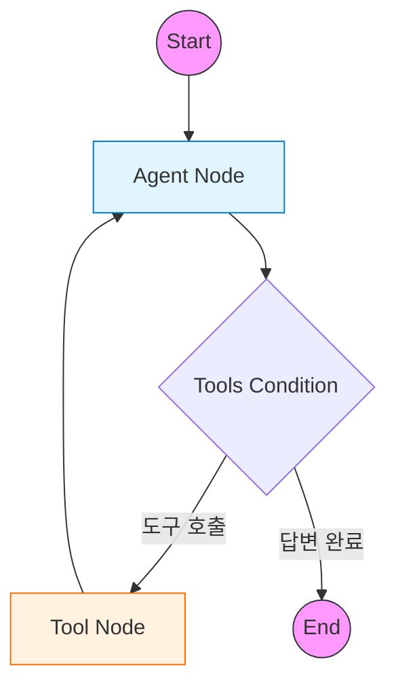

# 1️⃣ Basic Agent: LangGraph 표준 패턴 학습

LangGraph의 가장 기본적인 구조와 표준 패턴을 학습하는 예제입니다.
최신 LangGraph(v0.2+)에서 권장하는 `MessagesState`, `ToolNode`, `tools_condition`을 사용하여 ReAct 에이전트를 구현합니다.

---

## 🎯 학습 목표
1. **StateGraph(MessagesState)**: 메시지 기반 상태 관리의 표준 방식 이해
2. **Prebuilt Components**: `ToolNode`와 `tools_condition`을 활용한 코드 단순화
3. **Tool Binding**: LLM에 도구를 연결하고 실행 결과를 처리하는 흐름 파악

---

## 🏗️ 그래프 구조

전형적인 **ReAct(Reasoning + Acting)** 패턴입니다. 에이전트가 생각(LLM)하고 행동(Tool)하는 과정을 반복합니다.



---

## 🔑 핵심 코드 설명

### 1. MessagesState 사용
LangGraph는 메시지 기록 관리를 위한 표준 상태인 `MessagesState`를 제공합니다.
별도의 리듀서(Reducer) 정의 없이도, 새로운 메시지를 반환하면 자동으로 기존 리스트에 추가(Append)됩니다.

```python
from langgraph.graph import MessagesState

# 별도 TypedDict 정의 없이 바로 사용 가능
builder = StateGraph(MessagesState)
```

### 2. 표준 라우터 (tools_condition)
이전에는 `should_continue` 같은 라우터 함수를 직접 작성해야 했지만, 이제는 `prebuilt.tools_condition`이 그 역할을 대신합니다.
LLM의 응답에 `tool_calls`가 포함되어 있으면 "tools" 노드로, 아니면 종료(END)로 라우팅합니다.

```python
from langgraph.prebuilt import tools_condition

builder.add_conditional_edges(
    "agent",           # 시작 노드
    tools_condition,   # 표준 조건 함수
)
```

### 3. 도구 실행 노드 (ToolNode)
`ToolNode`는 LLM이 요청한 도구 호출을 실행하고, 그 결과를 `ToolMessage` 형태로 반환하는 작업을 자동화합니다.

```python
from langgraph.prebuilt import ToolNode

# 도구 리스트만 전달하면 끝!
builder.add_node("tools", ToolNode(tools))
```

---

## 📝 실행 흐름

1. **사용자**: "서울 날씨 어때?"
2. **Agent**: 질문 분석 → `get_weather('서울')` 도구 호출 결정 (AIMessage)
3. **Condition**: 도구 호출이 있으므로 `Tools` 노드로 이동
4. **Tools**: 함수 실행 → "맑음, 15°C" 반환 (ToolMessage)
5. **Agent**: 도구 결과를 보고 최종 답변 생성 → "서울은 맑고 15도입니다."
6. **Condition**: 도구 호출이 없으므로 `END`로 이동

---

## 실행 결과

### 테스트 1: 도구 사용 (날씨)

```
🙋 사용자: 서울의 날씨가 어때?
============================================================
🔧 도구 호출 감지: ['get_weather']
✅ 최종 응답 생성 완료

🤖 Agent: 현재 서울의 날씨는 맑고, 기온은 15°C입니다.
```

### 테스트 2: 도구 사용 (계산)

```
🙋 사용자: 123 * 456은 얼마야?
============================================================
🔧 도구 호출 감지: ['calculate']
✅ 최종 응답 생성 완료

🤖 Agent: 123 × 456 = 56,088 입니다.
```

### 테스트 3: 도구 불필요

```
🙋 사용자: 안녕하세요! 반갑습니다.
============================================================
✅ 최종 응답 생성 완료

🤖 Agent: 안녕하세요! 반가워요. 무엇을 도와드릴까요?
```

---

## 연습 문제

### 1. 새로운 도구 추가

검색 도구를 추가해보세요:

```python
@tool
def search_web(query: str) -> str:
    """웹에서 정보를 검색합니다."""
    # 구현해보세요
    pass
```

### 2. 시스템 프롬프트 수정

다른 페르소나를 가진 Agent로 변경해보세요.

### 3. 스트리밍 실행

`stream()`을 사용해 실시간 출력을 확인하세요.

```python
for step, state in enumerate(graph.stream(initial_state, stream_mode="values")):
    print(f"Step {step}: ...")
```

---

## 🔗 상세 예제

기본 개념을 익혔다면 다음 상세 예제로 심화 학습하세요:

| 예제 | 주제 | 학습 내용 |
|------|------|----------|
| [01a. Multi-Tool Agent](01a_multi_tool_agent.md) | 다중 도구 | 5개 이상 도구 관리, 도구 선택 로직 |
| [01b. Memory Agent](01b_memory_agent.md) | 메모리 기능 | MemorySaver, thread_id로 대화 유지 |
| [01c. Multi-Agent](01c_multi_agent.md) | 협업 시스템 | Supervisor 패턴, 전문 Agent 협력 |

---

## 💻 전체 코드 확인
[`examples/01_basic_agent.py`](../examples/01_basic_agent.py) 파일을 참고하세요.

---

## 다음 단계

➡️ [02. Naive RAG](02_naive_rag.md) - 기본 RAG 파이프라인 구현
