# 1️⃣ Basic Agent: LangGraph 표준 패턴 학습

LangGraph의 가장 기본적인 구조와 표준 패턴을 학습하는 예제입니다.
최신 LangGraph(v0.2+)에서 권장하는 `MessagesState`, `ToolNode`, `tools_condition`을 사용하여 ReAct 에이전트를 구현합니다.

---

## 🎯 학습 목표
1. **StateGraph(MessagesState)**: 메시지 기반 상태 관리의 표준 방식 이해
2. **Prebuilt Components**: `ToolNode`와 `tools_condition`을 활용한 코드 단순화
3. **Tool Binding**: LLM에 도구를 연결하고 실행 결과를 처리하는 흐름 파악

---

## 🏗️ 그래프 구조

전형적인 **ReAct(Reasoning + Acting)** 패턴입니다. 에이전트가 생각(LLM)하고 행동(Tool)하는 과정을 반복합니다.

```mermaid
graph TD
    START((Start)) --> Agent
    Agent[Agent Node] --> Condition{Tools Condition}
    Condition -->|도구 호출| Tools[Tool Node]
    Condition -->|답변 완료| END((End))
    Tools --> Agent

    style START fill:#f9f,stroke:#333
    style END fill:#f9f,stroke:#333
    style Agent fill:#e1f5fe,stroke:#0277bd
    style Tools fill:#fff3e0,stroke:#ef6c00
```



---

## 🔑 핵심 코드 설명

### 1. MessagesState 사용
LangGraph는 메시지 기록 관리를 위한 표준 상태인 `MessagesState`를 제공합니다.
별도의 리듀서(Reducer) 정의 없이도, 새로운 메시지를 반환하면 자동으로 기존 리스트에 추가(Append)됩니다.

```python
from langgraph.graph import MessagesState

# 별도 TypedDict 정의 없이 바로 사용 가능
builder = StateGraph(MessagesState)
```

### 2. 표준 라우터 (tools_condition)
이전에는 `should_continue` 같은 라우터 함수를 직접 작성해야 했지만, 이제는 `prebuilt.tools_condition`이 그 역할을 대신합니다.
LLM의 응답에 `tool_calls`가 포함되어 있으면 "tools" 노드로, 아니면 종료(END)로 라우팅합니다.

```python
from langgraph.prebuilt import tools_condition

builder.add_conditional_edges(
    "agent",           # 시작 노드
    tools_condition,   # 표준 조건 함수
)
```

### 3. 도구 실행 노드 (ToolNode)
`ToolNode`는 LLM이 요청한 도구 호출을 실행하고, 그 결과를 `ToolMessage` 형태로 반환하는 작업을 자동화합니다.

```python
from langgraph.prebuilt import ToolNode

# 도구 리스트만 전달하면 끝!
builder.add_node("tools", ToolNode(tools))
```

---

## 📝 실행 흐름

1. **사용자**: "서울 날씨 어때?"
2. **Agent**: 질문 분석 → `get_weather('서울')` 도구 호출 결정 (AIMessage)
3. **Condition**: 도구 호출이 있으므로 `Tools` 노드로 이동
4. **Tools**: 함수 실행 → "맑음, 15°C" 반환 (ToolMessage)
5. **Agent**: 도구 결과를 보고 최종 답변 생성 → "서울은 맑고 15도입니다."
6. **Condition**: 도구 호출이 없으므로 `END`로 이동

---

## 💻 전체 코드 확인
[`examples/01_basic_agent.py`](../examples/01_basic_agent.py) 파일을 참고하세요.
