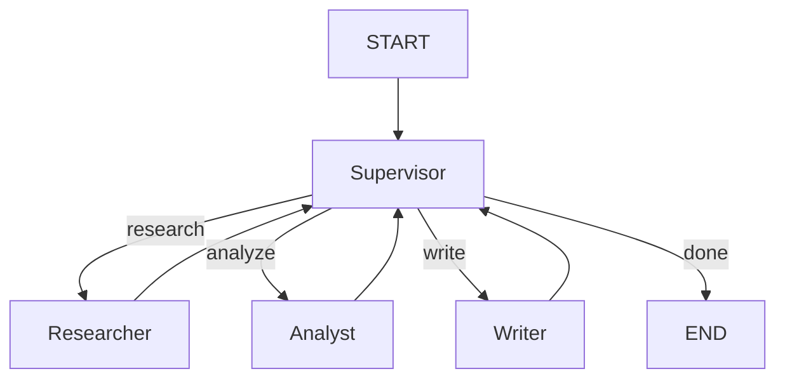

# 📘 01c. Multi-Agent - 협업 시스템

여러 전문 Agent가 Supervisor 패턴으로 협력하는 시스템입니다.

---

## 📋 학습 목표

1. 여러 Agent를 노드로 구성
2. Supervisor 패턴으로 작업 분배
3. Agent 간 상태 공유
4. 복잡한 워크플로우 설계

---

## 🏗️ 아키텍처



---

## 👥 Agent 역할

| Agent | 역할 |
|-------|------|
| **Supervisor** | 작업 분석, Agent 선택, 워크플로우 조율 |
| **Researcher** | 정보 수집, 조사 |
| **Analyst** | 데이터 분석, 인사이트 도출 |
| **Writer** | 최종 결과물 작성 |

---

## 📐 핵심 코드

### 상태 정의
```python
class MultiAgentState(TypedDict):
    task: str                    # 원본 작업
    current_agent: str           # 현재 활성 에이전트
    research_result: str         # 리서치 결과
    analysis_result: str         # 분석 결과
    writing_result: str          # 작성 결과
    final_output: str            # 최종 출력
    agent_history: List[str]     # 실행 히스토리
```

### Supervisor 노드
```python
def supervisor_node(state: MultiAgentState) -> dict:
    """작업을 분석하고 다음 Agent 결정"""
    llm = get_llm()
    
    # 현재 상태를 분석하여 다음 Agent 선택
    if not state.get("research_result"):
        next_agent = "researcher"
    elif not state.get("analysis_result"):
        next_agent = "analyst"
    elif not state.get("writing_result"):
        next_agent = "writer"
    else:
        next_agent = "done"
    
    return {"current_agent": next_agent, ...}
```

### 그래프 구성 (루프)
```python
def create_multi_agent_graph():
    graph = StateGraph(MultiAgentState)
    
    graph.add_node("supervisor", supervisor_node)
    graph.add_node("researcher", researcher_node)
    graph.add_node("analyst", analyst_node)
    graph.add_node("writer", writer_node)
    
    graph.add_edge(START, "supervisor")
    graph.add_conditional_edges("supervisor", route_by_supervisor)
    
    # 각 Agent → Supervisor (루프)
    graph.add_edge("researcher", "supervisor")
    graph.add_edge("analyst", "supervisor")
    graph.add_edge("writer", "supervisor")
    
    return graph.compile()
```

---

## 🔄 실행 흐름

```
1. START → Supervisor (작업 분석)
2. Supervisor → Researcher (조사 필요)
3. Researcher → Supervisor (조사 완료)
4. Supervisor → Analyst (분석 필요)
5. Analyst → Supervisor (분석 완료)
6. Supervisor → Writer (작성 필요)
7. Writer → Supervisor (완료)
8. Supervisor → END
```

---

## ✨ 핵심 포인트

1. **Supervisor 패턴**: 중앙 조율자가 작업 배분
2. **전문화**: 각 Agent가 특정 역할에 집중
3. **루프 구조**: Agent → Supervisor → Agent 반복

---

## 🔗 관련 문서

- [이전: Memory Agent](01b_memory_agent.md)
- [기본 예제로 돌아가기](01_basic_agent.md)
