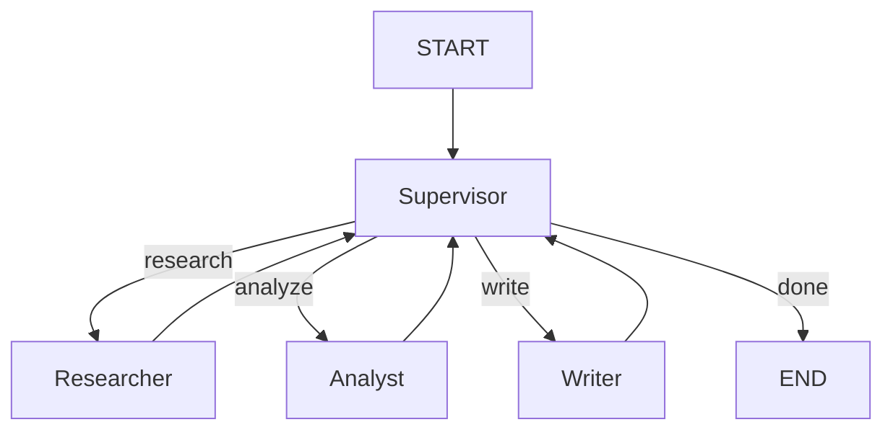

# 📘 01c. Multi-Agent - 협업 시스템

여러 전문 Agent가 Supervisor 패턴으로 협력하는 시스템입니다.

---

## 📋 학습 목표

1. 여러 Agent를 노드로 구성
2. Supervisor 패턴으로 작업 분배
3. Agent 간 상태 공유
4. 복잡한 워크플로우 설계

---

## 🖥️ CLI 실행 방법

이 예제는 **대화형 CLI 모드**로 실행됩니다.

```bash
python examples/01c_multi_agent.py
```

```
Multi-Agent 협업 시스템 (CLI 모드)
보고서 작성, 주제 분석 등 복잡한 업무를 지시하세요.
종료하려면 'quit' 또는 'exit'를 입력하세요.

🙋 어떤 업무를 지시하시겠습니까?: LangGraph의 장점을 분석하고 요약해줘
```

### 종료 방법
- `quit`, `exit`, 또는 `q` 입력
- `Ctrl+C` 키 입력

---

> [!IMPORTANT]
> **GPT-OSS (vLLM) 호환성**: 로컬 LLM 서버를 사용하는 경우 [Harmony 호환성 가이드](harmony_compatibility.md)를 참고하여 응답 파싱 및 메시지 정제를 적용하세요.

## 🏗️ 아키텍처



---

## 👥 Agent 역할

| Agent | 역할 |
|-------|------|
| **Supervisor** | 작업 분석, Agent 선택, 워크플로우 조율 |
| **Researcher** | 정보 수집, 조사 |
| **Analyst** | 데이터 분석, 인사이트 도출 |
| **Writer** | 최종 결과물 작성 |

---

## 📐 핵심 코드

### 상태 정의 (공유 작업판)
```python
class MultiAgentState(TypedDict):
    """팀 전체가 공유하는 메모장 양식입니다."""
    task: str                        # 처음 시킨 일 (주제)
    current_agent: str               # 지금 일하고 있거나 일해야 할 담당자 이름
    research_result: str             # 조사가 끝난 내용 (Researcher가 적음)
    analysis_result: str             # 분석이 끝난 내용 (Analyst가 적음)
    writing_result: str              # 최종 글쓰기 결과 (Writer가 적음)
    final_output: str                # 사용자에게 보여줄 마지막 답장
    agent_history: List[str]         # 누가 어떤 순서로 일했는지 기록 (기록용)
```

### Supervisor 노드 (팀장)
```python
def supervisor_node(state: MultiAgentState) -> dict:
    """[팀장] Supervisor: 팀원들의 진행 상황을 보고 다음 순서를 결정합니다."""
    # AI팀장에게 현재 상황을 알려주고 다음에 누구를 호출할지 묻습니다.
    # 결정 규칙: 조사 → 분석 → 작성 → 완료(done)
    prompt = ChatPromptTemplate.from_messages([
        ("system", "당신은 팀의 관리자(PM)입니다. 다음 단계를 결정하세요..."),
    ])
    
    # AI가 결정한 'next_agent' 이름을 current_agent 칸에 적어 놓습니다.
    return {
        "current_agent": next_agent,
        "agent_history": state.get("agent_history", []) + ["supervisor"],
    }
```

### 그래프 구성 (조직도 만들기)
```python
def create_multi_agent_graph():
    """AI들이 서로 어떻게 일감을 주고받을지 화살표를 그립니다."""
    builder = StateGraph(MultiAgentState)
    
    # 1. 팀원(노드)들을 배치합니다.
    builder.add_node("supervisor", supervisor_node)
    builder.add_node("researcher", researcher_node)
    builder.add_node("analyst", analyst_node)
    builder.add_node("writer", writer_node)
    
    # 2. 시작하면 무조건 팀장(supervisor)에게 갑니다.
    builder.add_edge(START, "supervisor")
    
    # 3. 팀장이 상황을 보고 멤버를 호출합니다 (조건부 연결).
    builder.add_conditional_edges("supervisor", route_by_supervisor)
    
    # 4. 업무를 마친 멤버는 다시 팀장에게 보고하러 돌아옵니다 (화살표 구축).
    builder.add_edge("researcher", "supervisor")
    builder.add_edge("analyst", "supervisor")
    builder.add_edge("writer", "supervisor")
    
    return builder.compile()
```

---

## 🔄 실행 흐름

```
1. START → Supervisor (작업 분석)
2. Supervisor → Researcher (조사 필요)
3. Researcher → Supervisor (조사 완료)
4. Supervisor → Analyst (분석 필요)
5. Analyst → Supervisor (분석 완료)
6. Supervisor → Writer (작성 필요)
7. Writer → Supervisor (완료)
8. Supervisor → END
```

---

## ✨ 핵심 포인트

1. **Supervisor 패턴**: 중앙 조율자가 작업 배분
2. **전문화**: 각 Agent가 특정 역할에 집중
3. **루프 구조**: Agent → Supervisor → Agent 반복

---

## 🔗 관련 문서

- [이전: Memory Agent](01b_memory_agent.md)
- [기본 예제로 돌아가기](01_basic_agent.md)
