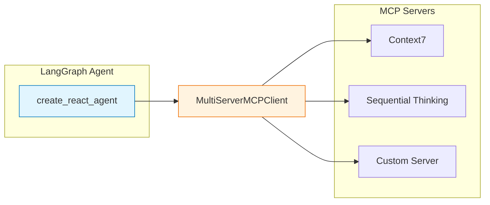

# 1️⃣d. MCP Agent: Model Context Protocol 서버 연동

외부 MCP(Model Context Protocol) 서버에 연결하여 해당 서버가 제공하는 도구를 
LangGraph 에이전트에서 활용하는 방법을 학습합니다.

---

## 🎯 학습 목표
1. **MCP 개념 이해**: AI 모델이 외부 도구/리소스에 접근하는 표준 프로토콜
2. **서버 등록 방법**: stdio, SSE 트랜스포트를 통한 MCP 서버 연결
3. **도구 바인딩**: MCP 도구를 LangGraph 에이전트에 통합

---

## 💡 MCP란?

**MCP (Model Context Protocol)** 는 AI 모델이 외부 도구, 데이터, 서비스에 접근하기 위한 표준화된 프로토콜입니다.

### 주요 특징
- **표준화**: 다양한 도구를 일관된 방식으로 연결
- **확장성**: 새로운 MCP 서버를 쉽게 추가 가능
- **분리**: 도구 구현과 에이전트 로직을 분리

### 트랜스포트 방식

| 방식 | 설명 | 사용 사례 |
|------|------|----------|
| **stdio** | 로컬 프로세스로 서버 실행 | npx로 패키지 실행, 로컬 Python 서버 |
| **sse** | HTTP Server-Sent Events | 원격 서버 연결 |
| **streamable-http** | HTTP 스트리밍 | 대용량 응답 처리 |

---

## 📦 필수 패키지 설치

```bash
pip install langchain-mcp-adapters langgraph
```

---

## 🔧 MCP 서버 설정

### 설정 구조

```python
MCP_SERVER_CONFIGS = {
    "서버_이름": {
        "command": "실행_명령어",  # 예: "npx", "python"
        "args": ["인자1", "인자2"],
        "transport": "stdio",  # 또는 "sse"
    },
}
```

### 예시: 자주 사용하는 MCP 서버들

```python
MCP_SERVER_CONFIGS = {
    # Context7: 라이브러리 문서 검색
    "context7": {
        "command": "npx",
        "args": ["-y", "@upstash/context7-mcp@latest"],
        "transport": "stdio",
    },
    
    # Sequential Thinking: 단계별 사고 도구
    "sequential_thinking": {
        "command": "npx",
        "args": ["-y", "@modelcontextprotocol/server-sequential-thinking"],
        "transport": "stdio",
    },
    
    # 원격 서버 (SSE 방식)
    "remote_server": {
        "url": "http://localhost:8000/sse",
        "transport": "sse",
    },
}
```

---

## 🔑 핵심 코드

### 1. MCP 클라이언트 연결

```python
from langchain_mcp_adapters.client import MultiServerMCPClient

# async context manager로 서버 연결
async with MultiServerMCPClient(MCP_SERVER_CONFIGS) as client:
    # MCP 서버에서 제공하는 도구 가져오기
    tools = client.get_tools()
    print(f"사용 가능한 도구: {[t.name for t in tools]}")
```

### 2. 에이전트 생성 및 실행

```python
from langgraph.prebuilt import create_react_agent
from langchain_openai import ChatOpenAI

async with MultiServerMCPClient(MCP_SERVER_CONFIGS) as client:
    model = ChatOpenAI(model="gpt-4")
    
    # MCP 도구를 에이전트에 전달
    agent = create_react_agent(
        model,
        tools=client.get_tools(),
        state_modifier="유용한 AI 어시스턴트입니다."
    )
    
    # 비동기 실행
    result = await agent.ainvoke(
        {"messages": [HumanMessage(content="LangGraph 사용법 알려줘")]}
    )
```

---

## 📊 아키텍처



---

## 🖥️ 실행 방법

```bash
python examples/01d_mcp_agent.py
```

### 예상 출력
```
🌐 LangGraph MCP Agent Example
============================================================
🙋 사용자: LangGraph의 create_react_agent 함수 사용법을 알려줘
============================================================
📦 [MCP] 연결된 서버: ['context7']
🔧 [MCP] 사용 가능한 도구: ['resolve-library-id', 'query-docs']

🤖 Agent: create_react_agent는 LangGraph에서 제공하는 프리빌트 함수로...
```

---

## ⚠️ 주의사항

### 1. 비동기 실행 필수
MCP 클라이언트는 비동기(async)로 동작합니다.

```python
import asyncio

# asyncio.run()으로 비동기 함수 실행
asyncio.run(run_mcp_agent("질문"))
```

### 2. 컨텍스트 매니저 사용
`async with` 블록 안에서만 MCP 연결이 유지됩니다.

```python
# ✅ 올바른 사용
async with MultiServerMCPClient(configs) as client:
    tools = client.get_tools()
    # 여기서만 tools 사용 가능

# ❌ 잘못된 사용
client = MultiServerMCPClient(configs)
tools = client.get_tools()  # 연결되지 않음!
```

### 3. 서버 가용성 확인
MCP 서버가 실행 가능한 상태인지 먼저 확인하세요.

```bash
# npx 기반 서버 테스트
npx -y @upstash/context7-mcp@latest
```

---

## 💻 전체 코드 확인

[`examples/01d_mcp_agent.py`](../examples/01d_mcp_agent.py)

---

## 🔗 관련 예제

| 예제 | 주제 |
|------|------|
| [01. Basic Agent](01_basic_agent.md) | Standard/ReAct 패턴 비교 |
| [01a. Multi-Tool Agent](01a_multi_tool_agent.md) | 다중 도구 관리 |
| [01c. Multi-Agent](01c_multi_agent.md) | Supervisor 패턴 |

---

## 다음 단계

➡️ [02. Naive RAG](02_naive_rag.md) - 기본 RAG 파이프라인 구현
