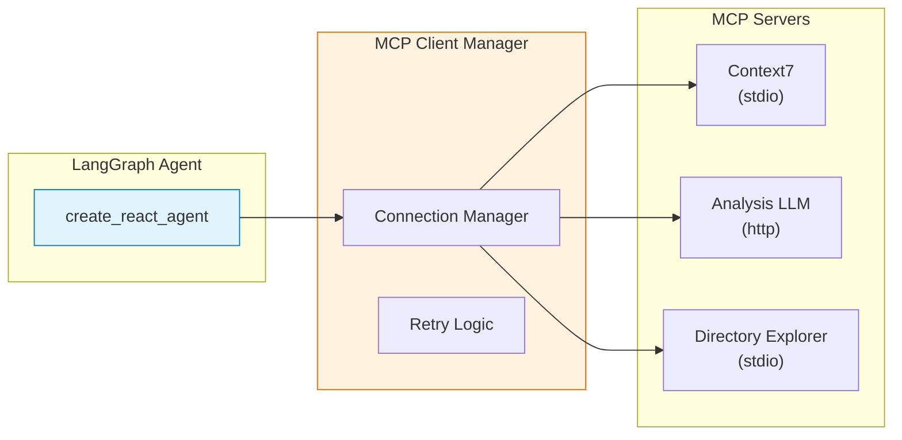

# 1️⃣d. MCP Agent: Model Context Protocol 서버 연동

외부 MCP(Model Context Protocol) 서버에 연결하여 해당 서버가 제공하는 도구를 
LangGraph 에이전트에서 활용하는 방법을 학습합니다.

---

## 🎯 학습 목표
1. **MCP 개념 이해**: AI 모델이 외부 도구/리소스에 접근하는 표준 프로토콜
2. **서버 등록 방법**: stdio, SSE, streamable-http 트랜스포트를 통한 MCP 서버 연결
3. **도구 바인딩**: MCP 도구를 LangGraph 에이전트에 통합
4. **Resilience**: `MCPClientManager`를 통한 재연결 및 오류 처리

---

## 💡 MCP란?

**MCP (Model Context Protocol)** 는 AI 모델이 외부 도구, 데이터, 서비스에 접근하기 위한 표준화된 프로토콜입니다.

### 트랜스포트 방식

| 방식 | 설명 | 사용 사례 |
|------|------|----------|
| **stdio** | 로컬 프로세스로 서버 실행 | npx로 패키지 실행, 로컬 Python 서버 |
| **sse** | HTTP Server-Sent Events | 원격 서버 연결 |
| **streamable-http** | HTTP 스트리밍 | 대용량 응답 처리 (vLLM 등) |

---

## 📦 필수 패키지 설치

```bash
pip install langchain-mcp-adapters langgraph
```

---

## 🔧 MCP 서버 설정

### 설정 구조

```python
MCP_SERVER_CONFIGS = {
    "서버_이름": {
        "command": "실행_명령어",
        "args": ["인자1", "인자2"],
        "transport": "stdio",
    },
     "원격_서버": {
        "url": "http://localhost:8001/mcp",
        "transport": "streamable_http", 
    }
}
```

### 예시: 본 예제에서 사용하는 서버들

```python
MCP_SERVER_CONFIGS = {
    # Context7: 라이브러리 문서 검색 (npx 실행)
    "context7": {
        "command": "npx",
        "args": ["-y", "@upstash/context7-mcp@latest"],
        "transport": "stdio",
    },
    
    # Analysis LLM: 3GPP 분석 도구 (HTTP 스트리밍)
    "analysis_llm": {
        "transport": "streamable_http", 
        "url": "http://localhost:8001/mcp", 
        "headers": {
            "Accept": "application/json, text/event-stream"
        },
    },
    
    # Directory Explorer: 로컬 파일 탐색 (Python 실행)
    "directory_explorer": {
        "command": "python",
        "args": ["mcp/simple_dir_mcp.py"],
        "transport": "stdio",
    },
}
```

---

## 🔑 핵심 코드

### 1. MCPClientManager를 통한 연결 관리

기존의 단순 `MultiServerMCPClient` 대신, 재시도 및 오류 처리가 포함된 `MCPClientManager`를 사용합니다.

```python
from utils.mcp_client import MCPClientManager

# 매니저 생성
manager = MCPClientManager(
    server_configs=server_configs,
    max_retries=3,
    retry_delay=2.0
)

# 서버 연결 (비동기)
await manager.connect()

# 도구 가져오기
tools = await manager.get_tools()
```

### 2. Stream 모드 실행 (astream)

create_react_agent로 생성된 에이전트는 `astream`을 통해 실행 과정을 실시간으로 확인할 수 있습니다.

```python
async for chunk in agent.astream(
    {"messages": [HumanMessage(content="질문")]},
    stream_mode="values"
):
    if "messages" in chunk:
        last_msg = chunk["messages"][-1]
        
        # 도구 호출 확인
        if hasattr(last_msg, 'tool_calls') and last_msg.tool_calls:
            print(f"도구 호출: {last_msg.tool_calls}")
            
        # AI 응답 확인
        elif hasattr(last_msg, 'content') and last_msg.content:
            print(f"응답: {last_msg.content}")
```

---

## 📊 아키텍처



---

## 🖥️ 실행 방법

```bash
python examples/01d_mcp_agent.py
```

### 실행 후 인터랙티브 모드
```
💬 MCP Interactive Chat Mode
======================================================================
MCP 서버에 연결하고 에이전트를 초기화합니다...

✅ 준비 완료! 대화를 시작하세요. (종료하려면 'q' 또는 'quit' 입력)
----------------------------------------------------------------------

🙋 User: Context7을 사용해서 LangGraph 문서 찾아줘
```

---

## ⚠️ 주의사항

1. **사전 요구사항**: `npx` (Node.js)가 설치되어 있어야 Context7 서버가 실행됩니다.
2. **서버 실행**: `analysis_llm` 같은 HTTP 기반 MCP 서버는 별도로 실행 중이어야 연결 가능합니다. (실행되어 있지 않으면 연결 실패 로그가 뜨지만, 다른 서버는 정상 작동합니다)
3. **리소스 정리**: `manager.disconnect()`를 호출하여 하위 프로세스를 깔끔하게 종료해야 합니다.

---

## 💻 전체 코드 확인

[`examples/01d_mcp_agent.py`](../examples/01d_mcp_agent.py)
