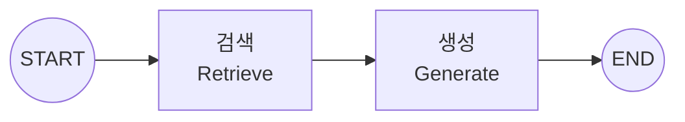
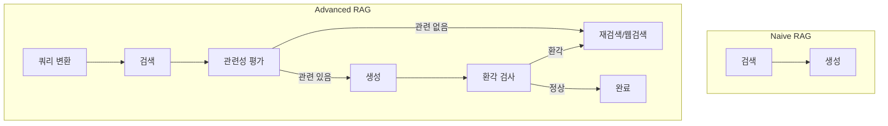

# 📘 02. Naive RAG - 기본 RAG 파이프라인

가장 기본적인 RAG(Retrieval-Augmented Generation) 파이프라인 구현입니다.

---

## 📋 목차

- [개요](#개요)
- [RAG 아키텍처](#rag-아키텍처)
- [핵심 구성요소](#핵심-구성요소)
- [코드 분석](#코드-분석)
- [한계점과 개선 방향](#한계점과-개선-방향)
- [연습 문제](#연습-문제)

---

## 개요

### RAG란?

**RAG (Retrieval-Augmented Generation)**는:

1. 사용자 질문과 관련된 **문서를 검색**하고
2. 검색된 문서를 **컨텍스트로 제공**하여
3. LLM이 **더 정확한 답변을 생성**하도록 하는 기법

### 왜 RAG가 필요한가?

| 문제 | RAG 해결책 |
|------|-----------|
| LLM의 지식은 학습 시점까지만 | 최신 문서 검색으로 보완 |
| 도메인 특화 지식 부족 | 전문 문서 DB 활용 |
| 환각(Hallucination) 문제 | 검색된 문서에 기반한 답변 |

---

## RAG 아키텍처

### 그래프 구조



### 데이터 흐름

```
질문 → Vector Store 검색 → 관련 문서 → 프롬프트 구성 → LLM → 답변
```

---

## 핵심 구성요소

### 1. Vector Store

문서를 벡터로 저장하고 유사도 검색을 수행합니다.

```python
from utils.vector_store import VectorStoreManager

manager = VectorStoreManager(
    embeddings=embeddings,
    collection_name="naive_rag_example",
    chunk_size=500,      # 청크 크기
    chunk_overlap=100,   # 청크 간 중복
)

# 문서 추가
manager.add_texts(texts=sample_texts)

# 검색
docs = manager.search(query="질문", k=3)
```

### 2. 임베딩 (Embedding)

텍스트를 벡터로 변환하는 모델입니다.

```python
from utils.llm_factory import get_embeddings

embeddings = get_embeddings()

# 텍스트 → 벡터
vector = embeddings.embed_query("안녕하세요")
# 결과: [0.012, -0.034, 0.056, ...]
```

### 3. 청킹 (Chunking)

긴 문서를 적절한 크기로 분할합니다.

---

## 코드 분석

### State 정의

```python
class RAGState(TypedDict):
    """
    RAG 파이프라인의 상태를 정의합니다.
    """
    question: str                    # 사용자 질문
    context: str                     # 검색된 컨텍스트 (문자열)
    documents: List[Document]        # 검색된 문서 리스트
    answer: str                      # 최종 답변
```

### Retrieve 노드

```python
def retrieve_node(state: RAGState) -> dict:
    """
    검색 노드: 사용자 질문과 관련된 문서를 검색합니다.
    """
    print(f"\n🔍 검색 중: '{state['question']}'")
    
    # Vector Store에서 문서 검색
    manager = get_vector_store()
    documents = manager.search(
        query=state["question"],
        k=3  # 상위 3개 문서 검색
    )
    
    print(f"   → {len(documents)}개 문서 발견")
    
    # 문서 내용을 컨텍스트 문자열로 결합
    context_parts = []
    for i, doc in enumerate(documents, 1):
        context_parts.append(f"[문서 {i}]\n{doc.page_content}")
    
    context = "\n\n".join(context_parts)
    
    return {
        "documents": documents,
        "context": context,
    }
```

### Generate 노드

```python
def generate_node(state: RAGState) -> dict:
    """
    생성 노드: 검색된 문서를 바탕으로 답변을 생성합니다.
    """
    print("\n💭 답변 생성 중...")
    
    llm = get_llm()
    
    # RAG 프롬프트 템플릿
    prompt = ChatPromptTemplate.from_messages([
        ("system", """당신은 도움이 되는 AI 어시스턴트입니다.
아래 제공된 컨텍스트를 기반으로 사용자의 질문에 답변하세요.

중요:
- 컨텍스트에 있는 정보만 사용하세요
- 컨텍스트에 답이 없으면 "제공된 정보에서 답을 찾을 수 없습니다"라고 말하세요
- 답변은 명확하고 간결하게 작성하세요

컨텍스트:
{context}"""),
        ("human", "{question}"),
    ])
    
    # 프롬프트 구성 및 LLM 호출
    chain = prompt | llm
    
    response = chain.invoke({
        "context": state["context"],
        "question": state["question"],
    })
    
    print("   → 답변 생성 완료")
    
    return {"answer": response.content}
```

---

## 한계점과 개선 방향

### Naive RAG의 한계

| 한계 | 설명 |
|------|------|
| 검색 품질 미검증 | 관련 없는 문서도 그대로 사용 |
| 단일 검색 시도 | 재검색 불가 |
| 답변 검증 없음 | 환각 가능성 |
| 쿼리 그대로 사용 | 쿼리 최적화 없음 |

### 개선 방향



---

## 실행 결과

### 테스트 쿼리

```
🙋 질문: LangGraph란 무엇인가요?
============================================================

🔍 검색 중: 'LangGraph란 무엇인가요?'
   → 3개 문서 발견

💭 답변 생성 중...
   → 답변 생성 완료

📚 검색된 문서 수: 3

🤖 답변:
LangGraph는 LangChain 팀에서 개발한 라이브러리로, 상태를 가진 다중 행위자 애플리케이션을 구축합니다.
```

---

## 연습 문제

### 1. 다양한 문서 형식

PDF, CSV 등 다른 형식의 문서를 로드해보세요.

```python
from langchain_community.document_loaders import PyPDFLoader

loader = PyPDFLoader("document.pdf")
documents = loader.load()
```

### 2. 검색 결과 개수 변경

`k` 값을 조절해 검색 결과 수가 답변에 미치는 영향을 확인하세요.

### 3. 청크 크기 실험

`chunk_size`와 `chunk_overlap`을 조절해 최적 값을 찾아보세요.

---

## 다음 단계

➡️ [03. Entity RAG](03_entity_rag.md) - 엔티티 기반 하이브리드 검색
