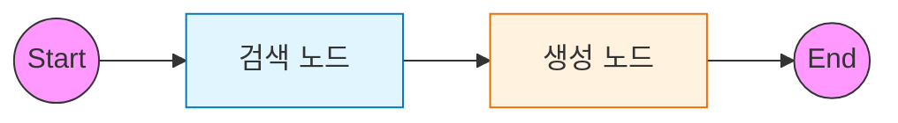

# 2️⃣ Naive RAG: 표준 검색-생성 파이프라인

이 예제는 가장 기본적인 RAG(Retrieval-Augmented Generation) 파이프라인을 LangGraph로 구현하는 방법을 다룹니다.

---

## 🎯 학습 목표
1. **RAG 파이프라인**: `Retrieve` (검색) → `Generate` (생성) 흐름 이해
2. **State 설계**: 문서와 답변을 포함하는 `TypedDict` 상태 정의
3. **Vector Store 연동**: 문서 임베딩 및 검색 노드 통합

---

## 🖥️ CLI 실행 방법

이 예제는 **대화형 CLI 모드**로 실행됩니다.

```bash
python examples/02_naive_rag.py
```

```
LangGraph Naive RAG Example
CLI 모드로 실행됩니다. 질문을 입력하세요.
종료하려면 'quit', 'exit', 또는 'q'를 입력하세요.

🙋 질문을 입력하세요: LangGraph가 뭐야?
```

### 종료 방법
- `quit`, `exit`, 또는 `q` 입력
- `Ctrl+C` 키 입력

---

## 🏗️ 그래프 구조

검색 결과를 다음 노드로 전달하는 선형(Linear) 구조입니다.



---

## 🔑 핵심 코드 설명

### 1. RAG State 정의
RAG 파이프라인에서 공유해야 할 데이터는 **질문, 검색된 문서, 최종 답변**입니다.
`TypedDict`를 사용하여 이를 명확히 정의합니다.

```python
class RAGState(TypedDict):
    question: str                # 입력 질문
    documents: List[Document]    # 검색된 문서 리스트
    answer: str                  # 생성된 답변
```

### 2. 검색 노드 (Retrieve)
`llm_factory`와 `VectorStoreManager`를 사용하여 질문과 유사한 문서를 검색합니다.

```python
# 유틸리티를 통한 임베딩 및 벡터 스토어 초기화
from utils.llm_factory import get_embeddings
from utils.vector_store import VectorStoreManager

vs = VectorStoreManager(embeddings=get_embeddings())

def retrieve_node(state: RAGState):
    """문서를 검색하는 노드"""
    docs = vs.search(state["question"])
    return {"documents": docs}
```

### 3. 생성 노드 (Generate)
검색된 `documents`를 프롬프트에 컨텍스트로 주입하여 LLM 답변을 생성합니다.

```python
def generate_node(state: RAGState):
    """답변을 생성하는 노드"""
    context = "\n\n".join(doc.page_content for doc in state["documents"])
    # LLM 체인을 통한 답변 생성
    response = chain.invoke({"context": context, "question": state["question"]})
    return {"answer": response}
```

---

## 📂 데이터 로딩 (공통 모듈)

본 예제는 `utils/data_loader.py`의 공통 모듈을 사용하여 `./rag` 디렉토리의 파일을 자동으로 로드합니다.

```python
from utils.data_loader import get_rag_vector_store

def get_vector_store():
    """Vector Store 초기화 (자동 데이터 로드 + 영속화)"""
    return get_rag_vector_store(collection_name="naive_rag")
```

### 지원 파일 형식
| 확장자 | 설명 |
|--------|------|
| `.txt`, `.md` | 텍스트 파일 |
| `.csv` | CSV 파일 |
| `.pdf` | PDF 문서 |
| `.xlsx` | Excel 파일 |
| `.json` | JSON 파일 (전체를 하나의 문서로) |
| `.jsonl` | JSONL 파일 (한 줄씩 개별 문서로) |

### 자동 변경 감지
- `./rag` 폴더에 파일 추가/수정 시 자동으로 재임베딩
- 변경 없으면 `./vector_db/naive_rag/`의 기존 임베딩 재사용

---

## 📝 실행 흐름

1. **데이터 준비**: `./rag` 폴더의 문서를 로드하여 벡터 DB 구축
2. **사용자 입력**: "LangGraph가 뭐야?" (`question` 입력)
3. **Retrieve**: 질문 벡터와 유사한 문서 검색 (`documents` 업데이트)
4. **Generate**: 문서 내용을 참고하여 답변 생성 (`answer` 업데이트)
5. **End**: 최종 상태 반환

---

## 실행 결과

### 테스트 쿼리

```
RAG 시스템이 가동되었습니다. (대상 폴더: ./rag)
종료하려면 'quit' 또는 'exit'를 입력하세요.

🙋 질문을 입력하세요: LangGraph란 무엇인가요?
============================================================

🔍 검색 중: 'LangGraph란 무엇인가요?'
   → 3개 문서 발견

💭 답변 생성 중...
   → 답변 생성 완료

📚 검색된 문서 수: 3

🤖 답변:
LangGraph는 LangChain 팀에서 개발한 라이브러리로, 상태를 가진 다중 행위자 애플리케이션을 구축합니다.
```

---

## 연습 문제

### 1. 다양한 문서 추가
`./rag` 디렉토리에 자신만의 `.txt`, `.pdf`, `.csv` 파일을 넣고 다시 실행해보세요. 자동으로 인식되어 검색 대상에 포함됩니다.

### 2. 검색 결과 개수 변경
`vs.search(..., k=4)` 에서 `k` 값을 조절해 검색 결과 수가 답변에 미치는 영향을 확인하세요.

### 3. Ollama 임베딩 사용
`.env` 파일에서 `EMBEDDING_PROVIDER=ollama`로 변경하여 로컬 임베딩 모델을 사용해보세요.

---

## 🔗 상세 예제

기본 RAG를 익혔다면 다음 상세 예제로 심화 학습하세요:

| 예제 | 주제 | 학습 내용 |
|------|------|----------|
| [02a. Rerank RAG](02a_rerank_rag.md) | Rerank 전략 | 검색 결과 재정렬, LLM 기반 평가 |
| [02b. Query Transform RAG](02b_query_transform_rag.md) | 쿼리 변환 | HyDE, Multi-Query 확장 |

---

## 💻 전체 코드 확인
[`examples/02_naive_rag.py`](../examples/02_naive_rag.py) 파일을 참고하세요.

---

## 다음 단계

➡️ [03. Entity RAG](03_entity_rag.md) - 엔티티 기반 하이브리드 검색
