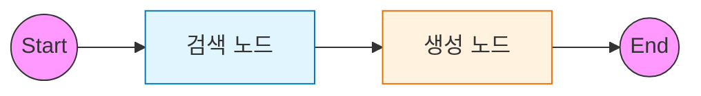

# 2️⃣ Naive RAG: 표준 검색-생성 파이프라인

이 예제는 가장 기본적인 RAG(Retrieval-Augmented Generation) 파이프라인을 LangGraph로 구현하는 방법을 다룹니다.

---

## 🎯 학습 목표
1. **RAG 파이프라인**: `Retrieve` (검색) → `Generate` (생성) 흐름 이해
2. **State 설계**: 문서와 답변을 포함하는 `TypedDict` 상태 정의
3. **Vector Store 연동**: 문서 임베딩 및 검색 노드 통합

---

## 🏗️ 그래프 구조

검색 결과를 다음 노드로 전달하는 선형(Linear) 구조입니다.



---

## 🔑 핵심 코드 설명

### 1. RAG State 정의
RAG 파이프라인에서 공유해야 할 데이터는 **질문, 검색된 문서, 최종 답변**입니다.
`TypedDict`를 사용하여 이를 명확히 정의합니다.

```python
class RAGState(TypedDict):
    question: str                # 입력 질문
    documents: List[Document]    # 검색된 문서 리스트
    answer: str                  # 생성된 답변
```

### 2. 검색 노드 (Retrieve)
Vector Store에서 질문과 유사한 문서를 검색하고, 상태의 `documents` 필드를 업데이트합니다.

```python
def retrieve(state: RAGState):
    docs = vector_store.search(state["question"])
    return {"documents": docs}
```

### 3. 생성 노드 (Generate)
검색된 `documents`를 프롬프트에 컨텍스트로 주입하여 LLM 답변을 생성합니다.

```python
def generate(state: RAGState):
    context = format_docs(state["documents"])
    response = chain.invoke({"context": context, "question": state["question"]})
    return {"answer": response}
```

---

## 📝 실행 흐름

1. **사용자**: "LangGraph가 뭐야?" (`question` 입력)
2. **Retrieve**: 질문 벡터와 유사한 문서 2개 검색 (`documents` 업데이트)
3. **Generate**: 문서 내용을 참고하여 답변 생성 (`answer` 업데이트)
4. **End**: 최종 상태 반환

---

## 💻 전체 코드 확인
[`examples/02_naive_rag.py`](../examples/02_naive_rag.py) 파일을 참고하세요.
