# 2️⃣ Naive RAG: 표준 검색-생성 파이프라인

이 예제는 가장 기본적인 RAG(Retrieval-Augmented Generation) 파이프라인을 LangGraph로 구현하는 방법을 다룹니다.

---

## 🎯 학습 목표
1. **RAG 파이프라인**: `Retrieve` (검색) → `Generate` (생성) 흐름 이해
2. **State 설계**: 문서와 답변을 포함하는 `TypedDict` 상태 정의
3. **Vector Store 연동**: 문서 임베딩 및 검색 노드 통합

---

## 🖥️ CLI 실행 방법

이 예제는 **대화형 CLI 모드**로 실행됩니다.

```bash
python examples/02_naive_rag.py
```

```
LangGraph Naive RAG Example
CLI 모드로 실행됩니다. 질문을 입력하세요.
종료하려면 'quit', 'exit', 또는 'q'를 입력하세요.

🙋 질문을 입력하세요: LangGraph가 뭐야?
```

### 종료 방법
- `quit`, `exit`, 또는 `q` 입력
- `Ctrl+C` 키 입력

---

## 🏗️ 그래프 구조

검색 결과를 다음 노드로 전달하는 선형(Linear) 구조입니다.

```mermaid
graph LR
    START((Start)) --> Retrieve[검색 노드]
    Retrieve --> Generate[생성 노드]
    Generate --> END((End))

    style START fill:#f9f,stroke:#333
    style END fill:#f9f,stroke:#333
    style Retrieve fill:#e1f5fe,stroke:#0277bd
    style Generate fill:#fff3e0,stroke:#ef6c00
```



---

## 🔑 핵심 코드 설명

### 1. RAG State 정의
RAG 파이프라인에서 공유해야 할 데이터는 **질문, 검색된 문서, 최종 답변**입니다.
`TypedDict`를 사용하여 이를 명확히 정의합니다.

```python
class RAGState(TypedDict):
    question: str                # 입력 질문
    documents: List[Document]    # 검색된 문서 리스트
    answer: str                  # 생성된 답변
```

### 2. 검색 노드 (Retrieve)
`llm_factory`와 `VectorStoreManager`를 사용하여 질문과 유사한 문서를 검색합니다.

```python
# 유틸리티를 통한 임베딩 및 벡터 스토어 초기화
from utils.llm_factory import get_embeddings
from utils.vector_store import VectorStoreManager

vs = VectorStoreManager(embeddings=get_embeddings())

def retrieve_node(state: RAGState):
    """문서를 검색하는 노드"""
    docs = vs.search(state["question"])
    return {"documents": docs}
```

### 3. 생성 노드 (Generate)
검색된 `documents`를 프롬프트에 컨텍스트로 주입하여 LLM 답변을 생성합니다.

```python
def generate_node(state: RAGState):
    """답변을 생성하는 노드"""
    context = "\n\n".join(doc.page_content for doc in state["documents"])
    # LLM 체인을 통한 답변 생성
    response = chain.invoke({"context": context, "question": state["question"]})
    return {"answer": response}
```

---

## 📂 데이터 로딩 (Multi-format)

본 예제는 `DirectoryLoader`를 사용하여 `./rag` 디렉토리 내의 다양한 파일 형식을 자동으로 로드합니다.

```python
def dataloader():
    """다양한 형식의 문서를 자동으로 로드합니다."""
    loader = DirectoryLoader(
        "./rag",
        glob="**/*.*",  # 모든 확장자 시도
        show_progress=True,
        use_multithreading=True,
        # 각 파일 확장자에 맞는 로더 연결
        loaders={
            ".pdf": PyPDFLoader,
            ".csv": CSVLoader,
            ".xlsx": UnstructuredExcelLoader,
            ".txt": TextLoader,
            ".md": TextLoader,
        }
    )
    docs = loader.load()
    vs.add_documents(docs)
```

---

## 📝 실행 흐름

1. **데이터 준비**: `./rag` 폴더의 문서를 로드하여 벡터 DB 구축
2. **사용자 입력**: "LangGraph가 뭐야?" (`question` 입력)
3. **Retrieve**: 질문 벡터와 유사한 문서 검색 (`documents` 업데이트)
4. **Generate**: 문서 내용을 참고하여 답변 생성 (`answer` 업데이트)
5. **End**: 최종 상태 반환

---

## 실행 결과

### 테스트 쿼리

```
RAG 시스템이 가동되었습니다. (대상 폴더: ./rag)
종료하려면 'quit' 또는 'exit'를 입력하세요.

🙋 질문을 입력하세요: LangGraph란 무엇인가요?
============================================================

🔍 검색 중: 'LangGraph란 무엇인가요?'
   → 3개 문서 발견

💭 답변 생성 중...
   → 답변 생성 완료

📚 검색된 문서 수: 3

🤖 답변:
LangGraph는 LangChain 팀에서 개발한 라이브러리로, 상태를 가진 다중 행위자 애플리케이션을 구축합니다.
```

---

## 연습 문제

### 1. 다양한 문서 추가
`./rag` 디렉토리에 자신만의 `.txt`, `.pdf`, `.csv` 파일을 넣고 다시 실행해보세요. 자동으로 인식되어 검색 대상에 포함됩니다.

### 2. 검색 결과 개수 변경
`vs.search(..., k=4)` 에서 `k` 값을 조절해 검색 결과 수가 답변에 미치는 영향을 확인하세요.

### 3. Ollama 임베딩 사용
`.env` 파일에서 `EMBEDDING_PROVIDER=ollama`로 변경하여 로컬 임베딩 모델을 사용해보세요.

---

## 🔗 상세 예제

기본 RAG를 익혔다면 다음 상세 예제로 심화 학습하세요:

| 예제 | 주제 | 학습 내용 |
|------|------|----------|
| [02a. Rerank RAG](02a_rerank_rag.md) | Rerank 전략 | 검색 결과 재정렬, LLM 기반 평가 |
| [02b. Query Transform RAG](02b_query_transform_rag.md) | 쿼리 변환 | HyDE, Multi-Query 확장 |

---

## 💻 전체 코드 확인
[`examples/02_naive_rag.py`](../examples/02_naive_rag.py) 파일을 참고하세요.

---

## 다음 단계

➡️ [03. Entity RAG](03_entity_rag.md) - 엔티티 기반 하이브리드 검색
