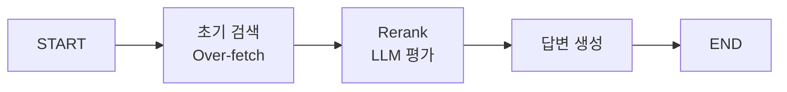

# 📘 02a. Rerank RAG - 검색 결과 재정렬

LLM 기반으로 검색된 문서를 재정렬(Rerank)하여 관련성을 높이는 RAG입니다.

---

## 📋 학습 목표

1. 2단계 검색 전략 (Retrieve → Rerank)
2. LLM 기반 관련성 점수 산정
3. Cross-encoder 개념 이해
4. Top-K 재선택

---

## 🔑 핵심 개념

### 왜 Rerank가 필요한가?

| 초기 검색 | Rerank 후 |
|----------|----------|
| 의미적 유사도만 고려 | 질문-문서 관련성 직접 평가 |
| 순서가 최적이 아닐 수 있음 | 더 관련 있는 문서가 상위로 |

---

## 📐 그래프 구조



---

## 📐 핵심 코드

### 초기 검색 (Over-fetch)
```python
def retrieve_node(state):
    # 최종 필요 개수(3)보다 많이 검색 (6개)
    docs = vs.search(query=state["question"], k=6)
    return {"initial_documents": docs}
```

### Rerank 노드
```python
def rerank_node(state):
    prompt = """문서가 질문에 얼마나 관련있는지 0-10 점수로 평가하세요."""
    
    scored_docs = []
    for doc in state["initial_documents"]:
        score = llm_evaluate(doc)  # 0-10 점수
        scored_docs.append({"document": doc, "score": score})
    
    # 점수 기준 정렬 후 상위 3개 선택
    scored_docs.sort(key=lambda x: x["score"], reverse=True)
    top_docs = scored_docs[:3]
    return {"reranked_documents": top_docs}
```

---

## ✨ 핵심 포인트

1. **Over-fetch**: 최종 필요 개수보다 많이 검색
2. **LLM 평가**: 각 문서의 관련성 점수 산정
3. **재정렬**: 점수 기준 정렬 후 Top-K 선택

---

## 🔗 관련 문서

- [기본 RAG](02_naive_rag.md)
- [다음: Query Transform RAG](02b_query_transform_rag.md)
