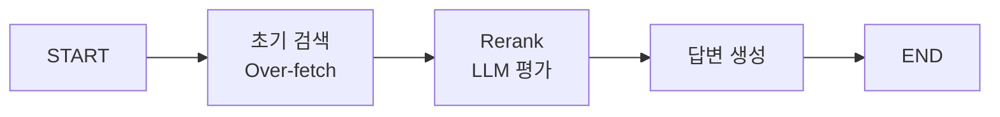

# 📘 02a. Rerank RAG - 검색 결과 재정렬

LLM 기반으로 검색된 문서를 재정렬(Rerank)하여 관련성을 높이는 RAG입니다.

---

## 📋 학습 목표

1. 2단계 검색 전략 (Retrieve → Rerank)
2. LLM 기반 관련성 점수 산정
3. Cross-encoder 개념 이해
4. Top-K 재선택

---

## 🖥️ CLI 실행 방법

이 예제는 **대화형 CLI 모드**로 실행됩니다.

```bash
python examples/02a_rerank_rag.py
```

```
Rerank RAG 예제 (CLI 모드)
정밀한 재정렬을 통해 답변 품질을 높이는 예제입니다.
종료하려면 'quit' 또는 'exit'를 입력하세요.

🙋 검색할 질문을 입력하세요: RAG에서 Reranking의 역할은?
```

### 종료 방법
- `quit`, `exit`, 또는 `q` 입력
- `Ctrl+C` 키 입력

---

## 🔑 핵심 개념

### 왜 Rerank가 필요한가?

| 초기 검색 | Rerank 후 |
|----------|----------|
| 의미적 유사도만 고려 | 질문-문서 관련성 직접 평가 |
| 순서가 최적이 아닐 수 있음 | 더 관련 있는 문서가 상위로 |

---

## 📐 그래프 구조



---

## 📐 핵심 코드

### 초기 검색 (Over-fetch: 일단 많이 찾기)
```python
def retrieve_node(state: RerankRAGState) -> dict:
    """[1단계: 일단 많이 찾기] 필요 이상으로 넉넉하게 문서를 검색합니다."""
    # 나중에 3개로 걸러낼 예정이므로, 일단 6개를 넉넉히 찾아옵니다.
    docs = vs.search(query=state["question"], k=6)
    
    return {"initial_documents": docs}
```

### Rerank 노드 (정밀하게 다시 고르기)
```python
def rerank_node(state: RerankRAGState) -> dict:
    """[2단계: AI가 꼼꼼히 다시 고르기] 찾아온 것들 중 진짜 정답 후보를 골라냅니다."""
    # 1. 모든 문서에 대해 AI가 관련성 점수를 매기도록 루프 실행
    scored_docs = []
    for doc in state["initial_documents"]:
        # llm.invoke()를 통한 점수 산출 로직...
        scored_docs.append({"document": doc, "score": score})
    
    # 2. 점수가 높은 순으로 정렬하고 상위 3개만 딱 골라냅니다.
    scored_docs.sort(key=lambda x: x["score"], reverse=True)
    top_3 = scored_docs[:3]
    
    return {"reranked_documents": [d["document"] for d in top_3]}
```

---

## ✨ 핵심 포인트

1. **Over-fetch**: 최종 필요 개수보다 많이 검색
2. **LLM 평가**: 각 문서의 관련성 점수 산정
3. **재정렬**: 점수 기준 정렬 후 Top-K 선택

---

## 🔗 관련 문서

- [기본 RAG](02_naive_rag.md)
- [다음: Query Transform RAG](02b_query_transform_rag.md)
