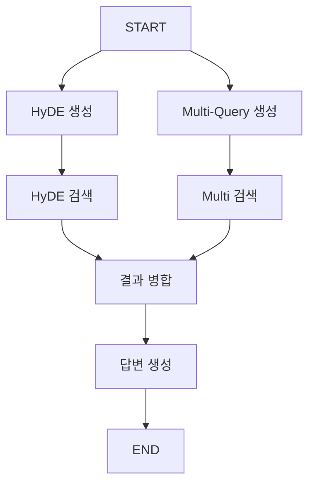

# 📘 02b. Query Transform RAG - 쿼리 변환

HyDE와 Multi-Query를 사용해 쿼리를 변환하여 검색 효율을 높이는 RAG입니다.

---

## 📋 학습 목표

1. HyDE: 가상 문서 생성 후 검색
2. Multi-Query: 쿼리를 여러 변형으로 확장
3. 결과 퓨전

---

## 🔑 핵심 개념

### HyDE (Hypothetical Document Embeddings)

```
질문 → LLM이 가상의 답변 생성 → 가상 답변으로 검색
```

- 질문보다 답변이 문서와 유사한 어휘를 가짐
- 임베딩 기반 검색 효율 향상

### Multi-Query

```
질문 → 여러 관점으로 재작성 → 각각 검색 → 결과 병합
```

- 검색 범위 확대
- 동의어, 다른 표현 포함

---

## 📐 그래프 구조



---

## 📐 핵심 코드

### HyDE
```python
def generate_hyde_document(state):
    prompt = "질문에 대한 상세한 답변을 작성하세요."
    hyde_doc = llm.invoke({"question": state["question"]})
    return {"hyde_document": hyde_doc}

def search_with_hyde(state):
    docs = vs.search(query=state["hyde_document"], k=3)
    return {"hyde_results": docs}
```

### Multi-Query
```python
def generate_multi_queries(state):
    prompt = "질문을 3가지 다른 관점에서 재작성하세요."
    queries = llm.invoke(state["question"])
    return {"multi_queries": queries}

def search_with_multi_queries(state):
    all_docs = []
    for query in state["multi_queries"]:
        docs = vs.search(query=query, k=2)
        all_docs.extend(docs)
    return {"multi_query_results": deduplicate(all_docs)}
```

---

## ✨ 핵심 포인트

1. **HyDE**: 질문 → 가상 답변 → 검색
2. **Multi-Query**: 질문 → 변형들 → 각각 검색 → 병합
3. **병렬 실행**: 두 방식을 동시에 실행

---

## 🔗 관련 문서

- [이전: Rerank RAG](02a_rerank_rag.md)
- [기본 RAG로 돌아가기](02_naive_rag.md)
