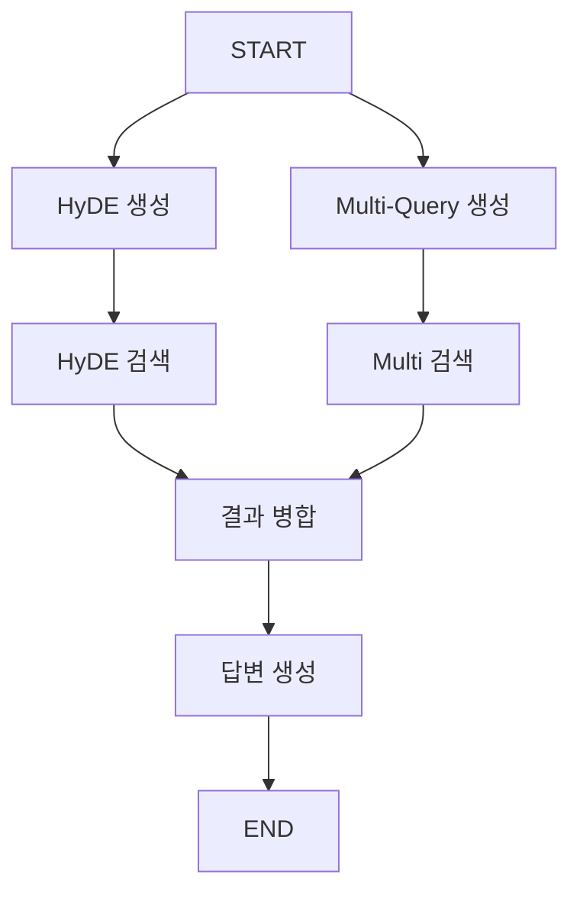

# 📘 02b. Query Transform RAG - 쿼리 변환

HyDE와 Multi-Query를 사용해 쿼리를 변환하여 검색 효율을 높이는 RAG입니다.

---

## 📋 학습 목표

1. HyDE: 가상 문서 생성 후 검색
2. Multi-Query: 쿼리를 여러 변형으로 확장
3. 결과 퓨전

---

## 🖥️ CLI 실행 방법

이 예제는 **대화형 CLI 모드**로 실행됩니다.

```bash
python examples/02b_query_transform_rag.py
```

```
Query Transform RAG 예제 (CLI 모드)
HyDE와 Multi-Query 기술을 사용하여 검색 정확도를 높입니다.
종료하려면 'quit' 또는 'exit'를 입력하세요.

🙋 어떤 것을 검색할까요?: HyDE 검색 기법이 뭐야?
```

### 종료 방법
- `quit`, `exit`, 또는 `q` 입력
- `Ctrl+C` 키 입력

---

## 🔑 핵심 개념

### HyDE (Hypothetical Document Embeddings)

```
질문 → LLM이 가상의 답변 생성 → 가상 답변으로 검색
```

- 질문보다 답변이 문서와 유사한 어휘를 가짐
- 임베딩 기반 검색 효율 향상

### Multi-Query

```
질문 → 여러 관점으로 재작성 → 각각 검색 → 결과 병합
```

- 검색 범위 확대
- 동의어, 다른 표현 포함

---

## 📐 그래프 구조



---

## 📐 핵심 코드

### HyDE (가상 답변 상상하여 검색하기)
```python
def retrieve_hyde_node(state: QueryTransformState) -> dict:
    """[단계 1] '답변은 이럴 거야'라고 AI가 상상해서 답변 지문 만들기"""
    # AI에게 가짜 답변을 상세히 써달라고 부탁합니다.
    hyde_prompt = "..."
    response = llm.invoke(hyde_prompt) 
    return {"hyde_document": response.content}

def search_hyde_node(state: QueryTransformState) -> dict:
    """[단계 2] 상상한 답변(HyDE)과 가장 비슷한 진짜 문서 찾기"""
    # AI가 상상한 가짜 답변을 검색어로 써서 실제 지식 창고를 뒤집니다.
    docs = vs.search(query=state["hyde_document"], k=3)
    return {"hyde_results": docs}
```

### Multi-Query (질문을 다각도로 변형해서 검색하기)
```python
def generate_queries_node(state: QueryTransformState) -> dict:
    """[단계 1] 질문을 3가지 다른 표현으로 변형하기"""
    # 의미는 같지만 단어 구성을 다르게 하여 3개의 질문 리스트를 만듭니다.
    response = llm.invoke(multi_query_prompt)
    # 파싱 로직...
    return {"multi_queries": queries}

def search_multi_node(state: QueryTransformState) -> dict:
    """[단계 2] 여러 개의 질문으로 넓게 뒤지기"""
    # 각 질문마다 돌아가며 검색하고 중복을 제거하여 모읍니다.
    all_docs = []
    for q in state["multi_queries"]:
        docs = vs.search(query=q, k=2)
        all_docs.extend(docs)
    return {"multi_query_results": all_docs}
```

---

## ✨ 핵심 포인트

1. **HyDE**: 질문 → 가상 답변 → 검색
2. **Multi-Query**: 질문 → 변형들 → 각각 검색 → 병합
3. **병렬 실행**: 두 방식을 동시에 실행

---

## 🔗 관련 문서

- [이전: Rerank RAG](02a_rerank_rag.md)
- [기본 RAG로 돌아가기](02_naive_rag.md)
