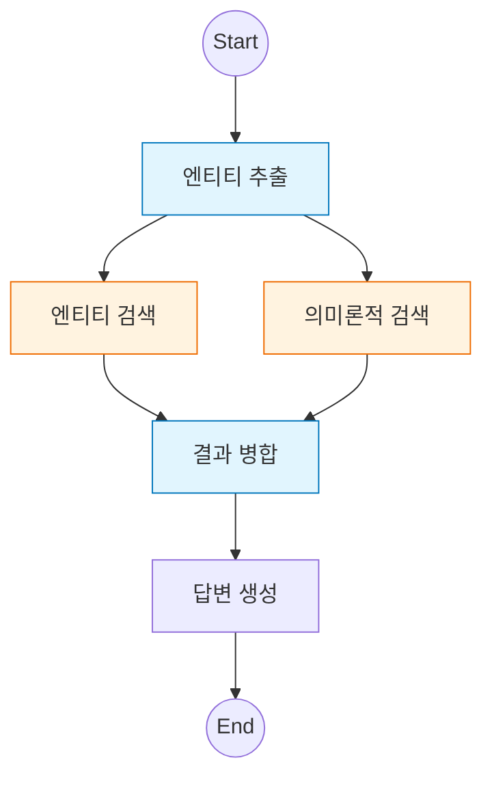

# 3️⃣ Entity RAG: 병렬 실행과 하이브리드 검색

이 예제는 LangGraph의 강력한 기능인 **병렬 실행(Parallel Execution)**을 활용하여 검색 품질을 높이는 방법을 다룹니다.

---

## 🎯 학습 목표
1. **병렬 실행 (Fan-out/Fan-in)**: 여러 노드를 동시에 실행하고 결과를 병합하는 패턴
2. **엔티티 추출**: LLM을 이용해 비정형 질문에서 핵심 키워드(Entity) 추출
3. **하이브리드 검색**: 키워드 검색(Entity)과 의미론적 검색(Semantic)의 결합

---

## 🖥️ CLI 실행 방법

이 예제는 **대화형 CLI 모드**로 실행됩니다.

```bash
python examples/03_entity_rag.py
```

```
LangGraph Entity RAG Example (Parallel Execution)
CLI 모드로 실행됩니다. 질문을 입력하세요.
종료하려면 'quit', 'exit', 또는 'q'를 입력하세요.

🙋 질문을 입력하세요: LangGraph와 LangChain에 대해 알려줘
```

### 종료 방법
- `quit`, `exit`, 또는 `q` 입력
- `Ctrl+C` 키 입력

---

## 🏗️ 그래프 구조

`Extract Entity` 노드 이후, `Entity Search`와 `Semantic Search`가 동시에 실행됩니다.



---

## 🔑 핵심 코드 설명

### 1. 병렬 실행 설정
LangGraph에서는 한 노드에서 여러 노드로 엣지를 연결하면 자동으로 병렬 실행됩니다.
또한 여러 노드에서 하나의 노드로 엣지를 모으면, 모든 선행 노드가 완료될 때까지 대기(Fan-in)합니다.

```python
# Fan-out: 추출 후 두 검색 동시 시작
builder.add_edge("extract_entities", "entity_search")
builder.add_edge("extract_entities", "semantic_search")

# Fan-in: 두 검색이 끝나면 병합
builder.add_edge("entity_search", "merge")
builder.add_edge("semantic_search", "merge")
```

### 2. 엔티티 추출 (Structured Output)
`JsonOutputParser`를 사용하여 LLM의 응답을 파이썬 리스트로 변환합니다.

```python
prompt = ChatPromptTemplate.from_messages([
    ("system", "질문에서 핵심 키워드를 JSON 리스트로 반환하세요.")
])
chain = prompt | llm | JsonOutputParser()
# 결과 예시: {"entities": ["LangGraph", "LangChain"]}
```

---

## 📝 실행 흐름

1. **사용자**: "LangGraph와 LangChain의 차이는?"
2. **Extract**: `['LangGraph', 'LangChain']` 추출
3. **Parallel Search**:
   - `Entity Search`: 태그가 'LangGraph', 'LangChain'인 문서 검색
   - `Semantic Search`: 질문 벡터와 유사한 문서 검색
4. **Merge**: 두 검색 결과의 중복을 제거하고 합침
5. **Generate**: 풍부한 문맥을 바탕으로 답변 생성

---

---

## 🔗 상세 예제

Entity RAG를 익혔다면 다음 상세 예제로 심화 학습하세요:

| 예제 | 주제 | 학습 내용 |
|------|------|----------|
| [03a. Knowledge Graph RAG](03a_knowledge_graph_rag.md) | 지식 그래프 | 엔티티 간 관계 기반 검색 (예정) |

---

## 💻 전체 코드 확인
[`examples/03_entity_rag.py`](../examples/03_entity_rag.py) 파일을 참고하세요.

---

## 다음 단계

➡️ [04. Advanced RAG](04_advanced_rag.md) - 자가 수정 RAG 파이프라인 구현
