# 📘 03. Entity RAG - 엔티티 기반 검색

엔티티 추출과 하이브리드 검색을 결합한 고급 RAG 패턴입니다.

---

## 📋 목차

- [개요](#개요)
- [Entity RAG 아키텍처](#entity-rag-아키텍처)
- [핵심 기법](#핵심-기법)
- [코드 분석](#코드-분석)
- [연습 문제](#연습-문제)

---

## 개요

### Entity RAG란?

쿼리에서 **엔티티(개체)를 추출**하고, 이를 활용해 더 정확한 검색을 수행하는 기법입니다.

### Naive RAG vs Entity RAG

| 구분 | Naive RAG | Entity RAG |
|------|-----------|------------|
| 검색 방식 | 의미론적 유사도만 | 엔티티 + 의미론적 |
| 쿼리 처리 | 그대로 사용 | 엔티티 추출 후 활용 |
| 정확도 | 일반적 | 엔티티 관련 질문에 강함 |

---

## Entity RAG 아키텍처

### 그래프 구조

```mermaid
graph TD
    START((START)) --> extract[엔티티 추출]
    extract --> entity_search[엔티티 검색]
    extract --> semantic_search[의미론적 검색]
    entity_search --> merge[결과 병합]
    semantic_search --> merge
    merge --> generate[답변 생성]
    generate --> END((END))
```



### 병렬 검색의 장점

- 엔티티 기반: 정확한 키워드 매칭
- 의미론적: 표현은 다르지만 의미가 유사한 문서
- 두 결과 병합 → 더 포괄적인 컨텍스트

---

## 핵심 기법

### 1. 엔티티 추출 (NER)

LLM을 사용해 쿼리에서 엔티티를 추출합니다.

```python
# 엔티티 유형
- technology: LangGraph, Python, ChromaDB
- concept: RAG, 임베딩, 벡터 검색
- organization: OpenAI, Google
- person: 인물 이름
```

**LLM 기반 추출 프롬프트:**
```python
prompt = """텍스트에서 기술/개념/조직 엔티티를 추출하세요.
JSON 형식: {{"entities": [{{"name": "이름", "type": "technology|concept|organization"}}]}}
엔티티 없으면: {{"entities": []}}"""
```

### 2. 엔티티 기반 검색

메타데이터에 저장된 엔티티 정보로 필터링합니다.

```python
# 문서 저장 시 엔티티 메타데이터 포함
manager.add_texts(
    texts=["LangGraph는 LangChain 팀이 개발..."],
    metadatas=[{"entities": "LangGraph,LangChain"}]
)

# 검색 시 엔티티 매칭
for doc in search_results:
    if entity["name"].lower() in doc.metadata.get("entities", "").lower():
        # 엔티티 매칭된 문서
        entity_docs.append(doc)
```

### 3. 하이브리드 병합

엔티티 검색과 의미론적 검색 결과를 병합합니다.

```python
def merge_results_node(state: EntityRAGState) -> dict:
    # 엔티티 문서 우선
    merged = list(entity_docs)
    seen = {doc.page_content for doc in merged}
    
    # 중복 제거하며 의미론적 결과 추가
    for doc in semantic_docs:
        if doc.page_content not in seen:
            merged.append(doc)
            seen.add(doc.page_content)
    
    merged = merged[:5]  # 최대 5개
    return {"merged_documents": merged, "context": context}
```

---

## 코드 분석

### State 정의

```python
class EntityRAGState(TypedDict):
    """Entity RAG 상태"""
    question: str                    # 사용자 질문
    entities: List[dict]             # 추출된 엔티티 [{"name": str, "type": str}]
    entity_documents: List[Document] # 엔티티 기반 검색 결과
    semantic_documents: List[Document]  # 의미론적 검색 결과
    merged_documents: List[Document] # 병합된 문서
    context: str                     # 최종 컨텍스트
    answer: str                      # 생성된 답변
```

### 엔티티 추출 노드

```python
def extract_entities_node(state: EntityRAGState) -> dict:
    """쿼리에서 엔티티 추출 (LLM 사용)"""
    print(f"\n🏷️ 엔티티 추출: '{state['question']}'")
    
    llm = get_llm()
    prompt = ChatPromptTemplate.from_messages([
        ("system", """텍스트에서 기술/개념/조직 엔티티를 추출하세요.
JSON 형식: {{"entities": [{{"name": "이름", "type": "technology|concept|organization"}}]}}
엔티티 없으면: {{"entities": []}}"""),
        ("human", "{question}"),
    ])
    
    try:
        chain = prompt | llm | JsonOutputParser()
        result = chain.invoke({"question": state["question"]})
        entities = result.get("entities", [])
        print(f"   → 추출: {[e['name'] for e in entities]}")
    except Exception as e:
        entities = []
    
    return {"entities": entities}
```

### 병렬 실행 구조

```python
def create_entity_rag_graph():
    graph = StateGraph(EntityRAGState)
    
    # 노드 추가
    graph.add_node("extract_entities", extract_entities_node)
    graph.add_node("entity_search", entity_search_node)
    graph.add_node("semantic_search", semantic_search_node)
    graph.add_node("merge", merge_results_node)
    graph.add_node("generate", generate_answer_node)
    
    # 엣지: 시작 → 엔티티 추출 → 병렬 검색 → 병합 → 생성 → 종료
    graph.add_edge(START, "extract_entities")
    graph.add_edge("extract_entities", "entity_search")
    graph.add_edge("extract_entities", "semantic_search")
    graph.add_edge("entity_search", "merge")
    graph.add_edge("semantic_search", "merge")
    graph.add_edge("merge", "generate")
    graph.add_edge("generate", END)
    
    return graph.compile()
```

---

## 실행 결과

### 테스트: 엔티티가 있는 질문

```
🙋 질문: LangGraph와 LangChain의 관계는?
============================================================

🏷️ 엔티티 추출: 'LangGraph와 LangChain의 관계는?'
   → 추출: ['LangGraph', 'LangChain']

🔍 엔티티 기반 검색...
   → 2개 문서

🔎 의미론적 검색...
   → 3개 문서

🔀 결과 병합...
   → 최종 4개

🤖 답변:
LangGraph는 LangChain 팀에서 개발한 라이브러리로, 
LangChain 위에 구축되어 상태 기반 에이전트를 지원합니다.
```

---

## 장단점

### 장점

✅ 엔티티 관련 질문에 높은 정확도
✅ 하이브리드 접근으로 포괄적 검색
✅ 메타데이터 활용으로 필터링 가능

### 단점

❌ 엔티티 추출에 추가 LLM 호출 필요
❌ 메타데이터 관리 오버헤드
❌ 엔티티 없는 일반 질문에는 효과 제한적

---

## 연습 문제

### 1. 커스텀 엔티티 유형

도메인 특화 엔티티 유형을 추가해보세요.
```python
# 예: 의료 도메인
- disease: 질병명
- drug: 약물명
- symptom: 증상
```

### 2. 가중치 적용

엔티티 매칭 문서에 더 높은 가중치를 부여해보세요.

### 3. 엔티티 정규화

동의어 처리 (GPT-4 = ChatGPT-4 = GPT4)

---

## 다음 단계

➡️ [04. Advanced RAG](04_advanced_rag.md) - Self-RAG & Corrective RAG
