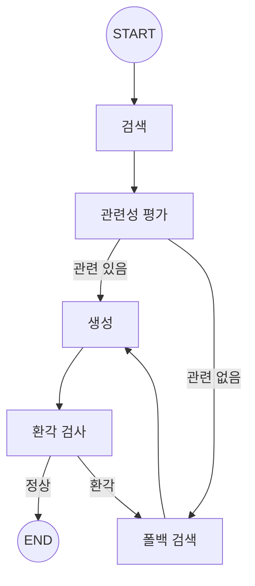

# 📘 04. Advanced RAG - Self-RAG & Corrective RAG

검색 결과 평가, 환각 검사, 자기 수정 루프를 구현한 고급 RAG 패턴입니다.

---

## 📋 목차

- [개요](#개요)
- [Advanced RAG 패턴](#advanced-rag-패턴)
- [아키텍처](#아키텍처)
- [핵심 기법](#핵심-기법)
- [코드 분석](#코드-분석)
- [연습 문제](#연습-문제)

---

## 개요

### 왜 Advanced RAG가 필요한가?

Naive RAG의 문제점:
- 검색 결과가 관련 없어도 그대로 사용
- 생성된 답변의 정확성 검증 없음
- 실패 시 재시도 불가

Advanced RAG의 해결책:
- **문서 관련성 평가** (Grading)
- **환각 검사** (Hallucination Check)
- **폴백 및 재시도** (Fallback)

---

## Advanced RAG 패턴

### 1. Self-RAG

LLM이 스스로 판단하는 RAG:
- 검색이 필요한지 판단
- 검색 결과의 관련성 평가
- 생성된 답변이 컨텍스트에 기반하는지 검증

### 2. Corrective RAG

오류를 수정하는 RAG:
- 관련 문서 부족 시 → 웹 검색으로 보완
- 환각 감지 시 → 재검색 및 재생성

### 3. Adaptive RAG

쿼리에 적응하는 RAG:
- 간단한 질문 → 직접 응답
- 복잡한 질문 → 다단계 검색

---

## 아키텍처

### 그래프 구조



### 핵심 분기점

1. **관련성 평가 후**: 충분한 관련 문서가 있는가?
2. **환각 검사 후**: 답변이 컨텍스트에 근거하는가?

---

## 핵심 기법

### 1. 문서 관련성 평가 (Grading)

각 문서가 질문과 관련있는지 LLM으로 평가합니다.

```python
def grade_documents(question, documents):
    prompt = """문서가 질문과 관련있으면 "yes", 없으면 "no"

질문: {question}
문서: {document}

관련성:"""
    
    relevant_docs = []
    for doc in documents:
        result = llm.invoke(prompt.format(
            question=question,
            document=doc.page_content
        ))
        if "yes" in result.lower():
            relevant_docs.append(doc)
    
    return relevant_docs
```

### 2. 환각 검사 (Hallucination Check)

생성된 답변이 컨텍스트에 근거하는지 검증합니다.

```python
def check_hallucination(context, answer):
    prompt = """답변이 컨텍스트에 근거하면 "grounded", 
아니면 "hallucinated"

컨텍스트: {context}
답변: {answer}

판정:"""
    
    result = llm.invoke(prompt.format(
        context=context,
        answer=answer
    ))
    
    return "grounded" in result.lower()
```

### 3. 폴백 전략 (Fallback)

검색 실패 시 대안을 시도합니다.

```python
def fallback_search(question, retry_count):
    if retry_count >= 2:
        return "정보를 찾지 못했습니다."
    
    # 대안 1: 쿼리 변형
    new_query = f"{question} 설명"
    
    # 대안 2: 웹 검색 (실제 구현 시)
    # results = web_search(question)
    
    return search(new_query)
```

---

## 코드 분석

### State 정의

```python
class AdvancedRAGState(TypedDict):
    question: str
    documents: List[Document]
    relevant_documents: List[Document]  # 관련 문서만
    context: str
    answer: str
    relevance_score: str      # "relevant" | "not_relevant"
    hallucination_check: str  # "grounded" | "hallucinated"
    retry_count: int          # 재시도 횟수
```

### 라우터 함수

```python
def route_by_relevance(state) -> Literal["generate", "fallback"]:
    """관련성에 따라 분기"""
    if state["relevance_score"] == "relevant":
        return "generate"
    return "fallback"

def route_by_hallucination(state) -> Literal[END, "fallback"]:
    """환각 여부에 따라 분기"""
    if state["hallucination_check"] == "grounded":
        return END
    if state["retry_count"] >= 2:
        return END  # 최대 재시도 도달
    return "fallback"
```

### 그래프 구성

```python
graph = StateGraph(AdvancedRAGState)

# 노드 추가
graph.add_node("retrieve", retrieve_node)
graph.add_node("grade", grade_documents_node)
graph.add_node("generate", generate_node)
graph.add_node("check_hallucination", check_node)
graph.add_node("fallback", fallback_node)

# 조건부 분기
graph.add_conditional_edges("grade", route_by_relevance)
graph.add_conditional_edges("check_hallucination", route_by_hallucination)
```

---

## 실행 결과

### 테스트 1: 정상 경로

```
🙋 질문: Self-RAG란 무엇인가요?
============================================================

🔍 검색: 'Self-RAG란 무엇인가요?'
   → 4개 문서

📊 문서 관련성 평가...
   → 관련 문서: 3/4개

💭 답변 생성...

🔬 환각 검사...
   → 결과: grounded

📊 평가 결과:
   - 관련성: relevant
   - 환각 검사: grounded
   - 재시도: 0회

🤖 답변:
Self-RAG는 LLM이 검색 필요성을 스스로 판단하고,
검색 결과와 생성 응답의 품질을 평가하는 기법입니다.
```

### 테스트 2: 폴백 경로

```
🙋 질문: 파이썬으로 웹서버 만드는 법? (관련 없는 질문)
============================================================

🔍 검색...
   → 4개 문서

📊 문서 관련성 평가...
   → 관련 문서: 0/4개

🔄 폴백 검색...
   → 재검색 결과: 0개

📊 평가 결과:
   - 관련성: not_relevant
   - 재시도: 2회

🤖 답변:
죄송합니다. '파이썬으로 웹서버 만드는 법?'에 대한 
정확한 정보를 찾지 못했습니다.
```

---

## 비용과 성능 트레이드오프

| 항목 | Naive RAG | Advanced RAG |
|------|-----------|--------------|
| LLM 호출 수 | 1회 | 3-5회 |
| 정확도 | 보통 | 높음 |
| 지연시간 | 빠름 | 느림 |
| 비용 | 저렴 | 비쌈 |

**권장 사용 케이스:**
- 높은 정확도가 필요한 경우
- 잘못된 정보의 비용이 큰 경우
- 사용자 경험보다 정확성이 중요한 경우

---

## 연습 문제

### 1. 웹 검색 폴백 추가

Tavily, DuckDuckGo 등을 활용해 웹 검색 폴백을 구현하세요.

```python
from langchain_community.tools import TavilySearchResults

search = TavilySearchResults()
results = search.invoke({"query": question})
```

### 2. 신뢰도 점수 추가

환각 검사에서 0-100 점수를 반환하도록 수정하세요.

### 3. 답변 개선 루프

환각이 감지되면 컨텍스트를 보강해 다시 생성하는 루프를 추가하세요.

---

## 정리

Advanced RAG는 Naive RAG의 한계를 극복하는 패턴들의 조합입니다:

1. **Self-RAG**: 자가 평가 및 검증
2. **Corrective RAG**: 오류 수정 및 보완
3. **Adaptive RAG**: 상황에 맞는 전략 선택

실제 프로덕션에서는 이러한 패턴들을 조합하여
도메인과 요구사항에 맞는 RAG 시스템을 구축합니다.

---

## 참고 자료

- [Self-RAG 논문](https://arxiv.org/abs/2310.11511)
- [Corrective RAG 논문](https://arxiv.org/abs/2401.15884)
- [LangGraph RAG 튜토리얼](https://langchain-ai.github.io/langgraph/)
