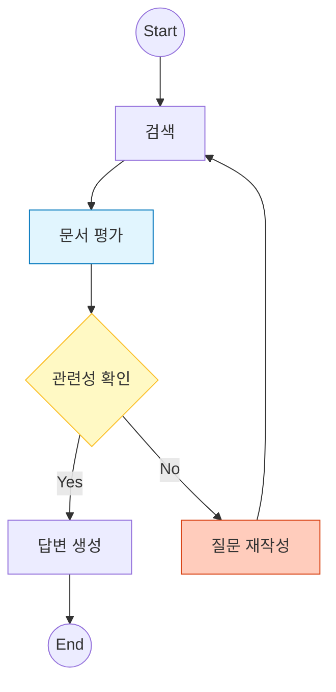

# 4️⃣ Advanced RAG: Self-RAG & Corrective RAG

이 예제는 검색된 정보의 품질을 스스로 평가하고, 부족한 경우 질문을 재작성하여 다시 검색하는 **자기 수정(Self-Correction)** 패턴을 구현합니다.

---

## 🎯 학습 목표
1. **Grading (문서 평가)**: LLM을 이용해 검색된 문서가 질문과 관련 있는지 판단
2. **Conditional Edge (조건부 엣지)**: 평가 결과(relevant/irrelevant)에 따라 다음 행동 결정
3. **Loop (순환)**: 질문을 재작성하고 검색 단계로 되돌아가는 사이클 구현

---

## 🏗️ 그래프 구조

`Grade` 노드에서 분기(Branching)가 발생합니다. 관련이 없으면 `Rewrite` 노드를 거쳐 다시 `Retrieve`로 돌아갑니다.



---

## 🔑 핵심 코드 설명

### 1. Advanced State 정의
평가 결과(`grade`)와 루프 제어를 위한 카운터(`loop_count`)를 상태에 포함합니다.

```python
class AdvancedRAGState(TypedDict):
    grade: str           # 'relevant' or 'irrelevant'
    loop_count: int      # 무한 루프 방지용
    # ...기본 필드 생략...
```

### 2. 조건부 엣지 (Router)
`grade_documents` 노드 실행 후, `check_relevance` 함수가 다음 경로를 결정합니다.

```python
def check_relevance(state):
    if state["grade"] == "relevant":
        return "generate"
    elif state["loop_count"] > 1: # 최대 재시도 초과 시 종료
        return "end"
    else:
        return "rewrite_query"

# 조건부 엣지 등록
builder.add_conditional_edges(
    "grade_documents",
    check_relevance,
    {"generate": "generate", "rewrite_query": "rewrite_query", "end": END}
)
```

### 3. 루프 구현 (Cyclic Edge)
질문 재작성 노드(`rewrite_query`)에서 다시 검색 노드(`retrieve`)로 엣지를 연결하여 사이클을 만듭니다.

```python
builder.add_edge("rewrite_query", "retrieve")
```

---

## 📝 실행 흐름

**Case 1: 관련 문서가 있는 경우**
1. **Retrieve**: "Self-RAG 설명" 검색
2. **Grade**: "Self-RAG" 관련 문서 확인 → `relevant` 판정
3. **Generate**: 답변 생성 후 종료

**Case 2: 관련 문서가 없는 경우 (예: "오늘 점심 메뉴")**
1. **Retrieve**: "오늘 점심 메뉴" 검색 (관련 문서 없음)
2. **Grade**: `irrelevant` 판정
3. **Rewrite**: "오늘 점심 메뉴 (상세 설명)"으로 쿼리 변경
4. **Retrieve**: 변경된 쿼리로 재검색 (Loop)
5. **Grade**: 여전히 없으면 재시도 횟수 초과로 종료 (Fallback)

---

<<<<<<< HEAD
## 비용과 성능 트레이드오프

| 항목 | Naive RAG | Advanced RAG |
|------|-----------|--------------|
| LLM 호출 수 | 1회 | 3-5회 |
| 정확도 | 보통 | 높음 |
| 지연시간 | 빠름 | 느림 |
| 비용 | 저렴 | 비쌈 |

**권장 사용 케이스:**
- 높은 정확도가 필요한 경우
- 잘못된 정보의 비용이 큰 경우
- 사용자 경험보다 정확성이 중요한 경우

---

## 연습 문제

### 1. 웹 검색 폴백 추가

Tavily, DuckDuckGo 등을 활용해 웹 검색 폴백을 구현하세요.

```python
from langchain_community.tools import TavilySearchResults

search = TavilySearchResults()
results = search.invoke({"query": question})
```

### 2. 신뢰도 점수 추가

환각 검사에서 0-100 점수를 반환하도록 수정하세요.

### 3. 답변 개선 루프

환각이 감지되면 컨텍스트를 보강해 다시 생성하는 루프를 추가하세요.

---

## 정리

Advanced RAG는 Naive RAG의 한계를 극복하는 패턴들의 조합입니다:

1. **Self-RAG**: 자가 평가 및 검증
2. **Corrective RAG**: 오류 수정 및 보완
3. **Adaptive RAG**: 상황에 맞는 전략 선택

실제 프로덕션에서는 이러한 패턴들을 조합하여
도메인과 요구사항에 맞는 RAG 시스템을 구축합니다.

---

## 🔗 상세 예제

Advanced RAG를 익혔다면 다음 상세 예제로 심화 학습하세요:

| 예제 | 주제 | 학습 내용 |
|------|------|----------|
| [04a. Adaptive RAG](04a_adaptive_rag.md) | 적응형 RAG | 쿼리 복잡도 분류, 동적 전략 선택 |

---

## 🚀 통합 테스트

모든 기법을 마스터했다면 통합 테스트로 실전 연습:

➡️ [05. Integrated Test](05_integrated_test.md) - 모든 기법 통합

---

## 참고 자료

- [Self-RAG 논문](https://arxiv.org/abs/2310.11511)
- [Corrective RAG 논문](https://arxiv.org/abs/2401.15884)
- [LangGraph RAG 튜토리얼](https://langchain-ai.github.io/langgraph/)
=======
## 💻 전체 코드 확인
[`examples/04_advanced_rag.py`](../examples/04_advanced_rag.py) 파일을 참고하세요.
>>>>>>> 62093943b002f40b7b25c0a0ab1eab8af9165336
