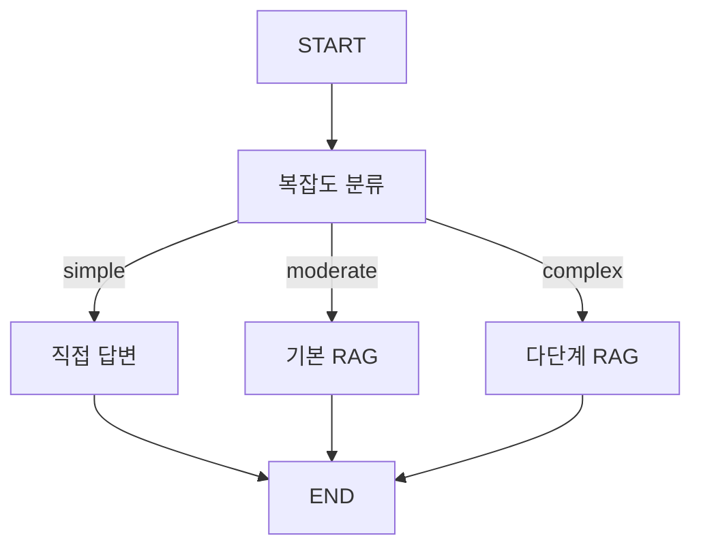

# 📘 04a. Adaptive RAG - 적응형 RAG

쿼리 복잡도를 분류하여 적절한 RAG 전략을 동적으로 선택하는 Adaptive RAG입니다.

---

## 📋 학습 목표

1. 쿼리 복잡도 분류 (단순/중간/복잡)
2. 전략별 다른 파이프라인 실행
3. 동적 라우팅
4. 비용-품질 트레이드오프

---

## 🖥️ CLI 실행 방법

이 예제는 **대화형 CLI 모드**로 실행됩니다.

```bash
python examples/04a_adaptive_rag.py
```

```
Adaptive RAG 예제 (CLI 모드)
질문의 난이도를 분석하여 가장 효율적인 방식으로 대답합니다.
종료하려면 'quit' 또는 'exit'를 입력하세요.

🙋 질문을 입력하세요: RAG와 파인튜닝의 차이는?
```

### 종료 방법
- `quit`, `exit`, 또는 `q` 입력
- `Ctrl+C` 키 입력

---

## 🔑 핵심 개념

### 복잡도별 전략

| 복잡도 | 예시 | 전략 |
|--------|------|------|
| **Simple** | "RAG가 뭐야?" | 검색 없이 직접 답변 |
| **Moderate** | "RAG의 장점은?" | 기본 RAG |
| **Complex** | "RAG와 Fine-tuning 비교 분석" | 다단계 RAG |

---

## 📐 그래프 구조



---

## 📐 핵심 코드

### 복잡도 분류 (심사위원 AI)
```python
def classify_query_node(state: AdaptiveRAGState) -> dict:
    """[판별 단계] 질문을 읽고 'simple/moderate/complex' 중 하나로 분류합니다."""
    # AI 심사위원에게 질문의 난이도를 판단해달라고 지시합니다.
    # 1. "simple": 인사, 잡담 등 검색이 필요 없는 질문
    # 2. "moderate": 일반적인 RAG 검색이 필요한 질문
    # 3. "complex": 다각도 분석이나 재작성이 필요한 복잡한 질문
    response = llm.invoke(classify_prompt)
    
    return {"query_complexity": response.content.lower().strip()}
```

### 복잡 전략 (다단계 정밀 RAG)
```python
def complex_strategy_node(state: AdaptiveRAGState) -> dict:
    """[전략 3: 어려운 질문] 질문을 쪼개서 깊게 조사하고 분석 보고서를 만듭니다."""
    # 1. 복잡한 질문을 해결하기 위한 하위 질문(Sub-queries)을 생성하거나 재작성합니다.
    # 2. 메인 질문 + 변형된 질문들로 지식 창고를 각각 검색합니다.
    # 3. 모은 모든 정보를 합쳐서 심층 답변을 생성합니다.
    # (실제 코드는 rewrite와 multi-query 로직을 포함합니다)
    return {"strategy_used": "Complex (다단계 정밀 RAG)", "answer": res}
```

---

## ✨ 핵심 포인트

1. **비용 효율**: 단순 질문에 RAG 불필요
2. **품질 최적화**: 복잡한 질문에 다단계 처리
3. **동적 라우팅**: LLM이 전략 결정

## 📂 공통 데이터 로더

모든 RAG 예제는 `utils/data_loader.py`의 공통 모듈을 사용합니다.

```python
from utils.data_loader import get_rag_vector_store

def get_adaptive_vs():
    return get_rag_vector_store(collection_name="adaptive_rag")
```

상세 내용: [Data Loader 문서](utils_data_loader.md)

---

## 🔗 관련 문서

- [기본 Advanced RAG](04_advanced_rag.md)
- [Data Loader](utils_data_loader.md)
- [05. Integrated RAG](05_integrated_test.md) - 모든 기법 통합
