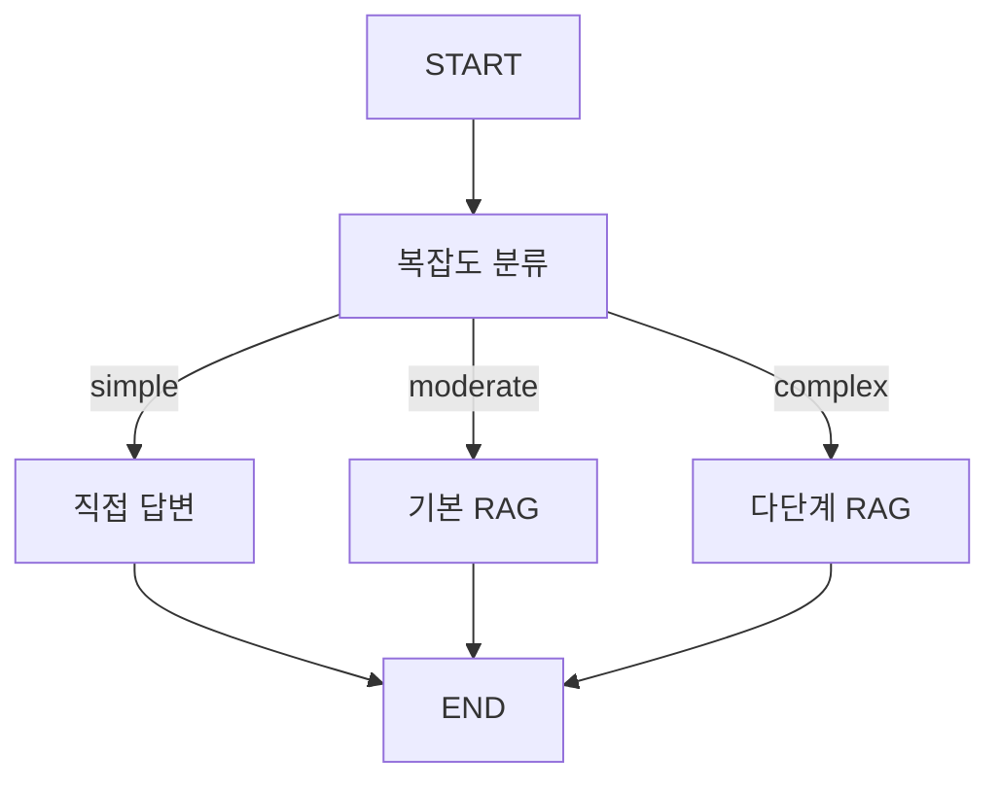

# 📘 04a. Adaptive RAG - 적응형 RAG

쿼리 복잡도를 분류하여 적절한 RAG 전략을 동적으로 선택하는 Adaptive RAG입니다.

---

## 📋 학습 목표

1. 쿼리 복잡도 분류 (단순/중간/복잡)
2. 전략별 다른 파이프라인 실행
3. 동적 라우팅
4. 비용-품질 트레이드오프

---

## 🔑 핵심 개념

### 복잡도별 전략

| 복잡도 | 예시 | 전략 |
|--------|------|------|
| **Simple** | "RAG가 뭐야?" | 검색 없이 직접 답변 |
| **Moderate** | "RAG의 장점은?" | 기본 RAG |
| **Complex** | "RAG와 Fine-tuning 비교 분석" | 다단계 RAG |

---

## 📐 그래프 구조



---

## 📐 핵심 코드

### 복잡도 분류
```python
def classify_query_node(state):
    prompt = """질문의 복잡도를 분류하세요.
    - simple: 간단한 정의
    - moderate: 일반적인 정보 요청
    - complex: 분석, 비교, 다단계 추론"""
    
    complexity = llm.invoke({"question": state["question"]})
    return {"query_complexity": complexity}
```

### 복잡 전략 (다단계 RAG)
```python
def complex_strategy_node(state):
    # 1단계: 질문 분해
    sub_questions = decompose_question(state["question"])
    
    # 2단계: 각 하위 질문에 대해 검색
    all_docs = []
    for sq in sub_questions:
        docs = vs.search(query=sq, k=2)
        all_docs.extend(docs)
    
    # 3단계: 통합 답변 생성
    answer = synthesize(original_question, all_docs)
    return {"answer": answer}
```

---

## ✨ 핵심 포인트

1. **비용 효율**: 단순 질문에 RAG 불필요
2. **품질 최적화**: 복잡한 질문에 다단계 처리
3. **동적 라우팅**: LLM이 전략 결정

---

## 🔗 관련 문서

- [기본 Advanced RAG](04_advanced_rag.md)
