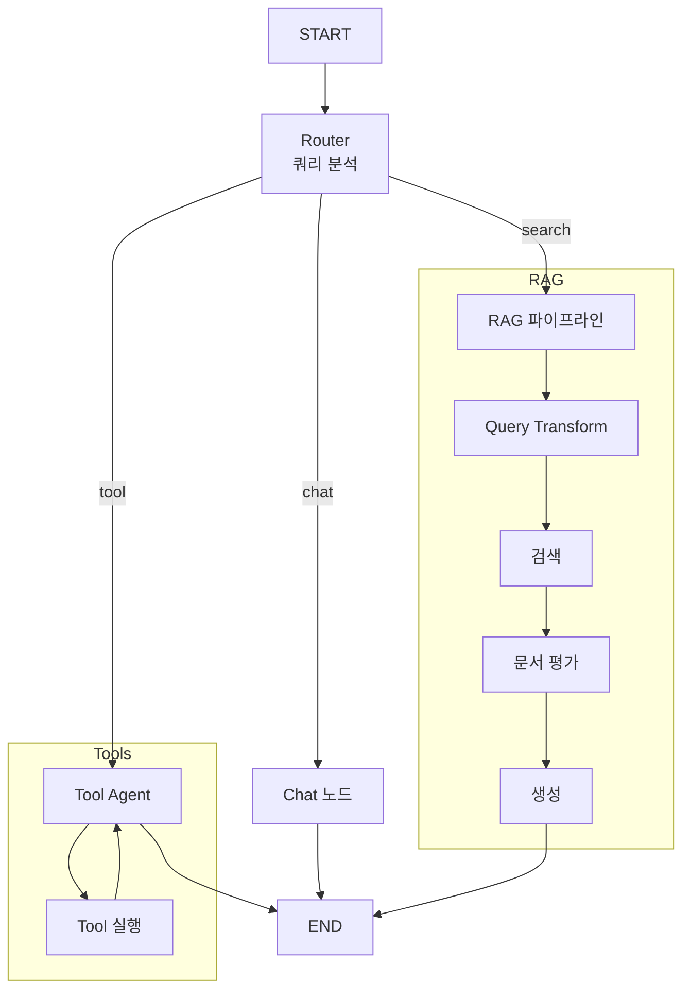

# 📘 05. Integrated Test - 통합 테스트

모든 LangGraph 기법을 통합한 최종 실전 예제입니다.

---

## 🖥️ CLI 실행 방법

이 예제는 가장 완성도 높은 **대화형 CLI 시스템**으로 실행됩니다.

```bash
python examples/05_integrated_test.py
```

```
🚀 통합 AI 에이전트 시스템 가동 중...
- 대화, 기술 검색, 도구 사용을 모두 지원합니다.
- 'quit' 또는 'exit'를 입력하여 종료

🙋 사용자: 아까 LangGraph에 대해 물어봤는데, 현재 시간 계산해서 보고서 써줘
```

### 기능 특징
- **Memory**: 세션이 유지되는 동안 모든 대화를 기억합니다.
- **Adaptive**: 질문에 따라 RAG를 쓸지, 도구를 쓸지 LLM이 판단합니다.
- **Harmony**: vLLM 로컬 서버 환경에서도 안정적으로 동작합니다. 상세 구현법은 [Harmony 호환성 가이드](harmony_compatibility.md)를 참고하세요.

---

## 📋 통합된 기법

| 기법 | 설명 |
|------|------|
| **Multi-Agent** | Router가 작업 분배 |
| **Memory** | MemorySaver로 대화 기록 유지 |
| **Adaptive RAG** | 쿼리 유형별 다른 처리 |
| **Tool Calling** | 외부 도구 활용 |
| **Document Grading** | 문서 관련성 평가 |
| **Query Transform** | HyDE 스타일 쿼리 변환 |

---

## 📐 아키텍처



---

## 🔀 쿼리 라우팅

| 쿼리 유형 | 예시 | 처리 경로 |
|----------|------|----------|
| **chat** | "안녕하세요" | Chat 노드 → 응답 |
| **search** | "LangGraph가 뭐야?" | Query Transform → 검색 → 평가 → 생성 |
| **tool** | "지금 몇 시야?" | Tool Agent → 도구 실행 → 응답 |

---

## 📐 핵심 코드

### Router 노드
```python
def router_node(state):
    query = state["messages"][-1].content
    
    prompt = """쿼리를 분석하여 처리 방식 결정:
    - chat: 인사, 잡담
    - search: 정보 검색
    - tool: 계산, 시간 조회"""
    
    query_type = llm.invoke({"query": query})
    return {"query_type": query_type}
```

### 메모리 활성화
```python
def create_integrated_agent():
    graph = StateGraph(IntegratedAgentState)
    
    # 노드들 추가...
    # 엣지들 추가...
    
    # 메모리 활성화
    memory = MemorySaver()
    compiled = graph.compile(checkpointer=memory)
    return compiled
```

### 세션별 대화
```python
def chat_with_agent(graph, thread_id, message):
    config = {"configurable": {"thread_id": thread_id}}
    result = graph.invoke(
        {"messages": [HumanMessage(content=message)]},
        config=config
    )
    return result["messages"][-1].content
```

---

## 🧪 테스트 시나리오

```python
# 1. 일반 대화
chat_with_agent(graph, "session", "안녕하세요!")

# 2. 정보 검색 (RAG)
chat_with_agent(graph, "session", "LangGraph가 뭐야?")

# 3. 도구 사용
chat_with_agent(graph, "session", "지금 몇 시야?")

# 4. 계산
chat_with_agent(graph, "session", "123 * 456 계산해줘")

# 5. 이전 대화 참조 (Memory)
chat_with_agent(graph, "session", "아까 LangGraph에 대해 뭐라고 했지?")
```

---

## ✨ 핵심 포인트

1. **통합 라우팅**: 쿼리 분석 후 적절한 경로로
2. **세션 관리**: thread_id로 대화 분리
3. **다양한 처리**: Chat, RAG, Tool 경로

---

## 🔗 관련 문서

- [00. LangGraph API 레퍼런스](00_langgraph_api_reference.md)
- [01. Basic Agent](01_basic_agent.md)
- [02. Naive RAG](02_naive_rag.md)
- [03. Entity RAG](03_entity_rag.md)
- [04. Advanced RAG](04_advanced_rag.md)
