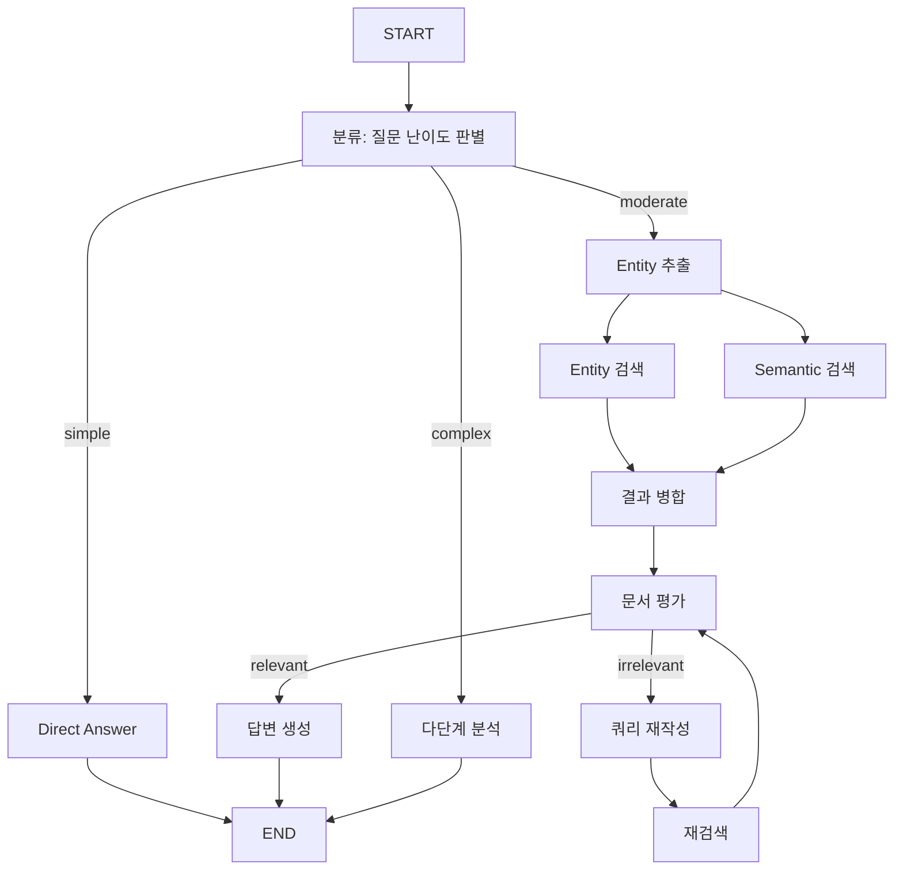

# 📘 05. Integrated RAG - Entity + Advanced + Adaptive 통합

03, 04, 04a의 RAG 기법을 하나로 통합한 최종 완성형 Agent입니다.

---

## 🖥️ CLI 실행 방법

```bash
python examples/05_integrated_test.py
```

```
🚀 통합 RAG 시스템 (Entity + Advanced + Adaptive)
- 질문 난이도에 따라 최적의 RAG 전략을 자동 선택합니다.
- 종료: 'quit', 'exit', 또는 'q'

🙋 질문: LangGraph와 LangChain의 차이점을 비교 분석해줘
```

---

## 📋 통합된 기법

| 원본 | 기법 | 역할 |
|------|------|------|
| **04a** | Adaptive RAG | 질문 난이도 자동 분류 (simple/moderate/complex) |
| **03** | Entity RAG | 엔티티 추출 + 병렬 검색 (Fan-out/Fan-in) |
| **04** | Advanced RAG | 문서 평가(Grading) + 쿼리 재작성 루프 |

---

## 📐 아키텍처



---

## 🚦 난이도별 처리 전략

| 난이도 | 예시 질문 | 처리 방식 |
|--------|----------|----------|
| **Simple** | "안녕하세요", "지금 몇 시야?" | 검색 없이 LLM 직접 답변 |
| **Moderate** | "LangGraph가 뭐야?" | Entity+Semantic 병렬 검색 → 문서 평가 → 생성 |
| **Complex** | "RAG와 Fine-tuning 비교 분석" | 질문 분해 → 다단계 검색 → 심층 분석 |

---

## 🔀 Moderate 전략 상세

### 1. Entity RAG (03 기법)

```python
# 엔티티 추출
entities = extract_entities("LangGraph와 LangChain의 차이")
# → ["LangGraph", "LangChain"]

# 병렬 검색 (Fan-out)
entity_docs = search_by_entity(entities)  # 동시
semantic_docs = search_semantic(question) # 동시

# 결과 병합 (Fan-in)
merged = merge_results(entity_docs, semantic_docs)
```

### 2. Advanced RAG (04 기법)

```python
# 문서 관련성 평가
grade = grade_documents(merged, question)

if grade == "relevant":
    # 관련 있음 → 답변 생성
    answer = generate(merged)
else:
    # 관련 없음 → 쿼리 재작성 후 재검색
    new_query = rewrite_query(question)
    new_docs = retrieve(new_query)
    # 다시 평가... (최대 2회 루프)
```

---

## 🔬 Complex 전략 상세 (04a 기법)

```python
# 1. 질문 분해
sub_queries = decompose("RAG와 Fine-tuning 비교 분석")
# → ["RAG의 장단점", "Fine-tuning의 장단점"]

# 2. 각 세부 질문으로 검색
for sq in sub_queries + [original_question]:
    docs = search(sq, k=2)
    all_context.extend(docs)

# 3. 심층 분석 답변 생성
answer = generate_deep_analysis(all_context)
```

---

## 📝 공통 데이터 로더 사용

모든 예제가 `utils/data_loader.py`의 공통 모듈을 사용합니다.

```python
from utils.data_loader import get_rag_vector_store

def get_vector_store():
    # 같은 collection 사용 시 임베딩 재사용
    return get_rag_vector_store(collection_name="integrated_rag")
```

---

## 🧪 테스트 시나리오

```bash
# Simple 질문 → 직접 답변
🙋 질문: 안녕하세요
📊 사용된 전략: Simple (직접 답변)
💡 실행 경로: classify → direct_answer

# Moderate 질문 → Entity+Advanced RAG
🙋 질문: LangGraph란 무엇인가요?
📊 사용된 전략: Advanced RAG (Entity + Grading)
💡 실행 경로: classify → entity_search → semantic_search → merge → grade_documents → generate

# Complex 질문 → 다단계 분석
🙋 질문: Self-RAG와 Corrective RAG의 차이점을 분석해줘
📊 사용된 전략: Complex (다단계 정밀 RAG)
💡 실행 경로: classify → complex_multi_step
```

---

## ✨ 핵심 포인트

1. **Adaptive 라우팅**: 질문 성격에 맞는 최적 전략 자동 선택
2. **Entity 병렬 검색**: 키워드+의미 기반 하이브리드 검색
3. **Self-Correction**: 관련 없는 문서 시 재검색 루프
4. **효율성**: 간단한 질문은 검색 없이 빠르게 응답

---

## 🔗 관련 문서

- [03. Entity RAG](03_entity_rag.md) - 병렬 검색 패턴
- [04. Advanced RAG](04_advanced_rag.md) - Self-RAG, Grading
- [04a. Adaptive RAG](04a_adaptive_rag.md) - 난이도별 라우팅
- [Data Loader](utils_data_loader.md) - 공통 데이터 로딩 모듈
